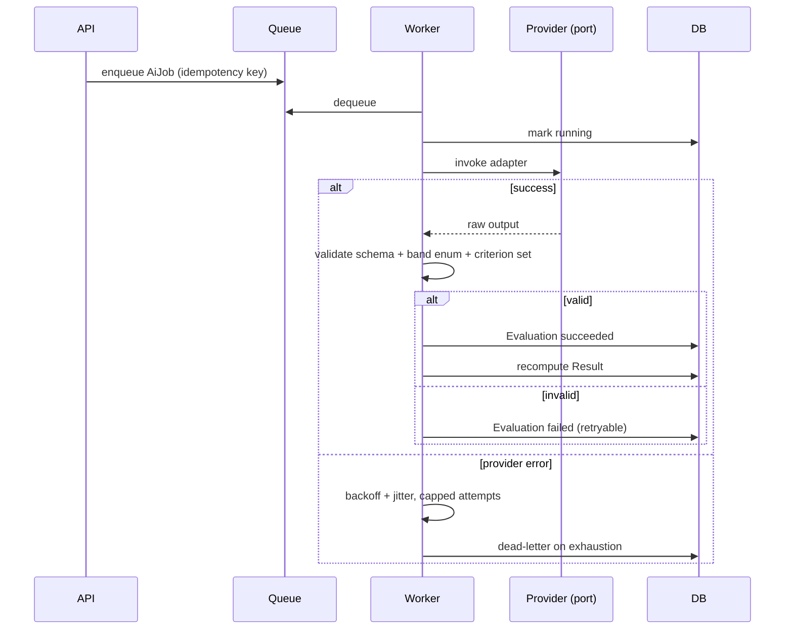

# AI Architecture

How each of the four IELTS modules is evaluated, and the rules that govern the AI subsystem as a whole.

> **LLM providers selected 2026-08-20: GPT (OpenAI) and Gemini (Google).** The Claude API remains excluded by owner decision. **Speech-to-text is still unselected.** No vendor SDK, no credentials, and no hosted AI call exists in this repository yet, and everything below stays expressed in terms of ports — with two vendors, that abstraction is now load-bearing rather than precautionary. → [`provider-comparison.md`](provider-comparison.md) · [ADR-0005](../decisions/0005-ai-provider-abstraction.md)

---

## The governing principle

> **AI produces evaluations. Application code produces results.**

This is requirement A-8 and [CLAUDE.md](../../CLAUDE.md) rule 2, and it is structural, not advisory. It shows up in the domain model as two separate entities:

| | `Evaluation` | `Result` |
|---|---|---|
| Produced by | The AI subsystem | Application code |
| Trust level | Untrusted until validated | Application state |
| Mutability | Superseded, never mutated | Recomputed |
| Records | `modelVersion`, `rubricVersion`, `confidence`, `rawOutput` | Band scores the learner sees |

An `Evaluation` never writes a `Result`. Schema validation, range checks, and application logic sit between them. → [`../domain/domain-model.md`](../domain/domain-model.md)

---

## Per-module design

```mermaid
graph TB
    subgraph Deterministic — no AI in the scoring path
        R[Reading] --> RK[Answer-key comparison]
        L[Listening] --> LK[Answer-key comparison]
        RK --> RB[Band via ScoringProfile]
        LK --> LB[Band via ScoringProfile]
        RK -.optional.-> RE[AI explanation only]
        LK -.optional.-> LE[AI explanation only]
    end

    subgraph AI-evaluated
        W[Writing] --> WE[LLM vs 4 criteria]
        S[Speaking] --> ASR[Speech-to-text]
        ASR --> FE[Deterministic feature extraction<br/>IN CODE]
        FE --> SE[LLM vs 4 criteria]
    end

    RB & LB & WE & SE --> V[Schema validation + range checks]
    V --> RES[Result]

    style RE stroke-dasharray: 5 5
    style LE stroke-dasharray: 5 5
```

### Reading and Listening — deterministic

Scored by comparing answers to the answer key. **No AI is involved in producing the score** (requirements A-1, A-2).

An LLM may optionally generate an *explanation* of why an answer was wrong. That explanation:

- Runs **after** the score is computed
- Cannot change the score
- Is a separate, failable, non-blocking job — a failed explanation must not block the result

Answer matching rules (case, whitespace, accepted alternates, word limits) live in the `ScoringProfile`, not in code. → [`../domain/band-scoring.md`](../domain/band-scoring.md)

### Writing — LLM against four criteria

Input: task prompt, learner's text, rubric, word count, and any task-specific constraints.
Output: a band per criterion (Task Response/Achievement, Coherence and Cohesion, Lexical Resource, Grammatical Range and Accuracy) with feedback, plus an aggregated section band.

Deterministic pre-processing done **in code**, not by the model:

- Word count and minimum-word-count violation
- Paragraph count and structure
- Off-topic detection is *not* pre-computed — that is a Task Response judgement

Sending a pre-computed word count matters: models count words unreliably, and "under 150 words" is a scored penalty condition that must be exact.

### Speaking — the expensive path

Audio → ASR → deterministic features → LLM → validated band. Detail in [`speaking-pipeline.md`](speaking-pipeline.md).

---

## Ports

Domain and Application know only these interfaces. Vendor SDKs live solely in `Infrastructure/Ai/`.

```csharp
public interface ISpeechRecognizer
{
    Task<TranscriptResult> TranscribeAsync(AudioReference audio, CancellationToken ct);
}

public interface IWritingEvaluator
{
    Task<EvaluationOutput> EvaluateAsync(WritingEvaluationRequest request, CancellationToken ct);
}

public interface ISpeakingEvaluator
{
    Task<EvaluationOutput> EvaluateAsync(SpeakingEvaluationRequest request, CancellationToken ct);
}

public interface IFeedbackGenerator   // optional, non-blocking
{
    Task<string> ExplainAsync(AnswerExplanationRequest request, CancellationToken ct);
}
```

**`TranscriptResult` must expose word-level timings.** The fluency features depend on them, so an ASR provider without word timestamps is not viable. This is a hard selection criterion, not a preference. → [`provider-comparison.md`](provider-comparison.md)

**`IFeedbackGenerator` is the Reading/Listening explanation port**, and its "optional, non-blocking" annotation is now a confirmed requirement rather than a design preference. `A-11` states the band comes from the answer key and an explanation can never modify it. The port returns a `string` — it has no way to express a band, which is exactly the property to preserve. → [`output-contracts.md`](output-contracts.md)

**`ISpeakingEvaluator` is currently unscoped.** `A-14` (Speaking AI scoring) is `UNCONFIRMED` as of 2026-08-20 → `M-26`. The port stays defined because removing and re-adding it would be churn, but do not read its existence as confirmation that Speaking AI is in scope.

### Ports needed by the 2026-08-20 brief — all `PROPOSED`

Three capabilities were added that no existing port covers:

```csharp
public interface IChatCompletion          // M-25 · AI Chat
{
    IAsyncEnumerable<string> StreamAsync(ChatRequest request, CancellationToken ct);
}

public interface IExamContentParser       // I-15a · AI-assisted import
{
    Task<ParsedExamCandidate> ParseAsync(SourceDocument document, CancellationToken ct);
}

public interface ITextToSpeech            // .docx proposal #18, only if B-8 accepts
{
    Task<AudioReference> SynthesiseAsync(string text, VoiceOptions options, CancellationToken ct);
}
```

| Port | Why its shape matters |
|---|---|
| `IChatCompletion` | Returns a **stream**, not a string — a chat that waits for a complete response before rendering feels broken. Streaming also means the cost ceiling has to be enforced *before* the call, not by inspecting the result. → `B-6c` |
| `IExamContentParser` | Returns a **`ParsedExamCandidate`**, deliberately not an `ExamVersion`. The name carries the security property: this is a proposal that must pass the same schema, asset, and checksum validation as a hand-authored package before it becomes exam content. → threat `T23` |
| `ITextToSpeech` | Returns an `AudioReference` — a **stored artifact**, not a stream. Prompts are fixed per `ExamVersion`, so synthesis happens once per prompt and is cached, never once per attempt |

`B-1` was resolved on 2026-08-20: **GPT (OpenAI) and Gemini (Google)** for LLM work; the Claude API remains excluded. `IChatCompletion` and `IExamContentParser` can now be designed against real vendor behaviour.

`ITextToSpeech` stays blocked on `B-8` (whether the feature is wanted at all), and **speech-to-text is still unselected** — which only matters if `M-26` keeps Speaking in scope.

Two constraints remain in force: no credentials in this repository, and **no real learner data through the test reseller**. → rule 6 in [CLAUDE.md](../../CLAUDE.md)

---

## Orchestration

AI work runs in the **worker host**, never in the request path.



Every job is idempotent, retried with capped exponential backoff and jitter, dead-lettered rather than dropped, and records provider, latency, usage, `modelVersion`, and `rubricVersion`.

**Partial results are returned immediately.** Reading and Listening scores reach the learner without waiting for Speaking evaluation — otherwise the slowest module gates the whole result.

---

## Versioning and reproducibility

Every `Evaluation` records:

| Field | Purpose |
|---|---|
| `modelVersion` | Which model produced it |
| `rubricVersion` | Which rubric text was used |
| `featureSnapshot` | The exact deterministic features sent |
| `rawOutput` | The unmodified provider response |

Together these make an evaluation explainable and reproducible. Without them, "why did this get 6.5?" is unanswerable, and a provider-side model update silently changes scoring with no audit trail.

**Re-running supersedes, never mutates.** The old `Evaluation` is marked `superseded` and retained — required for appeals (H-5) and for measuring scoring consistency (R5).

---

## Failure behaviour

| Failure | Behaviour |
|---|---|
| ASR fails | Retry; on exhaustion mark Speaking evaluation failed. **Never fabricate a band** |
| LLM returns invalid JSON | Retry with backoff; dead-letter on exhaustion |
| LLM returns an out-of-scale band | Reject as invalid — do not clamp. A clamped value hides a real fault |
| Provider rate-limits | Backoff and retry; surface as pending, not failed |
| Provider outage | Jobs queue and drain when service returns |
| Partial module failure | Other modules still produce results; the failed module shows an explicit state |

**The learner is never shown a fabricated or clamped score.** A pending or failed evaluation is shown as pending or failed. A wrong band is far more damaging than a delayed one.

---

## Non-negotiables

1. No vendor SDK type appears in `Domain` or `Application` (A-10).
2. All AI output is schema-validated before use (A-7).
3. AI never directly determines application state (A-6).
4. Learner content is data, never instructions (see [`../security/ai-security.md`](../security/ai-security.md)).
5. Band values are validated against the closed enum, server-side.
6. Every evaluation is versioned and reproducible.
7. No hosted AI call may be made until the owner selects a provider and supplies credentials.
