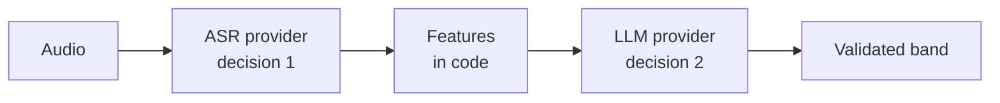

# AI Provider Comparison

> ## ✅ Decision 2 resolved — 2026-08-20
>
> **LLM evaluation: GPT (OpenAI) and Gemini (Google).** Claude API remains excluded by owner decision.
>
> | Stage | Route | Constraint |
> |---|---|---|
> | Testing | Third-party reseller supplying a `baseURL` | **Synthetic data only** — the reseller is an extra processor |
> | Production | Official OpenAI and Google APIs | Gated on `B-2` (PDPL) |
>
> **Decision 1 — speech-to-text — is still open**, and only matters if `M-26` keeps Speaking in scope.
> The hard requirement below (word-level timings) has not been relaxed.
>
> The comparison below is retained: it records *why* the requirements are what they are, and the
> selection checklist still applies when validating the chosen providers.

---

## What choosing two providers changes

Selecting **two** LLM vendors rather than one has consequences worth stating before any adapter is written.

**The port abstraction is now load-bearing.** [ADR-0005](../decisions/0005-ai-provider-abstraction.md) mandated `IWritingEvaluator` as insurance against vendor lock-in. With two vendors it stops being insurance and becomes the thing that makes the design work — there will be two adapters behind one port, and Application code must not be able to tell them apart.

**Both offer OpenAI-compatible endpoints, and that is a trap worth naming.** Gemini exposes an OpenAI-compatible surface, so one SDK with a swapped `baseURL` appears to reach both. That convenience is real for a spike and misleading for production:

| Looks the same | Actually differs |
|---|---|
| Chat completion shape | **Structured-output enforcement** — the mechanism and its strictness are not identical, and this product depends on schema conformance ([`output-contracts.md`](output-contracts.md)) |
| Token counting | Tokenisers differ, so cost per identical prompt differs |
| Model identifiers and versioning | `modelVersion` pinning must be recorded per vendor |
| Error and rate-limit semantics | Retry and backoff behaviour must be tuned per adapter |

`[NEEDS VALIDATION]` **V-11** — verify structured-output behaviour on **both** vendors against the actual schemas in `output-contracts.md` before committing. A schema that silently degrades on one vendor produces evaluations that fail validation and cost full price.

**Two vendors doubles the calibration work, not halves the risk.** [`cost-model.md`](cost-model.md) requires cost per evaluation to be *measured, not estimated*; that measurement now has to happen twice. Same for scoring consistency (`R-5`). Decide deliberately whether both run in production or one is a fallback — running both live means two sets of quality metrics to defend.

**The reseller `baseURL` is a third code path, not a shortcut.** It behaves like OpenAI's API but is operated by someone else, with its own uptime, rate limits, retention policy, and model-version pinning. Treat it as **configuration of the OpenAI adapter**, never as a separate adapter, and never point it at production data.

> **Status: undecided. The Claude API is excluded by owner decision.**
> No credentials exist in this repository and none may be committed. LLM providers are now selected; **speech-to-text is not**. → [CLAUDE.md](../../CLAUDE.md) rule 6 · [ADR-0005](../decisions/0005-ai-provider-abstraction.md)

This document exists to make that decision well, not to pre-empt it.

---

## The decision is partly a compliance decision

Before comparing accuracy or price: **sending Vietnamese learners' voice recordings to a foreign provider is a cross-border transfer of personal data** under Vietnam's PDPL, in force since 2026-01-01. It requires a Cross-Border Transfer Impact Assessment within 60 days of first transfer, with penalties up to 5% of prior-year revenue.

This is why **self-hosted ASR must stay in the option set** even if a hosted service scores better on benchmarks. → [`../security/privacy-vietnam-pdpl.md`](../security/privacy-vietnam-pdpl.md) · owner decision B-2

---

## Two independent decisions

Speech-to-text and LLM evaluation are **separate choices** and may come from different vendors — or one may be self-hosted and the other hosted.



Deciding them independently is a genuine benefit of the port-based design: switching one does not disturb the other.

---

## Decision 1 — Speech-to-text

### Hard requirements

A provider failing any of these is not viable regardless of price:

| Requirement | Why |
|---|---|
| **Word-level timestamps** | The deterministic fluency features depend on them entirely. Non-negotiable |
| Accepts `audio/m4a` **and** `audio/webm` — or we normalise first | iOS and Android produce different formats |
| Handles non-native accented English | This is the entire user population |
| Batch/async API | Evaluation is not interactive |
| Data-processing terms compatible with PDPL | See above |

Desirable but not required: per-word confidence scores, disfluency markers, streaming.

### Candidate landscape

`[NEEDS VALIDATION]` The figures below come from third-party aggregator benchmarks published mid-2026, **not** vendor contracts. Treat as indicative only. Verify current pricing and terms directly before deciding.

| Option | Indicative rate | Notes |
|---|---|---|
| Self-hosted Whisper / NeMo | Infrastructure cost only | **Keeps data in-country — the strongest PDPL position.** Requires GPU capacity and operational ownership |
| OpenAI Whisper API | ~$0.006/min | Low cost; no streaming |
| Deepgram Nova-3 | ~$0.0218/min | Positioned for real-time voice workloads |
| AssemblyAI | ~$0.37/hr | Transcript-intelligence features |
| ElevenLabs Scribe | ~$0.22–0.48/hr | Multilingual |
| Azure Speech | ~$1/hr | Bundles a pronunciation-assessment capability — see below |
| Speechmatics | Not published | Led a July 2026 benchmark at ~6.4% WER |

Benchmark context `[NEEDS VALIDATION]`: a July 2026 comparison across 14 models and 16 datasets reported Speechmatics Melia-1 at ~6.4% WER and AssemblyAI U-3.5 at ~7.0%.

### Why those benchmarks do not decide this

Published WER is measured on **general English corpora**. This product transcribes **Vietnamese-accented English at IELTS bands 4–8** — precisely the distribution where ASR degrades most, and where a transcription error becomes a scoring error directly.

> **Selection must be based on evaluation against a held-out sample of real VNI learner audio.** Nothing else predicts performance here.

Method: take 20–30 recordings spanning bands 4–8, run each candidate, and measure WER against human transcription plus the *downstream* effect — does the band change? Run this together with the cost estimation in [`cost-model.md`](cost-model.md); the same sample serves both.

### Pronunciation assessment services

Some vendors offer dedicated pronunciation scoring (accuracy, fluency, prosody, completeness). Two cautions before treating this as a shortcut to the IELTS Pronunciation criterion:

1. **Prosody assessment is commonly restricted to specific English locales** (e.g. en-US only). Verify locale coverage before depending on it.
2. **These scores are not IELTS-calibrated.** They are a *feature* to be mapped onto the band scale, not a band. Using one directly as a Pronunciation band would be unjustifiable.

This corresponds to Level C in [`speaking-pipeline.md`](speaking-pipeline.md), above the recommended MVP baseline.

---

## Decision 2 — LLM evaluation

### Hard requirements

| Requirement | Why |
|---|---|
| **Structured JSON output** with schema enforcement | Requirement A-7 |
| Low-variance / deterministic-leaning sampling | Scoring consistency, R5 |
| Model version pinning | Reproducibility — an unannounced model update silently changes scoring |
| Sufficient context for rubric + transcript | Rubric typically dominates |
| Batch endpoint | Bulk re-scoring |
| Prompt caching | The largest cost lever |
| Data-processing terms compatible with PDPL | See above |

**Excluded: the Claude API** (owner decision). Candidates therefore include OpenAI, Google, Azure OpenAI, other hosted vendors, and self-hosted open-weight models.

### Provider-independent gotchas

These bit during research and apply broadly. Verify each against whichever provider is chosen — **do not assume**.

**Structured-output schema support is commonly partial.** `enum`, `const`, and `anyOf` are widely supported; **numerical constraints (`minimum`/`maximum`) and recursive schemas frequently are not**. A band declared as:

```jsonc
{ "type": "number", "minimum": 0, "maximum": 9 }   // ✗ constraint may be ignored
```

can silently accept `8.3` or `47`. Declare the closed set instead:

```jsonc
{ "type": "number", "enum": [0, 0.5, 1, 1.5, …, 9] }   // ✓
```

→ [`output-contracts.md`](output-contracts.md)

**Prompt-cache minimum prefix length varies non-monotonically by model tier.** One vendor requires 512 tokens on its flagship but **4096** on its cheapest tier. A cost-motivated "send short prompts to the cheap model" rule can therefore fall below the cheap model's threshold and produce **zero** cache hits — costing more than not routing at all. Verify per model. → [`cost-model.md`](cost-model.md)

**Batch endpoints commonly discount ~50%** in exchange for delayed completion.

**Output tokens typically cost several times input tokens.** Constrain feedback length deliberately.

---

## Self-hosting

Worth genuine evaluation, not a token mention — the PDPL position makes it structurally attractive.

| | For | Against |
|---|---|---|
| ASR (Whisper/NeMo) | Data never leaves the country; no per-minute cost; predictable at scale | GPU capacity, ops burden, accuracy tuning |
| LLM (open-weight) | Same data position; no per-token cost | Evaluation quality on a subjective grading task is the open question; significant hardware |

`[ASSUMPTION]` A hybrid is the most likely landing point: **self-hosted ASR** (keeps raw voice — the most sensitive data — in-country) with a **hosted LLM** operating on transcripts and features rather than audio. This markedly reduces what crosses the border while retaining hosted-model quality where it matters most.

---

## Selection checklist

Work through this before committing:

- [ ] Word-level timestamps confirmed available (ASR)
- [ ] Both `m4a` and `webm` accepted, or a normalisation step designed
- [ ] Accuracy evaluated on **real VNI learner audio**, not published benchmarks
- [ ] Structured output verified — specifically whether `enum` is honoured
- [ ] Prompt-cache minimum prefix confirmed **per model tier**
- [ ] Batch endpoint availability and discount confirmed
- [ ] Model version pinning available
- [ ] Data-processing agreement reviewed against PDPL
- [ ] Data residency and retention options established
- [ ] Rate limits sufficient for projected peak
- [ ] Cost per evaluation measured end to end, not estimated
- [ ] Self-hosted option costed for comparison

---

## What is already provider-independent

Regardless of the outcome, none of this changes:

- Ports in `Application`; adapters in `Infrastructure` ([ADR-0005](../decisions/0005-ai-provider-abstraction.md))
- Deterministic feature extraction in code
- Schema validation of every output
- `modelVersion` and `rubricVersion` recorded on every `Evaluation`
- Band values validated against the closed enum server-side
- AI output never becoming application state without validation

Switching providers is an `Infrastructure` change. That is the point of building this way before the decision is made.
