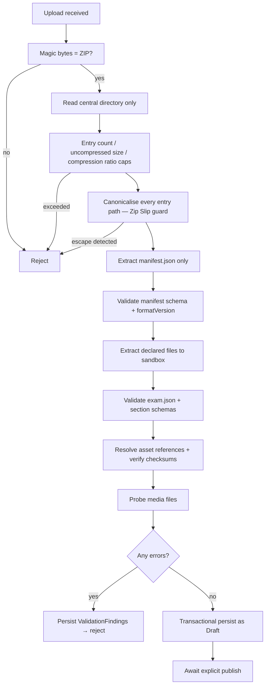

# Exam Package Format v1

Specification for the ZIP package that administrators upload for bulk exam import (requirements I-1 … I-13).

> ## Scope boundary — v1 does not cover AI-assisted parsing
>
> `I-15a` (2026-08-20) confirms that import must include **AI-assisted parsing**: AI analyses uploaded material and produces an exam structure.
>
> **This format does not support that, and extending it is not a small change.** v1 assumes a package that is *already schema-correct* — `manifest.json` declares every asset with a checksum, `exam.json` matches a published schema, and validation is a sequence of mechanical checks against declarations the author made deliberately. Its central design property is that **nothing has to be interpreted**.
>
> AI parsing inverts that: the input is raw source material with no manifest, no declared assets, and no schema. The two are different capabilities that happen to share an upload button.
>
> **The relationship between them:** AI parsing is a *front end* that produces something shaped like this format, which then passes through the **same** validation pipeline described below. AI output does not get a shorter path. → [`key-flows.md`](key-flows.md) §4a
>
> `I-15b` (which fields AI extracts), `I-15c` (output contract and accuracy threshold), and `I-15d` (implementation) are `PROPOSED`/`UNCONFIRMED` → **`B-7`**. `I-14` — accepting either a single exam or a multi-exam ZIP — is confirmed and *is* within reach of this format.

## Design goals

| Goal | How it is met |
|---|---|
| **Survive future change without a backend rewrite** (I-12) | Explicit `formatVersion`; additive-only minor versions; unknown optional fields ignored, not rejected |
| **Fail with actionable errors** | Every finding carries a JSON Pointer path, a stable code, and a human message |
| **Be authorable by non-engineers** | JSON with a published schema; assets referenced by relative path |
| **Be safe to process** (I-13) | Validation happens before extraction; nothing is trusted → [`../security/zip-ingestion-security.md`](../security/zip-ingestion-security.md) |
| **Be verifiable** | Per-asset checksums in the manifest |

---

## Structure

```
exam-package.zip
├── manifest.json           required — package metadata, integrity, asset index
├── exam.json               required — exam definition, sections, profiles
├── reading/
│   └── section.json
├── listening/
│   └── section.json
├── writing/
│   └── section.json
├── speaking/
│   └── section.json
└── assets/
    ├── audio/
    └── images/
```

Only `manifest.json` and `exam.json` are mandatory. A package may contain any subset of the four modules — a Writing-only practice package is valid.

---

## `manifest.json`

```jsonc
{
  "formatVersion": "1.0",
  "packageId": "vni-academic-mock-001",
  "createdAt": "2026-08-17T09:00:00Z",
  "createdBy": "content-team",
  "exam": {
    "title": "Academic Practice Test 1",
    "variant": "academic"
  },
  "contents": {
    "exam": "exam.json",
    "sections": {
      "reading":   "reading/section.json",
      "listening": "listening/section.json",
      "writing":   "writing/section.json",
      "speaking":  "speaking/section.json"
    }
  },
  "assets": [
    {
      "path": "assets/audio/listening-part1.m4a",
      "mediaType": "audio/mp4",
      "sizeBytes": 2411520,
      "sha256": "9f2b…",
      "durationMs": 301000
    }
  ]
}
```

### Why the asset index is mandatory

Declaring every asset up front lets validation reject a package **before** extracting anything: total declared size, entry count, and media types are all checkable against the archive's central directory first. An asset present in the archive but absent from the manifest is an error, not a warning — it is the signature of a smuggled file.

---

## `exam.json`

```jsonc
{
  "formatVersion": "1.0",
  "title": "Academic Practice Test 1",
  "variant": "academic",
  "description": "Full four-module practice test.",
  "timingProfile": {
    "sections": {
      "listening": { "durationSeconds": 1800, "transferTimeSeconds": 600 },
      "reading":   { "durationSeconds": 3600 },
      "writing":   { "durationSeconds": 3600 },
      "speaking":  { "parts": [
        { "part": 1, "responseSeconds": 300 },
        { "part": 2, "prepSeconds": 60, "responseSeconds": 120 },
        { "part": 3, "responseSeconds": 300 }
      ]}
    }
  },
  "scoringProfile": {
    "rawToBand": {
      "listening": [ { "minRaw": 39, "band": 9.0 }, { "minRaw": 37, "band": 8.5 } ],
      "reading":   [ { "minRaw": 39, "band": 9.0 }, { "minRaw": 37, "band": 8.5 } ]
    },
    "criterionWeights": {
      "writing": { "task1": 1, "task2": 2 }
    },
    "answerMatching": {
      "caseSensitive": false,
      "trimWhitespace": true,
      "allowSpellingVariants": false
    }
  },
  "sections": ["listening", "reading", "writing", "speaking"]
}
```

`rawToBand` is **per package** because band boundaries are equated per test version — see [`../domain/band-scoring.md`](../domain/band-scoring.md). This is the concrete expression of requirement G-3.

`[OPEN QUESTION]` H-4 — where VNI's tables come from is undecided. The format supports them either way.

---

## Section files

### `reading/section.json`

```jsonc
{
  "formatVersion": "1.0",
  "module": "reading",
  "parts": [
    {
      "order": 1,
      "kind": "passage",
      "title": "The History of Cartography",
      "body": "…passage text…",
      "questions": [
        {
          "id": "r-1",
          "order": 1,
          "type": "multiple-choice",
          "prompt": "What does the writer suggest about early maps?",
          "options": [
            { "key": "A", "text": "They were primarily decorative." },
            { "key": "B", "text": "They were commercially motivated." }
          ],
          "answerKey": { "accepted": ["B"] }
        },
        {
          "id": "r-2",
          "order": 2,
          "type": "short-answer",
          "prompt": "Which material replaced parchment?",
          "constraints": { "maxWords": 2 },
          "answerKey": { "accepted": ["paper", "pulp paper"] }
        }
      ]
    }
  ]
}
```

### `listening/section.json`

Same shape, plus an asset reference per part:

```jsonc
{
  "parts": [
    {
      "order": 1,
      "kind": "recording",
      "audio": "assets/audio/listening-part1.m4a",
      "transcript": "…optional, for AI feedback…",
      "questions": [ /* … */ ]
    }
  ]
}
```

### `writing/section.json`

```jsonc
{
  "parts": [
    {
      "order": 1,
      "kind": "task",
      "taskNumber": 1,
      "prompt": "The chart below shows…",
      "image": "assets/images/task1-chart.png",
      "constraints": { "minWords": 150 },
      "rubricRef": "writing-task1-v1"
    }
  ]
}
```

### `speaking/section.json`

```jsonc
{
  "parts": [
    {
      "order": 2,
      "kind": "speaking-part",
      "partNumber": 2,
      "cueCard": {
        "topic": "Describe a place you like to visit.",
        "bullets": ["where it is", "how often you go", "why you like it"]
      },
      "promptAudio": "assets/audio/speaking-part2-prompt.m4a",
      "prepSeconds": 60,
      "responseSeconds": 120
    }
  ]
}
```

`promptAudio` is optional — see `[OPEN QUESTION]` M-5 on the delivery model.

---

## Question types

| Type | Modules | Answer key shape |
|---|---|---|
| `multiple-choice` | R, L | `accepted: ["B"]` |
| `multiple-select` | R, L | `accepted: [["A","C"]]` |
| `true-false-notgiven` | R | `accepted: ["TRUE"]` |
| `yes-no-notgiven` | R | `accepted: ["NO"]` |
| `matching` | R, L | `accepted: [{"left":"1","right":"C"}]` |
| `completion` | R, L | `accepted: ["paper"]`, `constraints.maxWords` |
| `short-answer` | R, L | `accepted: [...]`, `constraints.maxWords` |
| `labelling` | L | `accepted: [...]` |
| `essay-task` | W | none — AI-evaluated |
| `speaking-response` | S | none — AI-evaluated |

The type list is **open for extension**: an unknown type is a validation error in v1, but adding a type is a minor version bump, not a breaking change.

---

## Versioning rules

| Change | Version impact |
|---|---|
| Add an optional field | Minor — `1.0` → `1.1` |
| Add a question type | Minor |
| Add a section module | Minor |
| Rename or remove a field | **Major** — `2.0` |
| Change a field's meaning | **Major** |

The importer accepts any `1.x` package and **ignores unknown optional fields** rather than rejecting them. This is what delivers requirement I-12: content authored against a newer minor version still imports into an older backend, degrading rather than failing.

Reject unknown *major* versions explicitly with a clear message naming the supported range.

---

## Import pipeline



Two properties matter most:

**Nothing is persisted until every check passes.** A partially imported exam is worse than a rejected one — it looks publishable while being incomplete.

**Import always produces `Draft`.** Publishing is a separate, explicitly permissioned action (`exam.publish`). Requirement I-11 allows either, but auto-publishing untrusted uploaded content directly to learners removes the only human review point in the pipeline.

Security detail: [`../security/zip-ingestion-security.md`](../security/zip-ingestion-security.md)

---

## Validation findings

```jsonc
{
  "severity": "error",
  "code": "ASSET_NOT_FOUND",
  "path": "/sections/listening/parts/0/audio",
  "message": "Referenced asset 'assets/audio/listening-part1.m4a' is declared in the manifest but absent from the archive."
}
```

Stable codes so the CMS can localise messages and so authors can script against them.

| Code | Meaning |
|---|---|
| `UNSUPPORTED_FORMAT_VERSION` | Major version outside the supported range |
| `MANIFEST_INVALID` | Manifest fails schema validation |
| `SCHEMA_INVALID` | A section file fails schema validation |
| `ASSET_NOT_FOUND` | Declared in manifest, missing from archive |
| `ASSET_UNDECLARED` | Present in archive, absent from manifest |
| `CHECKSUM_MISMATCH` | Asset content does not match its declared hash |
| `MEDIA_UNREADABLE` | File does not probe as valid media |
| `ANSWER_KEY_MISSING` | Auto-scored question without an answer key |
| `DUPLICATE_QUESTION_ID` | Question ID reused within the package |
| `SCORING_TABLE_INCOMPLETE` | `rawToBand` does not cover the full raw-score range |

The last one deserves emphasis: an incomplete conversion table silently produces wrong bands for scores in the gap. Validate coverage, not just syntax.
