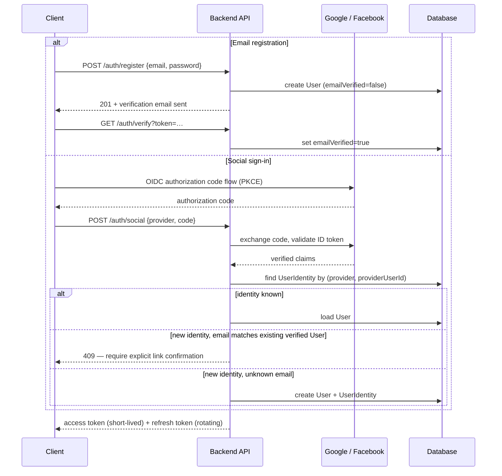
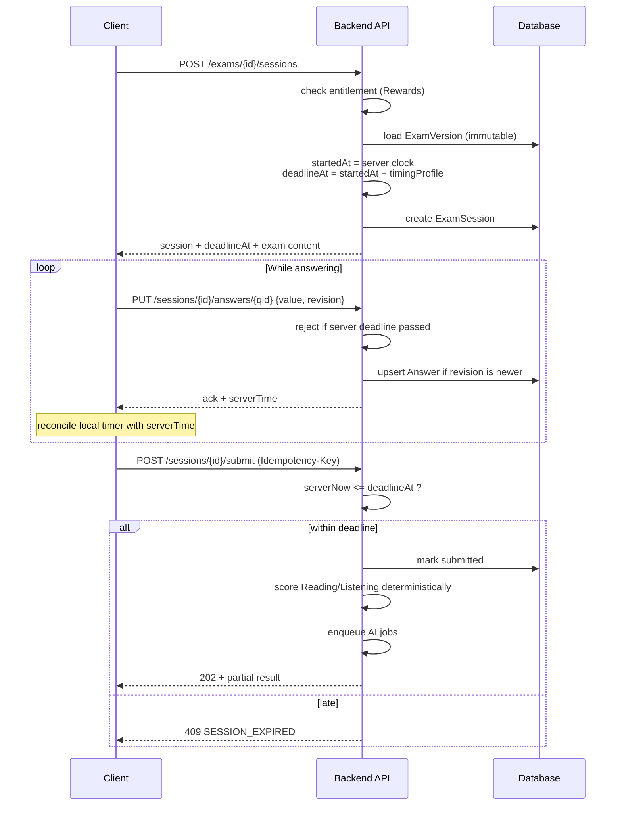
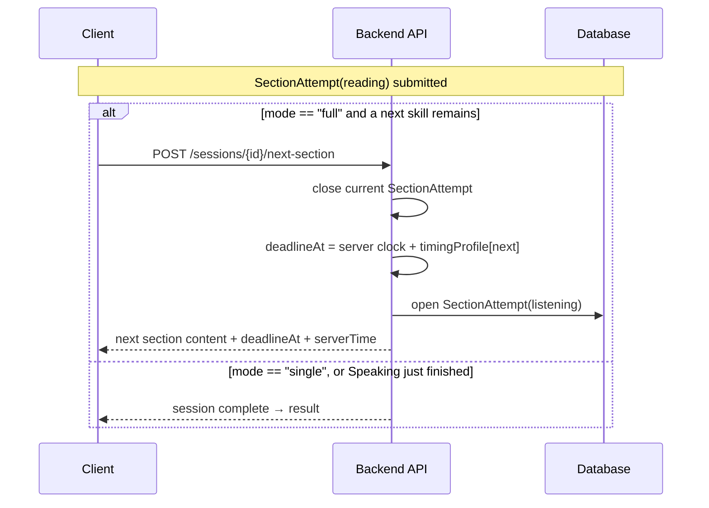
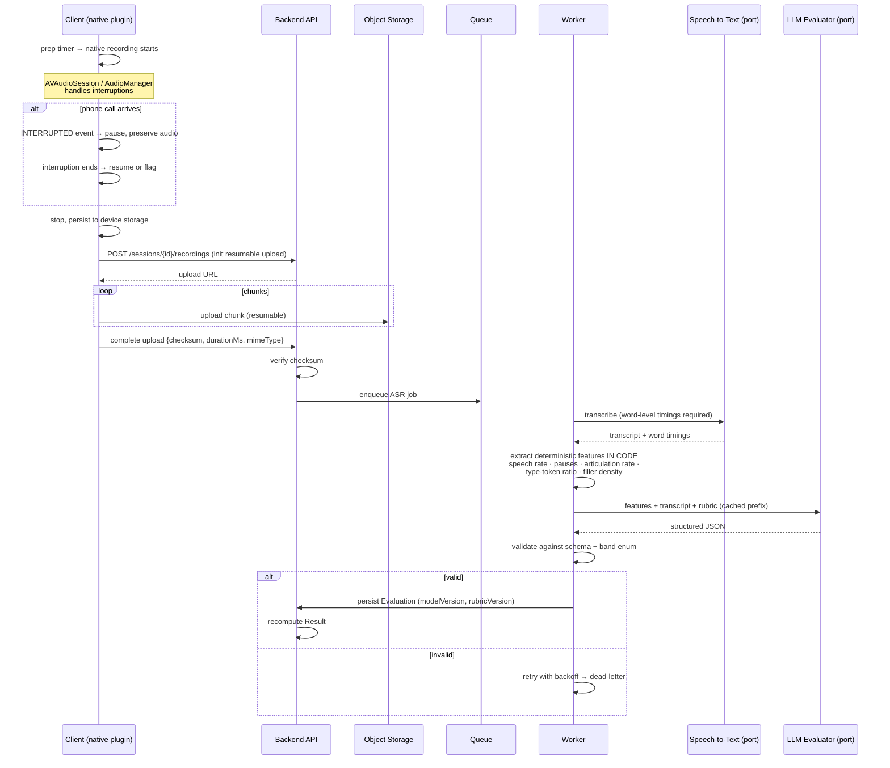
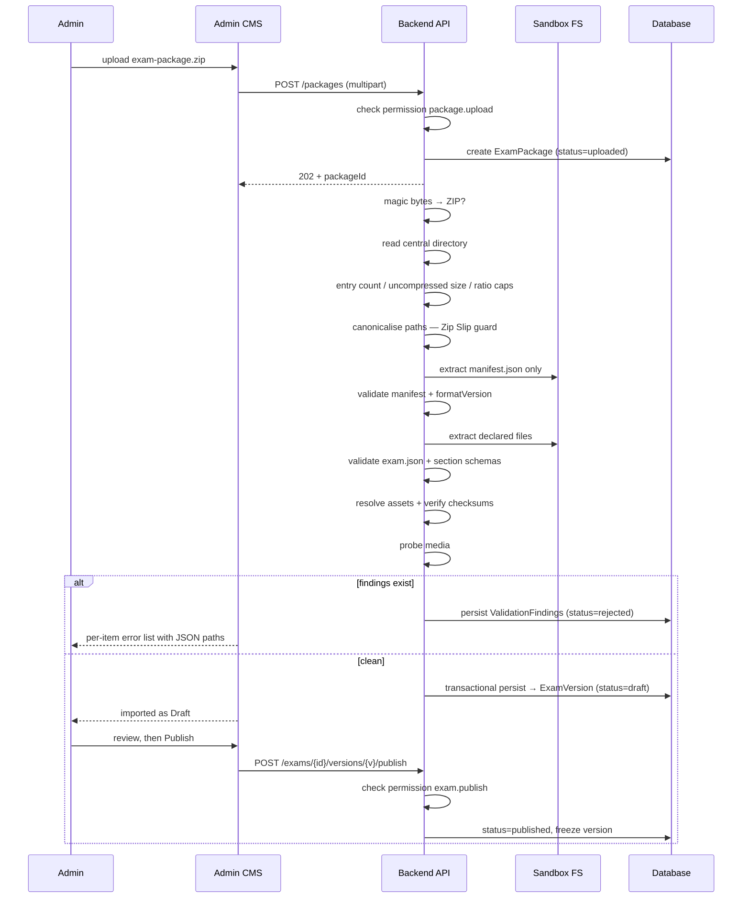
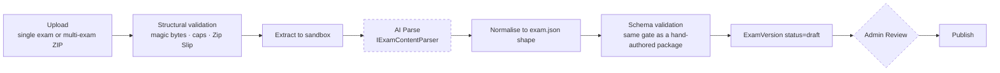
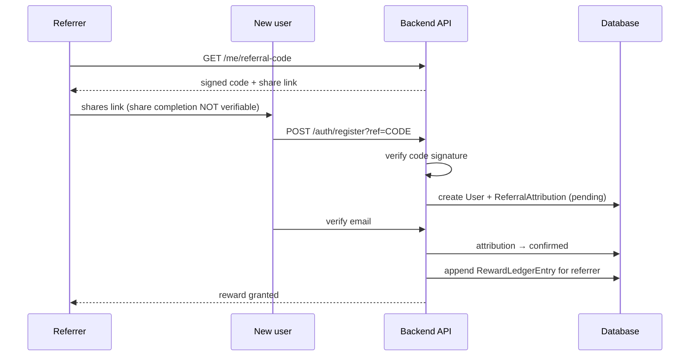
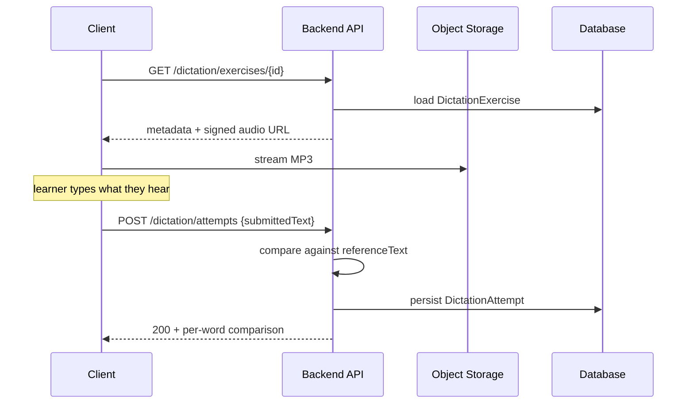
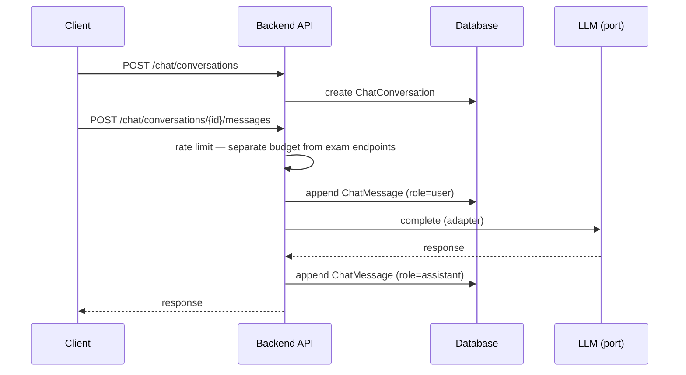

# Key Flows

Sequence diagrams for the flows where getting the design wrong is expensive.

---

## 1. Authentication

**The `409` branch is deliberate.** Silently linking a social identity to an existing account on matching email is a known account-takeover vector — an attacker who controls a social account with a victim's email address would inherit the victim's account. Linking requires proof of ownership of both sides. `[ASSUMPTION]` M-1.

PKCE is used because the mobile clients are public clients and cannot hold a client secret.

---

## 2. Exam session — start to submit

Three properties this flow guarantees:

- **The client never supplies a time.** `startedAt` and `deadlineAt` come from the server clock; every response carries `serverTime` so the client can correct drift ([ADR-0007](../decisions/0007-server-authoritative-exam-timer.md)).
- **Answer saves are revision-checked**, so a reconnecting client replaying a queued save cannot overwrite newer state.
- **Submission is idempotent**, so a retry after a network failure does not create a second submission.

### 2a. Full Test — advancing between skills

**Business rule `CONFIRMED`** (`E-11`…`E-13`): a Full Test runs Reading → Listening → Writing → Speaking inside **one** session. "Next" advances to the next skill in that session. A Single Skill session never auto-advances; its call to action is "new test".

**Mechanism `PROPOSED`** — the endpoint and its shape are a design proposal, not a settled contract:

Three things this must not do:

- **Never let the client choose the next skill.** The order is a property of the session, derived server-side. A client-supplied "next" is a way to skip Writing.
- **Never carry the previous deadline forward.** Each `SectionAttempt` gets a fresh server-derived `deadlineAt`. Reusing the session deadline would silently shorten later skills.
- **Never treat "Next" and "new test" as the same call.** They differ in both entity lifecycle and entitlement: one continues an attempt, the other starts one.

`[OPEN QUESTION]` **H-7a** — whether a break is allowed between skills, and for how long, is undecided. Until it is answered, this flow assumes the next section opens immediately. **H-7b** (timer behaviour when the app is backgrounded between skills) follows from that answer.

---

## 3. Speaking — record to result

Two design points carry most of the value:

**Features are computed in code, not by the model.** Speech rate, pause count and duration, articulation rate, and lexical diversity are arithmetic over ASR word timings. Asking an LLM to infer them from a transcript is more expensive, less accurate, and non-reproducible. It also directly serves IELTS *Fluency and Coherence*, which a bare transcript represents poorly. → [`../ai/speaking-pipeline.md`](../ai/speaking-pipeline.md)

**The interruption branch is not optional.** A phone call during a speaking test is routine, not an edge case. The native plugin distinguishes system `INTERRUPTED` from user `PAUSED`, which is what lets the app recover the recording rather than losing the attempt. → [ADR-0006](../decisions/0006-speaking-audio-capture-native-plugin.md)

---

## 4. CMS — exam package import

**Import always produces `Draft`.** Publishing is a separate permissioned action. Auto-publishing uploaded content straight to learners would remove the only human review point in the pipeline. → [`exam-package-format.md`](exam-package-format.md)

### 4a. AI-assisted parsing — a different pipeline

`I-15a` is **CONFIRMED**: import must include AI-assisted parsing, where AI analyses the uploaded material and produces an exam structure. Everything about *how far it goes* is not.

The flow above assumes a ZIP that is **already schema-correct** — `manifest.json` declares every asset, `exam.json` matches a published schema, and validation is a series of mechanical checks. AI parsing raw source material is a different capability and cannot reuse that pipeline unchanged.

| Step | Status | Note |
|---|---|---|
| Structural validation before anything is read | **unchanged** | Rule 3 in [CLAUDE.md](../../CLAUDE.md) applies in full — the archive is untrusted regardless of what reads it afterwards |
| `AI Parse` | `I-15a` CONFIRMED; extraction fields `PROPOSED` (`I-15b` → `B-7a`) | Port `IExamContentParser` — `PROPOSED` |
| Normalise → schema validation | `PROPOSED` | AI output re-enters the **same** schema gate as a hand-authored package. AI never bypasses validation |
| `Admin Review` before publish | `PROPOSED` (`I-16` → `B-9`) | Drawn dashed because it is a **recommendation awaiting owner confirmation**, not a settled rule |

Two security properties this shape exists to preserve:

- **AI output is validated, not trusted.** The parser produces a *candidate* exam structure that passes through the identical schema and asset checks a human-authored package faces. Rule 2 in [CLAUDE.md](../../CLAUDE.md) is not suspended because the producer happens to be a model.
- **The parser reads attacker-influenced content.** An uploaded document can carry instructions aimed at the model, and the model's output *becomes exam content shown to learners*. This is strictly more dangerous than prompt injection through a learner essay, because the blast radius is every candidate who sits the exam. → threat `T23` in [`../security/threat-model.md`](../security/threat-model.md)

`[BUSINESS DECISION]` **B-7** — input formats, extraction scope, accuracy threshold, and who owns a mis-parse are all undecided. **B-9** — whether Admin Review is mandatory.

---

## 5. Referral attribution — what replaces share-gating

**The reward is triggered by a verified signup, not by a share.** No platform reports share completion ([R1](../requirements/risks-and-dependencies.md#r1)) — `navigator.share()` resolves `undefined`, Facebook's Share Dialog returns only `error_message`, and `@capacitor/share` returns only `activityType`.

Attribution stays `pending` until the referred user verifies their email, which blocks the obvious fraud of self-referring with throwaway addresses.

> **Not implemented.** This flow is the *recommended* replacement and awaits owner decisions B-3 and B-4. → [`../requirements/assumptions-and-open-questions.md`](../requirements/assumptions-and-open-questions.md)

---

## 6. Dictation — audio to score

**Business flow `CONFIRMED`** (`M-22`), quoted from the owner brief: *"nghe viết chính tả thì cho chạy audio mp3 rồi user viết lại và chấm điểm thôi."*

| Property | Status | Why it matters |
|---|---|---|
| Scoring is **synchronous** — no queue, no job | `PROPOSED` | Follows from a deterministic comparison. If scoring later becomes AI-assisted, this becomes asynchronous like Writing |
| **No AI provider required** | `PROPOSED` | An architectural consequence of the proposed algorithm, **not** an owner statement. Do not cite it as a confirmed constraint |
| Word-level comparison algorithm | `PROPOSED` | The owner said only *"chấm điểm"*. The algorithm is a design choice |
| Not part of exam history | `PROPOSED` | Dictation is practice, not an `ExamSession`. It has its own entity precisely so it cannot contaminate band history |

**Deliberately absent:** no lesson plan, no spaced repetition, no difficulty progression. The owner warned explicitly against expanding this into a listening-learning system.

---

## 7. AI Chat — conversation

**Existence `CONFIRMED`** (`M-25`): *"thêm 1 cái nữa là chat với AI."* **Everything else is `UNCONFIRMED`** (`B-6a`…`B-6f`) — scope, provider, token cost, retention, PDPL handling, and MVP priority.

This section records the *shape* so the concept has somewhere to live. It is not a design ready to build.

Four things that must be settled before any of this is built:

- **No natural cost ceiling.** An exam has a fixed number of submissions; a conversation does not. Chat is the only AI feature here where a single user can generate unbounded spend. A per-conversation and per-user budget is required, not optional. → [`../ai/cost-model.md`](../ai/cost-model.md)
- **Chat logs are personal data.** Sending them to a foreign provider is a cross-border transfer carrying the same CTIA obligation as learner audio. → [`../security/privacy-vietnam-pdpl.md`](../security/privacy-vietnam-pdpl.md)
- **Free-form input is the widest injection surface in the product.** Unlike an essay, the learner is *intentionally* addressing the model. → threat `T24` in [`../security/threat-model.md`](../security/threat-model.md)
- **Rate limiting must be separate from exam endpoints.** `nfr.md` requires generous limits for in-session content reads so a timed exam is never throttled. Chat must not inherit that generosity.

`[PROPOSED]` port `IChatCompletion`, with streaming support. `B-1` selected GPT + Gemini for LLM **evaluation** (2026-08-20); whether chat uses the same providers is its own open decision (`B-6b`). The Claude API is excluded by owner decision.
