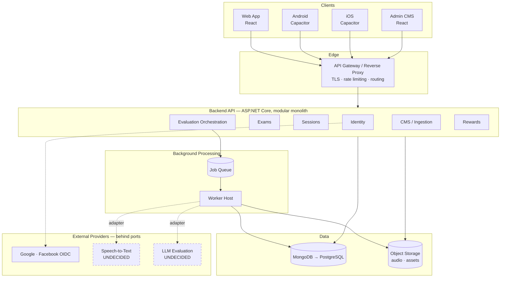
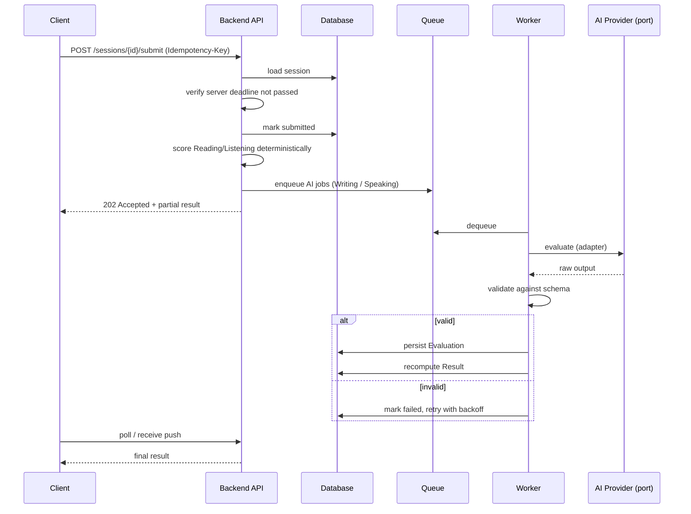
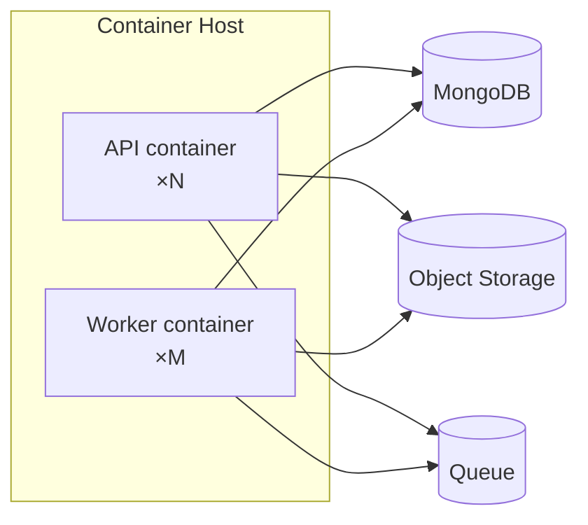

# System Architecture

## Guiding constraint

Requirements G-1, G-2, and D-5 all point the same direction: **prefer simple architecture that can evolve; do not prematurely build elaborate Clean Architecture.** The architecture below is deliberately modest. It has exactly one strict boundary (persistence) and one strict rule (AI is never trusted state). Everything else is conventional.

---

## Logical architecture

Dashed external AI providers are **undecided**, and the Claude API is excluded by owner decision. The architecture depends on ports, not vendors. → [ADR-0005](../decisions/0005-ai-provider-abstraction.md)

---

## Why a modular monolith

| Option | Verdict |
|---|---|
| **Modular monolith** | **Chosen.** Team size is small, the domain is still moving, and every module shares one transactional database. Module boundaries are enforced in code, so extraction stays possible |
| Microservices | Rejected. Distributed transactions and operational overhead for a product whose entity model is explicitly expected to change |
| Serverless functions | Rejected for the API. Speaking evaluation is long-running and stateful-ish; cold starts hurt an exam timer |

The one component that runs **out-of-process** is the worker host, because AI evaluation is long-running and must not occupy request threads or be lost on deploy.

---

## Component responsibilities

| Module | Owns | Never does |
|---|---|---|
| **Identity** | Users, identities, roles, permissions, tokens | Business decisions about entitlement |
| **Exams** | Definitions, versions, sections, questions, answer keys, scoring/timing profiles | Grade a submission |
| **Sessions** | Session lifecycle, **server-authoritative timing**, answer persistence, submission | Compute AI scores |
| **Evaluation** | Deterministic scoring, AI job orchestration, output validation, `Result` composition | Call a vendor SDK directly — always via a port |
| **CMS** | Package ingestion, validation, publishing, audit | Bypass Exams' invariants |
| **Rewards / Token** | Entitlement balance, referral attribution, append-only ledger | Anything, yet — no charging rules defined (`B-5`) |

### Modules added by the 2026-08-20 brief — all `PROPOSED`

The six modules above predate the brief. Four learner-facing capabilities were added and none has a home yet:

| Module | Owns | Where it belongs |
|---|---|---|
| **Dictation** | Dictation exercises, attempts, deterministic comparison | Its own module. Deliberately **not** inside Sessions — dictation is practice, and mixing it into `ExamSession` would let it contaminate band history |
| **Content** | Articles and downloadable documents | One module, not two. Both are admin-published, learner-read, and storage-backed; splitting them would duplicate the same three operations |
| **Chat** | Conversations, messages, provider orchestration | Its own module. Scope is `UNCONFIRMED` (`B-6`), so it is drawn as a boundary rather than a design |
| **Import parsing** | AI-assisted parsing of uploaded material | **Inside CMS**, not a peer module. It is a front end to the existing ingestion pipeline, and its output re-enters the same validation gates (`I-15a`) |

Two placements that would be wrong:

- **Dictation inside Sessions.** They share the shape "learner submits, system scores" and nothing else — no timer authority, no entitlement check, no band conversion, no exam version. The overlap is superficial.
- **Chat inside Evaluation.** Evaluation exists to produce scores that become application state under validation. Chat produces conversation. Putting them together would drag chat under the scoring trust model, which does not fit and would obscure the one rule that matters there: nothing chat returns is ever application state.

---

## Data flow — exam submission

**Reading and Listening return immediately** because they are deterministic. Writing and Speaking are asynchronous. The learner sees partial results at once rather than waiting on the slowest module — which matters because Speaking evaluation is the long pole.

---

## Cross-cutting concerns

| Concern | Approach |
|---|---|
| AuthN/AuthZ | Centralised in the API (requirement AU-4). Short-lived access tokens, rotating refresh tokens |
| Authorisation model | RBAC with `resource.action` permissions checked at the use-case boundary, not in controllers |
| Validation | Request DTO validation at the edge; domain invariants in the domain layer |
| Idempotency | `Idempotency-Key` on all non-GET state-changing endpoints |
| Errors | Single problem-details envelope, stable machine-readable codes |
| Observability | Structured logs with correlation IDs; AI jobs additionally record `modelVersion`, `rubricVersion`, latency, token/minute usage |
| Configuration | Environment-based. **No AI credentials exist yet** — see [CLAUDE.md](../../CLAUDE.md) rule 6 |
| Background work | Queue + worker host, retries with exponential backoff, dead-letter queue |
| File storage | Object storage for audio and exam assets. Never in the database, never on the app server's local disk |

→ Detail: [`../api/api-design-principles.md`](../api/api-design-principles.md) and [`../development/nfr.md`](../development/nfr.md)

---

## Deployment shape (MVP)

API and worker scale **independently** — this is the main reason they are separate processes. A burst of Speaking submissions should add workers, not API instances.

`[ASSUMPTION]` Docker-based deployment; the specific host is undecided. Note that a Vietnam-hosted or self-hosted deployment target may be forced by the PDPL analysis. → [`../security/privacy-vietnam-pdpl.md`](../security/privacy-vietnam-pdpl.md)

---

## Technical stack — status summary

Every row carries a status. Nothing here is implemented; the repository has no product source code.

### Confirmed by the owner

| Layer | Choice | Source |
|---|---|---|
| Backend framework | .NET / ASP.NET Core | Owner brief 2026-08-20: *"Backend: .NET, MongoDB. Không thay framework"* |
| Database, Phase 1 | MongoDB | Owner brief 2026-08-20 |

### Existing accepted decisions

`EXISTING` here means the **decision** exists as an accepted ADR — not that anything is built.

| Choice | ADR |
|---|---|
| .NET **10** specifically (LTS → 2028-11-14) | [0001](../decisions/0001-backend-dotnet10-aspnetcore.md) |
| Capacitor 8 + React + TypeScript | [0002](../decisions/0002-client-capacitor-react.md), re-evaluated 2026-08-20, unchanged |
| PostgreSQL as the migration target | [0003](../decisions/0003-database-mongodb-first-postgresql-target.md) |
| One strict persistence boundary | [0004](../decisions/0004-persistence-abstraction-boundary.md) |
| AI ports mandatory, provider deferred | [0005](../decisions/0005-ai-provider-abstraction.md) |
| Native audio plugin, not WebView `MediaRecorder` | [0006](../decisions/0006-speaking-audio-capture-native-plugin.md) |

> The owner said *".NET"* and *"MongoDB"*. **.NET 10** and **PostgreSQL-as-target** are engineering decisions recorded in ADRs, not business requirements — which is why they sit in this table rather than the one above.

### Recommended — `PROPOSED`, awaiting requirement freeze

| Area | Recommendation | Detail |
|---|---|---|
| Job queue | MongoDB-backed at MVP | [`backend-architecture.md`](backend-architecture.md) |
| Auth libraries | Built-in JWT + OIDC handlers; defer Duende | [`backend-architecture.md`](backend-architecture.md) |
| Validation · logging · telemetry | FluentValidation · Serilog · OpenTelemetry | [`backend-architecture.md`](backend-architecture.md) |
| Frontend | Vite + React + TS · React Router · TanStack Query · react-hook-form · no global state library | [`client-architecture.md`](client-architecture.md) |
| Object storage | `IObjectStorage` port over an S3-compatible API; MinIO for local development | below |
| New AI ports | `IChatCompletion` · `IExamContentParser` · `ITextToSpeech` | [`../ai/ai-architecture.md`](../ai/ai-architecture.md) |
| Mongo document shape | Embed `ExamVersion` content and `SectionAttempt`; separate collections for `Answer`, `ChatMessage`, and the token ledger | [`../database/strategy-mongodb-to-postgresql.md`](../database/strategy-mongodb-to-postgresql.md) |

### Open technology decisions

| ID | Question | Owner |
|---|---|---|
| `B-1` | AI provider (Claude API excluded) | Product |
| `B-11` | Data residency — must learner data stay in Vietnam? | Product / Legal |
| `H-9` | Accept a MongoDB-backed queue, or adopt a broker now? | Engineering |
| `H-10` | MongoDB topology — standalone or single-node replica set? Decides the transaction design | Engineering |
| `H-11` | Object storage vendor and hosting, **after** `B-11` | Engineering |
| `R13` | Version control for this repository | Engineering |

### Deferred — not rejected

Each carries a stated trigger, so the question does not have to be re-argued from scratch later.

| Technology | Revisit when |
|---|---|
| Kafka · RabbitMQ · Redis Streams | Measured queue depth or job latency exceeds the `nfr.md` targets |
| Redis for caching or sessions | A metric demonstrates the need — not a prediction that one might appear |
| Kubernetes · service mesh · autoscaling | Manual scaling stops covering a few hundred concurrent sessions |
| Multi-region · read replicas · CDN | A measured bottleneck. Multi-region also depends on `B-11` |
| Distributed tracing | Correlation IDs stop being enough to follow a request |
| Redux · Zustand | Client state genuinely outgrows React state plus TanStack Query |
| Duende IdentityServer | The product needs to *be* an identity provider for third parties — check `V-9` first |

### Rejected outright

Closed with reasoning; not open for re-litigation without new evidence.

| Rejected | Because |
|---|---|
| Flutter | The CMS is a data-heavy web surface; using Flutter there would **add** a frontend codebase rather than consolidate. → [ADR-0002](../decisions/0002-client-capacitor-react.md) |
| WebView `MediaRecorder` | iOS mutes microphone capture shortly after backgrounding — disqualifying for a timed exam. → [ADR-0006](../decisions/0006-speaking-audio-capture-native-plugin.md) |
| Microservices · event sourcing · CQRS read models · GraphQL | Small team, moving domain, no read-scale problem. → *What is deliberately absent*, below |
| Generic `IRepository` · Unit of Work · Specification pattern | Leak storage semantics; unnecessary at this scale. → [`backend-architecture.md`](backend-architecture.md) |

---

## Infrastructure plan — `PROPOSED`

Sized to the MVP targets in [`../development/nfr.md`](../development/nfr.md): low hundreds of concurrent sessions, 99.5% availability, manual scaling. Deliberately modest.

### `B-11` gates the whole stack — and it now has a hard constraint

**Verified 2026-08-20: MongoDB Atlas has no Vietnam region.** Atlas covers Singapore, Hong Kong, Japan, Indonesia, Malaysia, Thailand and others across Southeast Asia; Vietnam is not among them ([MongoDB Atlas cloud providers and regions](https://www.mongodb.com/docs/atlas/cloud-providers-regions/) · [MongoDB SEA expansion](https://vietnamnews.vn/media-outreach/1694498/mongodb-expands-availability-of-mongodb-atlas-in-southeast-asia-to-support-accelerated-regional-growth.html)).

That turns `B-11` from a preference into a fork with real operational cost:

| | **A — data must stay in Vietnam** | **B — Singapore acceptable** |
|---|---|---|
| Database | **Self-hosted MongoDB** on a Vietnamese provider. No managed option exists | **MongoDB Atlas**, Singapore region |
| Who runs the replica set, backups, upgrades, monitoring | **You do** | Vendor |
| Object storage | Viettel Cloud · FPT Cloud · CMC Cloud · VNG — **all S3-compatible** | Same, or AWS S3 / GCS Singapore |
| Compute | Vietnamese provider container hosting | AWS / GCP / Azure Singapore |
| Latency to learners | **Better** — Hanoi/HCMC beats Singapore noticeably for small files | ~30–50 ms worse |
| Latency to OpenAI / Gemini | Worse | Better |
| Operational burden | **Materially higher** | Lower |

Sources for the Vietnamese options: [Viettel Cloud Object Storage](https://docs.viettelcloud.vn/documentation/Storage/ObjectStorage/home) (S3 protocol, full API) · [CMC Cloud](https://ensun.io/search/cloud-computing/vietnam).

> **The honest read:** Scenario A costs you a database team you do not have. If `B-2` (legal opinion) does not actually require in-country storage, Scenario B is the better engineering trade — and note that learner essays already leave the country for evaluation either way, so A does not buy the privacy win it appears to. → [`../security/privacy-vietnam-pdpl.md`](../security/privacy-vietnam-pdpl.md)
>
> Choosing storage **behind the `IObjectStorage` port over an S3-compatible API** keeps that half of the decision reversible regardless of which scenario wins. The database half is not reversible in the same way, which is why `B-11` should wait for `B-2` rather than be guessed.

### Environments

| Environment | Purpose | Data |
|---|---|---|
| **Local** | Development. `docker compose` — MongoDB single-node replica set, MinIO, API, worker | Fixtures only |
| **Staging** | Integration testing, exam-package import rehearsal, AI adapter testing | **Synthetic only** — this is where the reseller `baseURL` is used, and rule 6 forbids real learner data through it |
| **Production** | Live | Real |

Two deployed environments is the minimum. Staging exists mainly because **importing an exam package and publishing it are irreversible-ish operations** that need a rehearsal surface — and because AI adapters cannot be tested against production learner data.

Run MongoDB as a **single-node replica set even locally** (`rs0`), so transactions behave the same in every environment. → `H-10`

### Components

| Component | Choice | Note |
|---|---|---|
| API | Container, ×N | Stateless, scales horizontally |
| Worker | Container, ×M | **Separate process** — scales independently of the API |
| Database | MongoDB, replica set | Topology per `H-10`; hosting per `B-11` |
| Queue | **MongoDB-backed** | No broker at MVP → `H-9` |
| Object storage | S3-compatible behind `IObjectStorage` | Vendor per `H-11` |
| Reverse proxy | TLS termination, rate limiting | A proxy, not an API-gateway product |
| Secrets | Environment configuration; a secret manager once a host is chosen | Never committed — enforced by the `.env*` hook |
| Monitoring | OpenTelemetry → collector | Backend unchosen; OTel keeps it swappable |
| CI/CD | **Nothing exists** | Blocked on `R13` — there is no repository to build from |

### Egress to AI providers

Both providers are US-based, so every evaluation crosses the Pacific.

- **Writing and Speaking evaluation are asynchronous**, run in the worker, and already budget 60 s and 2 min medians. Round-trip latency is irrelevant there.
- **AI Chat is not.** It is interactive and streamed, so base latency is felt directly by the learner. If chat latency becomes a problem, that is an argument for hosting closer to the providers — the opposite direction from `B-11` Scenario A.
- **Egress volume is small** — text prompts and responses. Audio upload goes to object storage, not to the AI provider, and only the ASR job sends audio onward.

### Backup and recovery

`nfr.md` specifies daily backups with a **tested restore**. Two things that are easy to miss:

1. **Object storage needs backing up too.** A database restore that points at deleted audio and PDFs is not a restore. Retention-class prefixes make this tractable.
2. **Under Scenario A you own backup entirely** — schedule, verification, off-site copy. Under Scenario B most of it is a vendor setting. This is the single largest hidden cost difference between the two.

### What is deliberately not built

Kubernetes · service mesh · autoscaling · multi-region · read replicas · CDN · distributed tracing · a message broker. Each with a measured revisit trigger in [§ Deferred](#deferred--not-rejected) above. At a few hundred concurrent sessions, every one of these adds an operational surface with nothing to show for it.

---

## Object storage

`PROPOSED`. Object storage from day one is already established in [`../development/nfr.md`](../development/nfr.md); the shape below is new.

**An `IObjectStorage` port over an S3-compatible API**, so the vendor stays swappable — which matters because `B-11` may rule out foreign hosting entirely and the answer is not yet known. MinIO covers local development against the same API.

| Content | Retention class |
|---|---|
| Learner audio (m4a / webm) | 90 days `[ASSUMPTION]` M-2 |
| Transcripts and AI artifacts | 2 years |
| Exam assets — audio, images | Lifetime of the `ExamVersion` |
| Documents (PDF) | Lifetime of the resource |
| Dictation audio (MP3) | Lifetime of the exercise |
| Uploaded ZIP packages | Retained for audit after import `[ASSUMPTION]` |

**Separate buckets or prefixes per retention class, not per content type.** Deletion obligations run along retention lines: PDPL storage limitation and a data-subject deletion request both have to reach object storage, not just the database ([`../development/nfr.md`](../development/nfr.md) § Privacy). A layout organised by retention makes deletion a policy on a prefix; a layout organised by file type makes it a scan.

**Binary content is never embedded in the database.** Exam packages reference assets by storage key, and the manifest carries a checksum per asset — this is already how [`exam-package-format.md`](exam-package-format.md) works, and it is what keeps `ExamVersion` documents small enough to embed their content.

---

## What is deliberately absent

| Not built | Why |
|---|---|
| Event sourcing | The audit requirement (C-12) is satisfied by an `AuditEvent` log and an append-only reward ledger |
| CQRS with separate read models | No read-scale problem exists at MVP volumes |
| Service mesh / API gateway product | A reverse proxy with TLS and rate limiting is sufficient |
| GraphQL | Clients are first-party; REST with well-shaped endpoints is simpler to version and cache |
| Separate microservice per module | Module boundaries in code preserve the option without paying the cost now |
