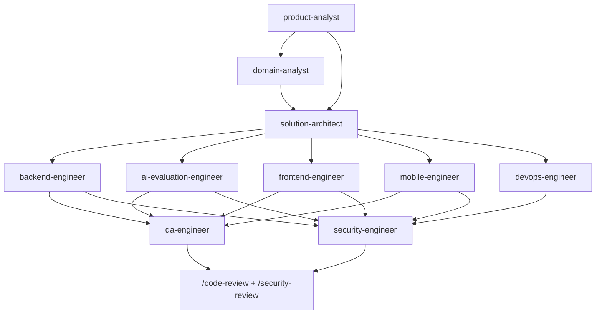
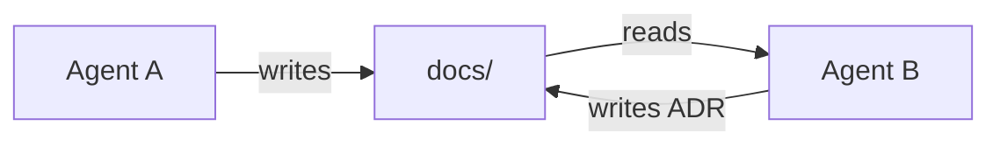

# Agent Orchestration

Ten Claude Code agents. Each owns distinct artifacts and guards against a distinct failure mode.

Requirement G-10: *do not create unnecessary agents.* The test applied to each was: **does this agent own outputs nobody else owns, and does it catch a class of mistake the others would miss?** An agent that only rephrases the main session's work is not justified.

---

## Roster

| Agent | Owns | Catches |
|---|---|---|
| `product-analyst` | Product framing, scope, user flows, screen inventory, Stitch briefs | Building the wrong thing well |
| `domain-analyst` | IELTS domain model, exam structure, band scoring, package format | Hard-coding rules that must be configuration |
| `solution-architect` | System architecture, ADRs, module boundaries, migration strategy | Over-engineering, and boundary erosion |
| `backend-engineer` | ASP.NET Core implementation, API design, persistence | Persistence types leaking past `Infrastructure` |
| `ai-evaluation-engineer` | AI pipelines, prompts, output schemas, cost model | Trusting model output; provider lock-in |
| `frontend-engineer` | React web + Admin CMS | Missing error/empty states; accessibility gaps |
| `mobile-engineer` | Capacitor, native plugins, audio, offline | WebView audio assumptions; client-authoritative timing |
| `qa-engineer` | Test strategy, E2E, calibration sets | Untested failure paths |
| `security-engineer` | Threat model, ZIP security, AI security, PDPL | Untrusted input treated as trusted |
| `devops-engineer` | Docker, CI/CD, environments, observability | Unobservable systems; unsafe deploys |

**No custom `code-reviewer`** — Claude Code's built-in `/code-review` and `/security-review` already cover it, and a custom one would compete with them.

---

## Dependency graph

### What can run in parallel

| Stage | Parallel | Why |
|---|---|---|
| Discovery | `product-analyst` ∥ `domain-analyst` | Product framing and IELTS domain research are independent |
| Design | `solution-architect` alone | Must reconcile both inputs — parallelising here produces conflicting architectures |
| Build | `backend-engineer` ∥ `ai-evaluation-engineer` ∥ `frontend-engineer` ∥ `mobile-engineer` ∥ `devops-engineer` | Separated by the API contract |
| Verify | `qa-engineer` ∥ `security-engineer` | Different concerns, same inputs |
| Review | `/code-review` then `/security-review` | Sequential — security reviews the reviewed code |

### What must wait

| Agent | Blocked until |
|---|---|
| `solution-architect` | Domain model and product scope exist |
| `backend-engineer` | Architecture and API contract agreed |
| `frontend-engineer` / `mobile-engineer` | API contract agreed |
| `ai-evaluation-engineer` | **Provider decided and credentials supplied** (B-1) — hard block |
| `qa-engineer` | Something exists to test |
| `security-engineer` | Something exists to threat-model |

The `ai-evaluation-engineer` block is absolute: it may design pipelines, schemas, and cost models, but may not write a provider adapter or make an API call. → [CLAUDE.md](../../CLAUDE.md) rule 6

---

## Artifacts by agent

| Agent | Produces |
|---|---|
| `product-analyst` | `docs/product/*`, and `docs/ux/*` once that directory is rebuilt |
| `domain-analyst` | `docs/domain/*`, `docs/architecture/exam-package-format.md` |
| `solution-architect` | `docs/architecture/*`, `docs/decisions/*`, `docs/database/*` |
| `backend-engineer` | `docs/api/*`, backend source (Phase 4+) |
| `ai-evaluation-engineer` | `docs/ai/*`, evaluation source (Phase 7+) |
| `frontend-engineer` | Web + CMS source (Phase 5/8) |
| `mobile-engineer` | `docs/architecture/client-architecture.md`, mobile source (Phase 9) |
| `qa-engineer` | Test strategy, test suites, calibration sets |
| `security-engineer` | `docs/security/*`, security tests |
| `devops-engineer` | `docs/development/nfr.md`, CI/CD, container config |

**Agents write to `docs/` and to source. They do not edit each other's artifacts** — a change to another agent's document is raised as a finding, not applied directly. This is what keeps ownership meaningful.

---

## How agents communicate

Through **artifacts in `docs/`**, not conversation. This matters because agent context does not persist between invocations — a decision recorded only in a transcript is lost.

Three rules:

1. **Decisions become ADRs.** An architectural decision that exists only in a conversation did not happen.
2. **Unresolved items get tagged** with one of the five tags and, if owner-blocking, added to `assumptions-and-open-questions.md`.
3. **Cross-agent disagreements become findings**, recorded in the relevant document, not resolved unilaterally.

---

## Conflict resolution

| Conflict | Resolution |
|---|---|
| Two agents disagree on a technical approach | `solution-architect` decides; records an ADR |
| Architecture vs security | **Security wins by default.** An architecture that cannot be secured is not viable. Documented exceptions require an ADR |
| Architecture vs product scope | `product-analyst` clarifies intent; architect adapts or escalates |
| Cost vs quality (AI) | Escalate to owner — this is a business trade-off, not a technical one |
| Anything vs an owner decision | Owner wins. Record the constraint |

The security-wins default is deliberate. Security concerns are routinely traded away under delivery pressure precisely because the cost of ignoring them is deferred.

---

## Keeping requirements consistent

The mechanism against drift is that **`docs/` is canonical and singular**:

- Requirements live in `docs/requirements/` only.
- Any agent finding a contradiction records it in `assumptions-and-open-questions.md` rather than picking an interpretation.
- Every `[BUSINESS DECISION]` and `[OPEN QUESTION]` funnels into that one file — the owner's action list.
- Resolved items are edited in place, keeping the history of what was once uncertain.

---

## Phase-to-agent mapping

| Phase | Lead | Supporting |
|---|---|---|
| 0 — Research | `solution-architect` | `domain-analyst`, `security-engineer` |
| 1 — Stitch UI/UX | `product-analyst` | `frontend-engineer` |
| 2 — Requirement freeze | `product-analyst` | all |
| 3 — Technical spec | `solution-architect` | `backend-engineer`, `ai-evaluation-engineer` |
| 4 — Backend foundation | `backend-engineer` | `devops-engineer`, `security-engineer` |
| 5 — CMS | `backend-engineer`, `frontend-engineer` | `security-engineer` |
| 6 — Exam engine | `backend-engineer` | `domain-analyst`, `qa-engineer` |
| 7 — AI assessment | `ai-evaluation-engineer` | `backend-engineer`, `security-engineer` |
| 8 — Web client | `frontend-engineer` | `qa-engineer` |
| 9 — Mobile | `mobile-engineer` | `qa-engineer` |
| 10 — QA / Security | `qa-engineer`, `security-engineer` | all |
| 11 — Production | `devops-engineer` | all |

→ [`roadmap.md`](roadmap.md)

---

## When *not* to use an agent

Delegation has a cost — context transfer, and a report that must be read and reconciled. Work directly in the main session for:

- Single-file edits
- Answering a question about existing documentation
- Small, well-scoped changes
- Anything where explaining the task takes longer than doing it

Use an agent when the work needs sustained focus in a specialised area, spans many files, or benefits from an independent perspective — a security review of your own design being the clearest example.
