# Development Roadmap

Adjusted from the outline in requirement §21L based on what the Phase 0 research found. Changes from the original outline are noted and justified.

---

## Overview

```mermaid
gantt
    title VNI IELTS AI — phase sequence
    dateFormat X
    axisFormat %s

    section Foundation
    P0 Research                :done, p0, 0, 1
    P1 Stitch UI/UX            :p1, after p0, 1
    P2 Requirement freeze      :crit, p2, after p1, 1
    P3 Technical spec          :p3, after p2, 1

    section Build
    P4 Backend foundation      :p4, after p3, 1
    P5 CMS + ingestion         :p5, after p4, 1
    P6 Exam engine             :p6, after p4, 1
    P7 AI assessment           :crit, p7, after p6, 1

    section Clients
    P8 Web client              :p8, after p6, 1
    P9 Mobile clients          :p9, after p8, 1

    section Release
    P10 QA + Security          :p10, after p9, 1
    P11 Production             :p11, after p10, 1
```



Two phases are marked critical for different reasons: **P2** because everything downstream depends on it, and **P7** because it is externally blocked.

---

## Phase 0 — Research and foundation ✅

Repository state, domain research, architecture decisions, AI environment setup.

**Exit criteria:** documentation structure exists · ADRs recorded · owner action list produced · Claude/Cursor configured.

---

## Phase 1 — UI/UX

Design the product visually before specifying it technically (requirement W-1/W-2).

> **Tooling changed.** W-1 named Google Stitch. It was evaluated and dropped — non-deterministic output from identical prompts, no API for deleting screens, and it reinterpreted `DESIGN.md` rather than following it. The current prototype is hand-written HTML/CSS/JavaScript, which is deterministic and honours the design tokens because they live in CSS. → [`next-actions.md`](next-actions.md) T3

Priority order — first five surface the open decisions, the rest are conventional:

1. Speaking flow, including interruption and upload states
2. Results flow, including partial and failed states
3. Exam session shell, including offline and resume
4. Package upload and validation (CMS)
5. Rewards and referral — to *provoke* decisions B-3/B-4
6. Everything else

**Exit criteria:** a `DESIGN.md` the product owner is happy with · priority screens designed **including failure states** · exported for stakeholder review.

`[NOTE]` The first attempt at this phase was removed on 2026-08-18 — design language and prototype both discarded, to be reworked from scratch.

---

## Phase 2 — Requirement freeze 🔴

The gate everything downstream depends on. Walk in with [`../requirements/assumptions-and-open-questions.md`](../requirements/assumptions-and-open-questions.md) as the agenda.

**Must be resolved:**

| Item | Blocks |
|---|---|
| **B-1** AI provider + credentials | Phase 7 entirely |
| **B-2** PDPL cross-border position | B-1, and launch |
| **B-3** Share-gating replacement | Rewards design |
| **B-4** Subscription/reward rules | Entitlement logic |
| **H-1** Exam structure and catalogue | Domain finalisation |
| **H-3** Speaking evaluation depth | AI scope and cost |
| **H-4** Band conversion table source | Scoring correctness |

**Exit criteria:** every blocking item resolved · scope agreed · domain model frozen.

> **Do not begin Phase 4 before this gate closes.** Building against a moving domain model is the failure mode this whole sequencing exists to avoid.

---

## Phase 3 — Technical specification

API contract (OpenAPI), finalised domain model, PostgreSQL schema design (now permitted — requirements are frozen), test strategy, infrastructure plan.

**Exit criteria:** OpenAPI spec agreed · domain model frozen · ADRs updated.

---

## Phase 4 — Backend foundation

Solution structure, layering, **architecture tests enforcing the persistence boundary**, MongoDB persistence, authentication (email + Google + Facebook), RBAC, error handling, idempotency, observability, CI/CD, Docker.

**Exit criteria:** authenticated API deployable · architecture tests passing · CI green.

> **Provision Xcode and an Apple Developer account during this phase**, not at Phase 9. The native audio plugin — the highest-risk technical assumption in the product — cannot be validated on real devices without it, and discovering a problem at Phase 9 is far more expensive than at Phase 4. **This is a change from the original outline.**

---

## Phase 5 — CMS and content ingestion

`[CHANGED]` **Moved before the exam engine.** The original outline placed CMS after the exam engine. Reversing it means the exam engine is developed against real imported content rather than hand-written fixtures — which exercises the package format early, when changing it is still cheap.

Admin CMS shell, user/role/permission management, exam authoring, **package upload and the full validation pipeline**, publish/unpublish, audit logging.

**Exit criteria:** an exam package imports end to end · security tests for ZIP handling pass · publishing works.

---

## Phase 6 — Exam engine

Session lifecycle, **server-authoritative timing**, answer persistence with revisions, submission with idempotency, deterministic Reading/Listening scoring, band conversion, result composition, score history.

**Exit criteria:** a full exam can be taken and scored without AI · timer manipulation tests pass.

> Reading and Listening are fully functional here **without any AI**. This is a deliberate property of the design: a working product exists before the externally-blocked phase begins.

---

## Phase 7 — AI assessment 🔴 externally blocked

**Cannot start until B-1 and B-2 are resolved.** No provider, no credentials, no legal position.

Provider adapters behind existing ports, ASR integration, **deterministic feature extraction**, Writing and Speaking evaluation, output validation, versioning, cost instrumentation, admin evaluation inspection.

**Exit criteria:** end-to-end evaluation working · **cost per evaluation measured, not estimated** · calibration set established · consistency ≥ target.

Before committing to a provider, run the combined evaluation described in [`../ai/cost-model.md`](../ai/cost-model.md): 20–30 real learner recordings spanning bands 4–8, measuring both ASR accuracy on Vietnamese-accented English and actual end-to-end cost. Published benchmarks do not answer either question.

---

## Phase 8 — Web client

Learner web app, exam-taking UI per module, results and feedback, score history, offline tolerance, accessibility.

**Exit criteria:** full exam journey on web · E2E tests pass · accessibility audit clean.

---

## Phase 9 — Mobile clients

Capacitor Android and iOS builds, **native audio plugin integration**, resumable upload, background/interruption handling, push notifications, store submission.

**Exit criteria:** full journey on physical devices · **audio capture validated including phone-call interruption and backgrounding** · store review passed.

> `[TECHNICAL RISK]` If Phase 4 provisioning did not happen, this phase begins with an unvalidated assumption about the riskiest component in the product.

---

## Phase 10 — QA and security

Full regression, load testing, penetration testing, **AI red-teaming (prompt injection)**, PDPL compliance verification, monitoring and alerting, runbooks.

**Exit criteria:** security review passed · load targets met · **CTIA filed if transferring** · rollback tested.

---

## Phase 11 — Production

Production infrastructure, data migration if needed, monitoring, staged rollout, support processes.

**Exit criteria:** production stable · alerting verified · support ready.

---

## Post-launch — PostgreSQL migration

`[CHANGED]` The original outline did not place this explicitly. It runs **after requirement freeze and before significant production data accumulates** — migrating a large production dataset is a materially harder project than migrating a small one.

If launch precedes the migration, the cost rises sharply. → [`../database/migration-plan.md`](../database/migration-plan.md)

---

## Changes from the §21L outline

| Change | Reason |
|---|---|
| CMS (P5) before exam engine (P6) | Develops the exam engine against real imported content; exercises the package format while it is still cheap to change |
| Xcode provisioning pulled into P4 | The highest-risk technical assumption cannot be validated without it; discovering a problem at P9 is far more expensive |
| P7 explicitly marked externally blocked | It is, and pretending otherwise would produce a schedule that cannot hold |
| PostgreSQL migration given an explicit slot | Timing determines its cost |
| Failure states elevated in P1 | The prototype's job is to provoke decisions, and failure states are where the decisions hide |

---

## Critical path

```
P0 → P1 → P2 → P3 → P4 → P6 → P8 → P9 → P10 → P11
                            ↘ P5 ↗
                              P7 (blocked on B-1, B-2)
```

**P2 is the true bottleneck.** Seven blocking decisions funnel through it, and none is technical — they are all owner decisions. The most useful thing that can happen between now and then is those decisions being made.
