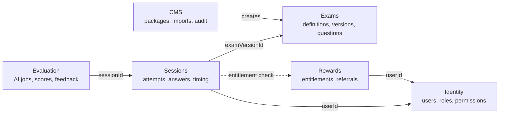
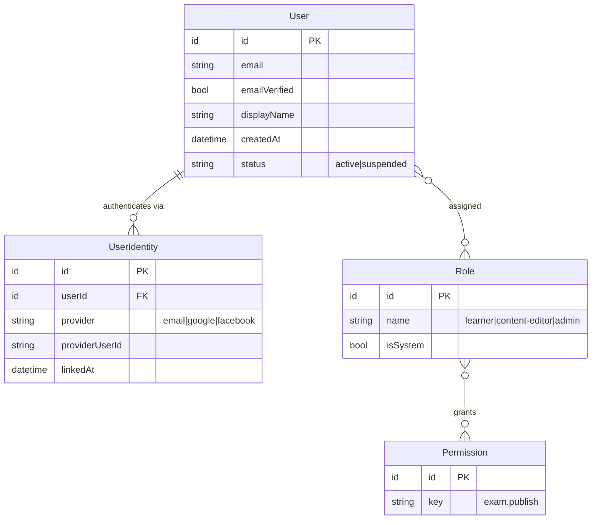
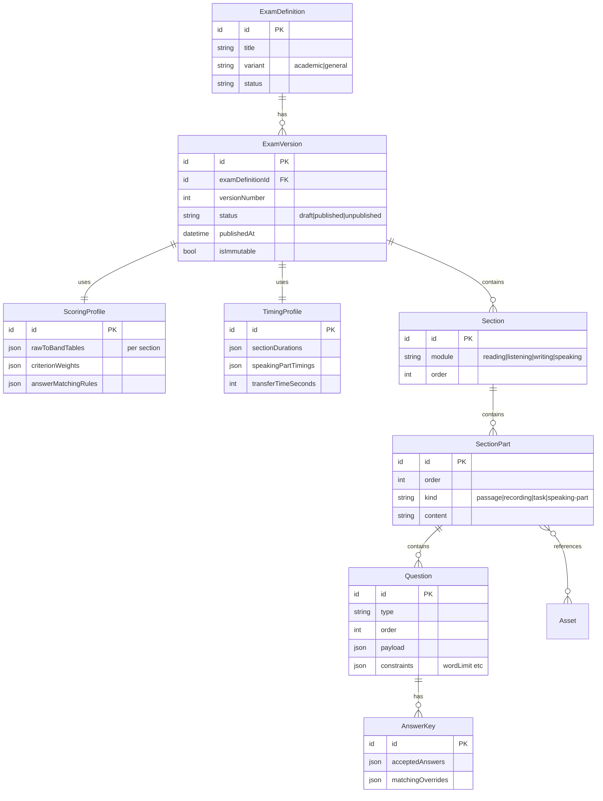
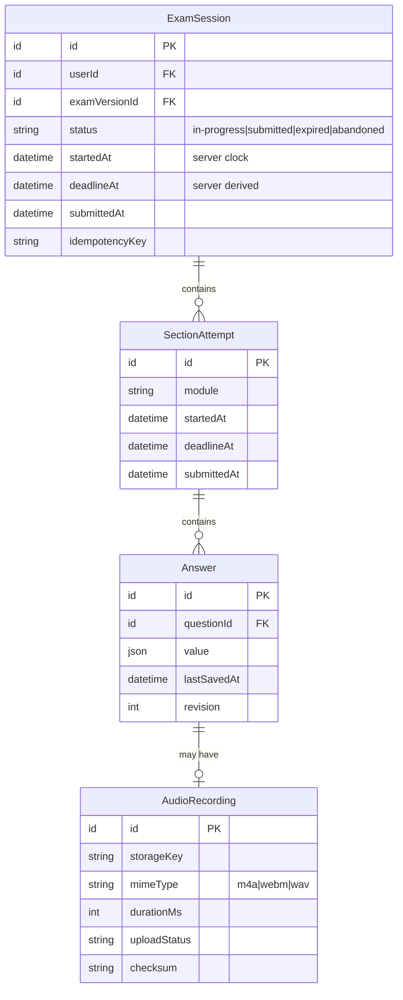
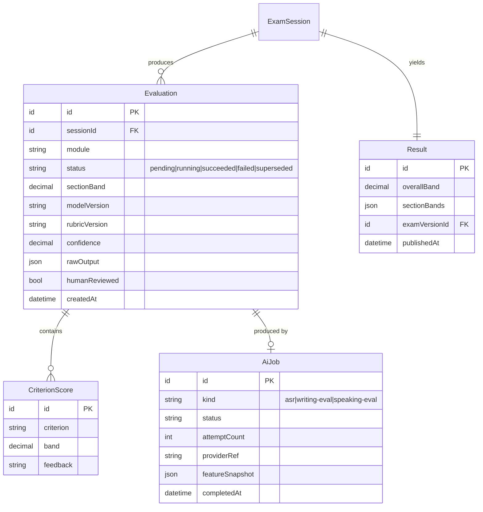
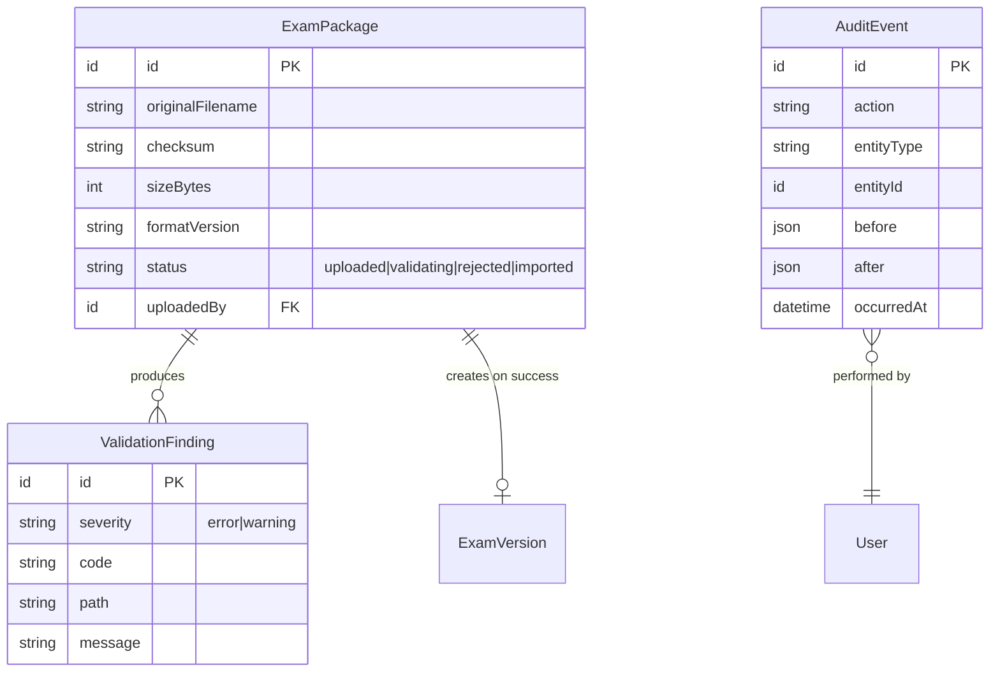
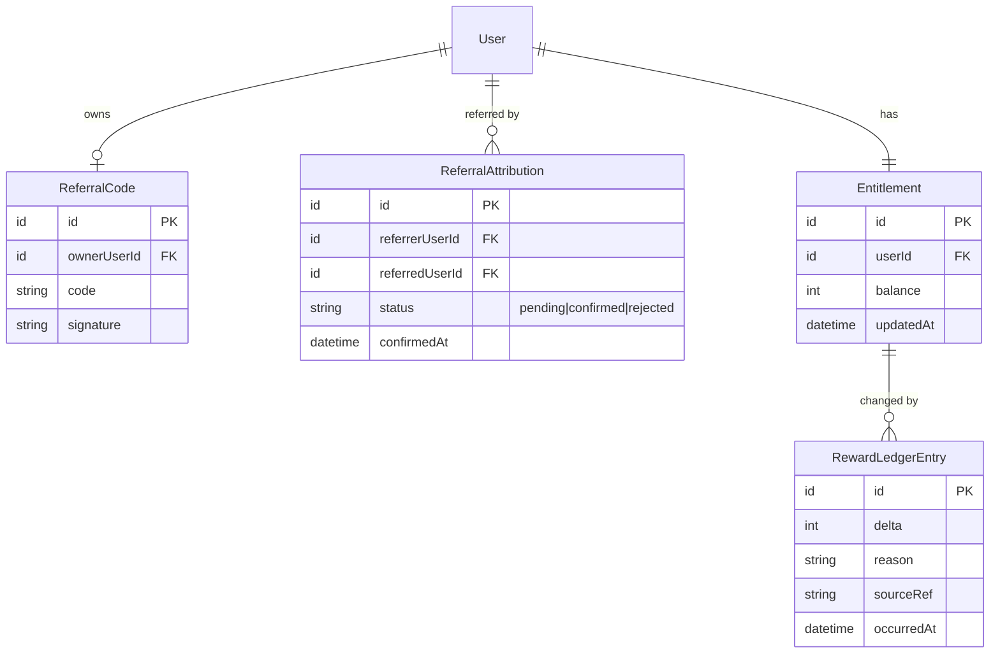
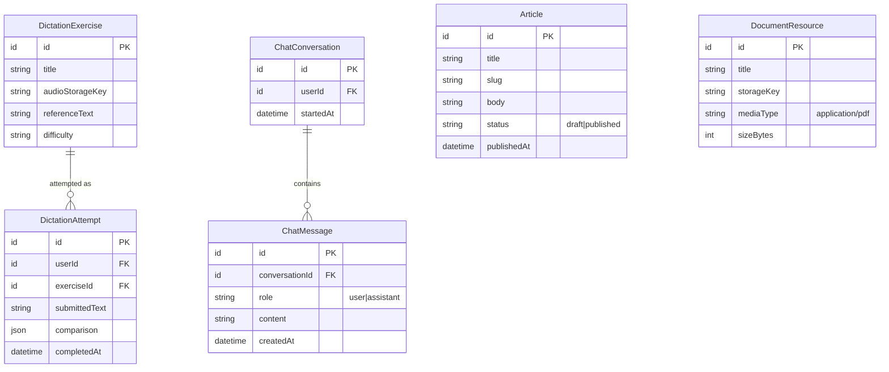

# Domain Model

Core entities and relationships. **Not final** — the domain is expected to evolve until requirement freeze, which is precisely why Phase 1 uses MongoDB ([ADR-0003](../decisions/0003-database-mongodb-first-postgresql-target.md)).

Entity names in requirement §21C were given as a starting point, not a specification. Where this model diverges, the reason is stated.

> **Nothing on this page is implemented.** There is no source code in this repository. Entities described here are a design, not a schema in existence.

---

## Glossary — these words are not synonyms

The most common way to misread this model is to treat *exam*, *attempt*, *submission*, *scoring*, and *result* as five names for one thing. They are five different things with different lifecycles and different levels of trust.

| Term | Entity | What it actually means |
|---|---|---|
| **Exam** / Test | `ExamDefinition` + `ExamVersion` | The *content*. Immutable once published |
| **Attempt** | `ExamSession` | **One sitting** by one learner against one `ExamVersion`. This is what a learner means by "my attempt" |
| Per-skill attempt | `SectionAttempt` | One module inside that sitting, with its **own** deadline |
| **Submission** | `ExamSession.submittedAt` / `SectionAttempt.submittedAt` | The **act of handing in**. Not a separate entity — modelling it as one produces two sources of truth for the same moment |
| **Scoring** | `Evaluation` (+ `AiJob` *only when AI is involved*) | The *process*. Can fail, be retried, be superseded |
| **Result** | `Result` | What the learner sees. Computed by **application code** from validated evaluations |

The chain runs:

```
ExamDefinition → ExamVersion → ExamSession (attempt) → SectionAttempt → Answer
                                     ↓ submitted
                                Evaluation  →  Result
```

### Full Test and Single Skill are the same entity, different shape

`E-11`…`E-13` in [`../requirements/confirmed.md`](../requirements/confirmed.md) confirm two modes. They do **not** need two entities:

| Mode | Shape |
|---|---|
| **Full Test** | one `ExamSession` containing **four** `SectionAttempt`s, advanced in the order Reading → Listening → Writing → Speaking |
| **Single Skill** | one `ExamSession` containing **one** `SectionAttempt`, which never auto-advances |

`[PROPOSED]` `ExamSession.mode: "full" | "single"` distinguishes them. Advancing within a Full Test is a server operation that closes the current `SectionAttempt` and opens the next with a **server-derived** `deadlineAt` — the client never supplies one ([ADR-0007](../decisions/0007-server-authoritative-exam-timer.md)).

---

## Bounded contexts

Six modules, each owning its entities. Cross-module references are by ID only — never by object reference — which is what allows the modular monolith to be split later if it ever needs to be.



---

## Identity



**`UserIdentity` is separate from `User`** so one account can carry multiple login methods (requirement AU-1/2/3). Collapsing them would make account linking impossible without a migration.

`[ASSUMPTION]` Identities link only after verified email ownership, never silently — silent linking on matching email is a known account-takeover vector. → M-1

Permission keys follow `resource.action`. The examples in requirement C-13 are explicitly not final. → [`../architecture/backend-architecture.md`](../architecture/backend-architecture.md)

---

## Exams



### Why `ExamVersion` is immutable once published

A published version is frozen; editing creates a new version. Sessions and results reference the exact version they used. Without this, correcting a conversion table would silently rewrite every historical score computed under the old table — a data-integrity failure that is invisible until someone disputes a score. → [`band-scoring.md`](band-scoring.md)

`ScoringProfile` and `TimingProfile` are separate entities rather than inline fields because they are the two things most likely to be tuned independently of content.

---

## Sessions



**`startedAt` and `deadlineAt` are written from the server clock and never accepted from the client** (requirement G-4, [ADR-0007](../decisions/0007-server-authoritative-exam-timer.md)).

`Answer.revision` supports autosave without lost updates when a client reconnects and replays queued saves.

`AudioRecording.mimeType` must accommodate **both** `audio/m4a` (iOS) and `audio/webm` (Android) — the platforms genuinely differ. → [`../architecture/client-architecture.md`](../architecture/client-architecture.md)

`ExamSession.idempotencyKey` makes submission replay-safe. → [`../api/api-design-principles.md`](../api/api-design-principles.md)

---

## Evaluation



### Why `Evaluation` is separate from `Result`

This separation is the structural expression of requirement A-8 — *"treat AI scoring as an evaluation subsystem, not as trusted application state."*

- **`Evaluation`** is what the scoring subsystem produced: versioned, re-runnable, possibly superseded, possibly failed. When AI is involved it records `modelVersion` and `rubricVersion` so a score can always be explained and reproduced.
- **`Result`** is application state the learner sees: computed by application code from validated evaluations plus deterministic section scores.

An `Evaluation` never writes a `Result` directly. Server-side validation sits between them. Re-running an evaluation marks the old one `superseded` rather than mutating it, which preserves the audit trail needed for R-5 (scoring consistency) and H-5 (appeals).

`AiJob.featureSnapshot` stores the deterministic features that were sent to the model — essential for debugging why a score came out as it did, and for re-scoring without re-running ASR.

### Scoring strategy — `AiJob` is not part of every `Evaluation`

`[PROPOSED]` `Evaluation.strategy: "deterministic" | "ai-assisted"`.

Requirement `A-11` confirms Reading and Listening bands come from the **answer key**, never from a model. The model must express that, or a later reader will build a pipeline where every submission passes through an AI job:

| Module | Strategy | Band comes from | `AiJob`? |
|---|---|---|---|
| Reading | `deterministic` | `AnswerKey` | **No** |
| Listening | `deterministic` | `AnswerKey` | **No** |
| Writing | `ai-assisted` | validated AI output | Yes — `writing-eval` |
| Speaking | **UNCONFIRMED** | — | → `M-26` |

Two invariants follow:

1. **A deterministic `Evaluation` needs no AI provider at all.** This is what allows Reading and Listening to work fully in Phase 6, before the externally-blocked AI phase begins. Making `AiJob` mandatory would silently destroy that property.
2. **An AI explanation for Reading or Listening is a separate artifact, not a score.** It has no path to `sectionBand`. The output contract for it deliberately carries **no band field**, so the constraint is enforced by schema rather than by discipline. → [`../ai/output-contracts.md`](../ai/output-contracts.md)

### What "validated" means — currently under-specified

`Result` is described above as computed "from validated evaluations". Two different mechanisms could satisfy that sentence, and they imply very different architectures:

| Mechanism | Status |
|---|---|
| Server-side schema validation and range checks | `PROPOSED` — specified in [`../ai/output-contracts.md`](../ai/output-contracts.md) |
| Human review before a band is published | `UNCONFIRMED` — interacts with H-5 (appeals) and M-19 (admin access to learner content) |

→ `M-28` in [`../requirements/assumptions-and-open-questions.md`](../requirements/assumptions-and-open-questions.md). Until it is answered, do not describe validation as an existing business process.

---

## CMS and ingestion



`ValidationFinding` is a first-class entity rather than a log line: an administrator whose 200-question package failed needs a precise, addressable list of what to fix, not a stack trace. → [`../architecture/exam-package-format.md`](../architecture/exam-package-format.md)

---

## Rewards



> **This context is modelled but deliberately has no rules.**
> The reward mechanism stated in the requirements — gating progression on a verified social share — is not implementable, because no target platform reports share completion ([R1](../requirements/risks-and-dependencies.md#r1)). The model above is built around **referral attribution**, which *is* server-verifiable, and awaits an owner decision (B-3, B-4) before any logic is written.

### Token — the learner-facing name for this context

The 2026-08-20 brief names this currency **Token** and confirms four concepts: Balance, Earn, Spend, Transaction (`T-1`…`T-3`). The entities above already carry them — `Entitlement` holds the balance, `RewardLedgerEntry` is the transaction. Only the vocabulary changes; no new entity is needed.

**Still unconfirmed:** how many tokens each operation is worth (`T-4` → `B-5b`), and **which operations are charged at all** (`B-5a`). Reading and Listening scoring needs no AI provider, so charging for it would be charging for arithmetic.

#### `[PROPOSED]` Ledger invariant

```
Balance = sum(valid ledger transactions)
```

`RewardLedgerEntry` is append-only, and the balance is **derived** from it — never a counter mutated in several places. A balance computed from an immutable ledger is auditable and debuggable when a learner disputes it; `user.tokenBalance += n` scattered across call sites is neither, and drifts silently.

`[PROPOSED]` transaction kinds: `Earn` · `Spend` · `Refund` · `Adjustment` · `Reversed`. Not all need implementing at MVP, but the model must treat the transaction — not the balance — as the source of truth from the start. Retrofitting a ledger under a live counter means reconstructing history that was never recorded.

**Deduction must be idempotent.** A mobile client retrying a submission must not be charged twice for one operation — the same `Idempotency-Key` maps to one ledger entry. → threat `T22` in [`../security/threat-model.md`](../security/threat-model.md)

---

## Learner modules added 2026-08-20

All `[PROPOSED]`. The owner confirmed each module exists and described it in one sentence; these entities are the minimum shape that satisfies that sentence and nothing more. → `M-22`…`M-25` in [`../requirements/confirmed.md`](../requirements/confirmed.md)



| Entity | Deliberately absent |
|---|---|
| `DictationExercise` | No lesson plan, no spaced repetition, no progress curriculum. The owner warned explicitly against expanding dictation into a listening-learning system |
| `Article` | No comments, no reactions, no author profiles, no tags. One direction only: admin publishes, learner reads |
| `DocumentResource` | No editor, no versioning, no in-app annotation. View or download |
| `ChatConversation` | Scope, retention, and token cost are all **UNCONFIRMED** (`B-6`). Modelled minimally so the shape exists without pre-answering those questions |

**Dictation scoring** compares `submittedText` against `referenceText`. `[PROPOSED]` a word-level comparison, which needs no AI provider — but the owner said only *"chấm điểm"*, so both the algorithm and the no-provider property are proposals, not requirements.

`ChatMessage` is a **separate collection keyed by `conversationId`**, not an array embedded in the conversation. A long-running chat is exactly the unbounded-array shape that breaks in MongoDB.

---

## Deviations from the entity list in §21C

| Suggested | Modelled as | Why |
|---|---|---|
| `Exam` | `ExamDefinition` + `ExamVersion` | Immutability of published versions is required for reproducible historical scoring |
| `Submission` | `ExamSession` + `SectionAttempt` | IELTS modules are timed independently; a single submission entity cannot express per-module deadlines |
| `Score` | `CriterionScore` + `Result` | Criterion-level scores and the learner-visible result have different lifecycles and trust levels |
| `Subscription` | `Entitlement` + `RewardLedgerEntry` | No subscription model exists; "entitlement" describes what is actually needed without presuming commerce |
| — | `ScoringProfile`, `TimingProfile` | Required by the configurable-vs-fixed decision |
| — | `ValidationFinding` | Import failures need addressable, per-item feedback |
| — | `AuditEvent` | Requirement C-12 |
