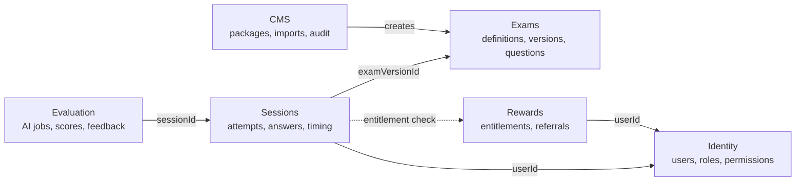
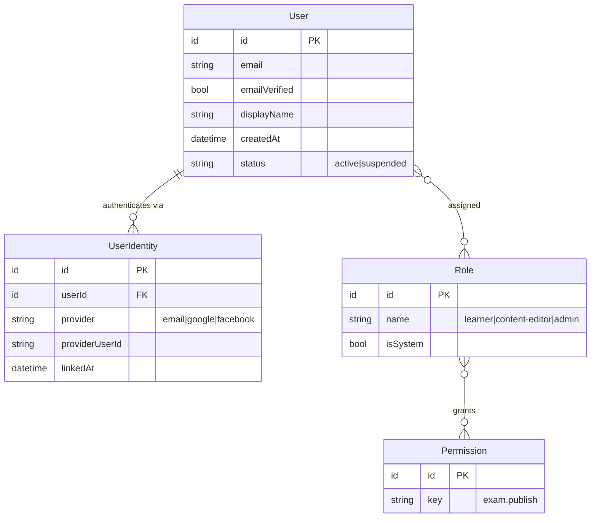
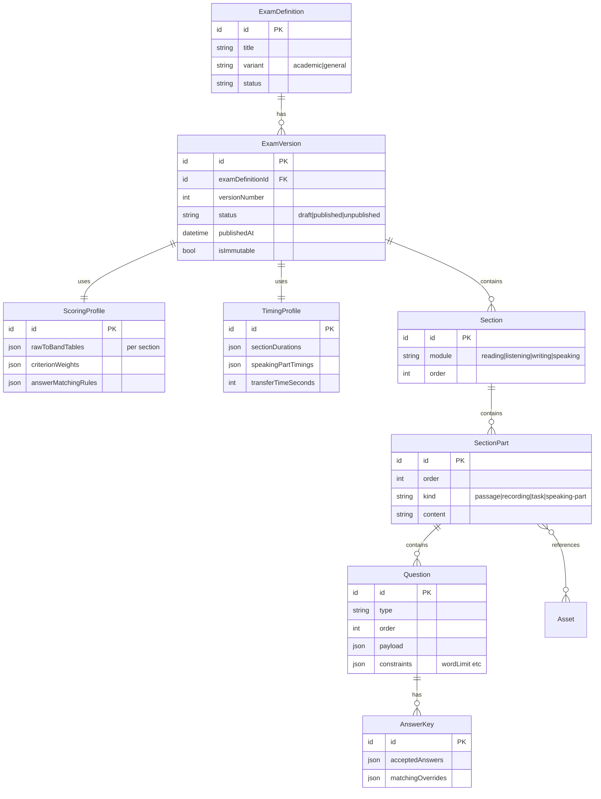
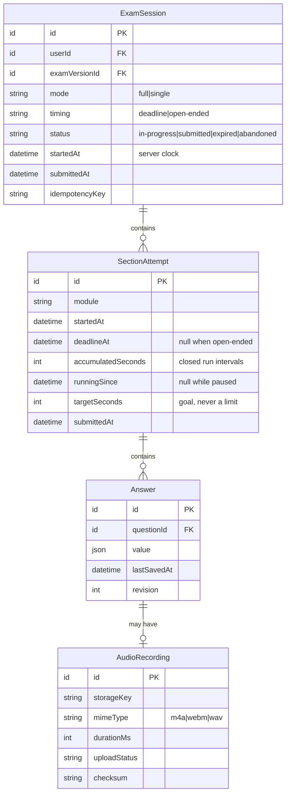
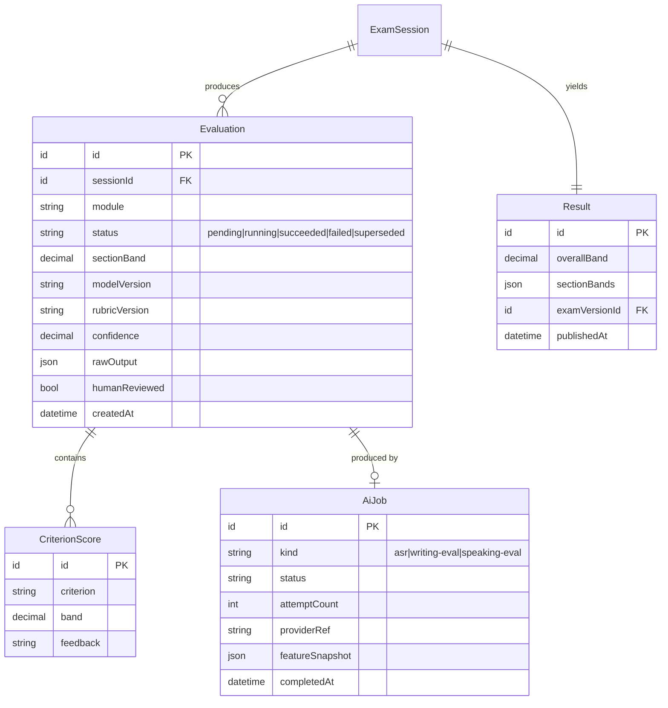
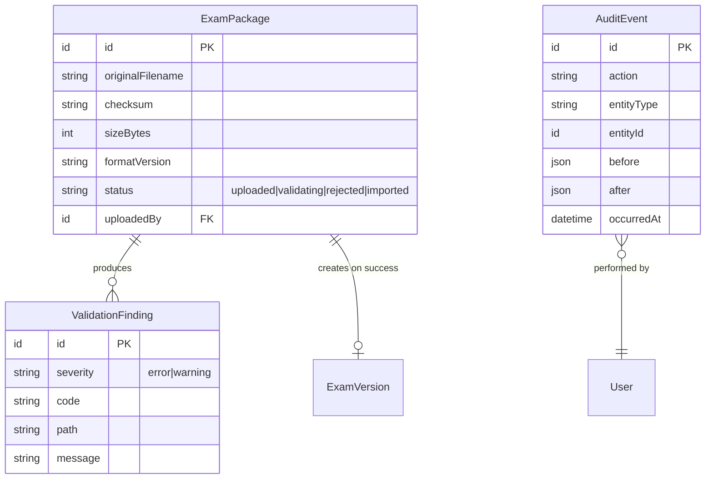
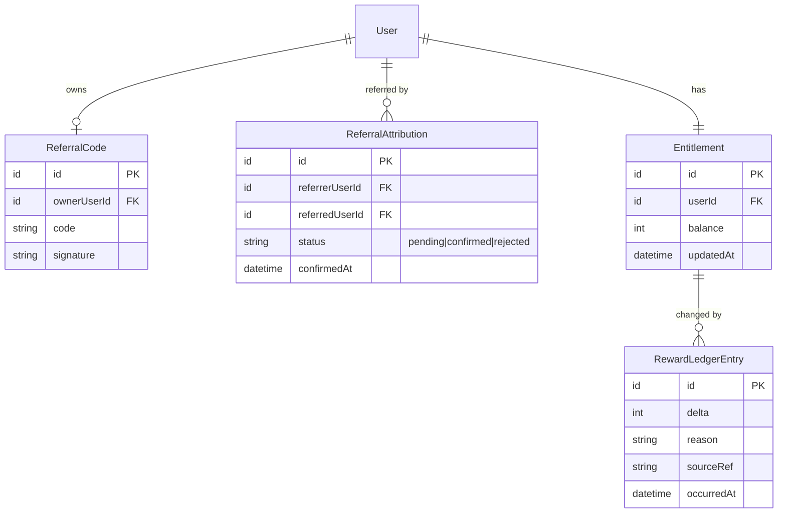
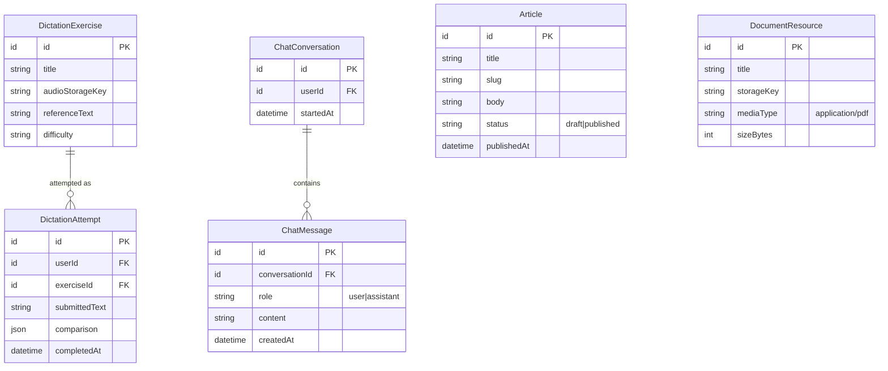

# Domain Model

Core entities and relationships. **Not final** — the domain is expected to evolve until requirement freeze, which is precisely why Phase 1 uses MongoDB ([ADR-0003](../decisions/0003-database-mongodb-first-postgresql-target.md)).

Entity names in requirement §21C were given as a starting point, not a specification. Where this model diverges, the reason is stated.

> **This page is part design and part description, and the two are not marked apart below.**
> The sentence that stood here until 2026-08-27 — *"Nothing on this page is implemented. There is
> no source code in this repository"* — had been false for a week, and it was the first thing a
> reader met. Identity, the exam catalogue, sittings, autosave, deterministic Reading and Listening
> marking, and the Writing/Speaking marking pipeline are **built and running** in
> `backend/src/Vni.Ielts.Domain`. Evaluation, Rewards/Token, CMS ingestion and the 2026-08-20
> learner modules are still design.
>
> **Check the code before building against a diagram on this page.** An entity here is not evidence
> of an implementation, and the class comments in that code are long and confident and are also not
> evidence. → [`../README.md` § Documented is not implemented](../README.md)

---

## Glossary — these words are not synonyms

The most common way to misread this model is to treat *exam*, *attempt*, *submission*, *scoring*, and *result* as five names for one thing. They are five different things with different lifecycles and different levels of trust.

| Term | Entity | What it actually means |
|---|---|---|
| **Exam** / Test | `ExamDefinition` + `ExamVersion` | The *content*. Immutable once published |
| **Attempt** | `ExamSession` | **One sitting** by one learner against one `ExamVersion`. This is what a learner means by "my attempt" |
| Per-skill attempt | `SectionAttempt` | One module inside that sitting, with its **own** deadline |
| **Submission** | `ExamSession.submittedAt` / `SectionAttempt.submittedAt` | The **act of handing in**. Not a separate entity — modelling it as one produces two sources of truth for the same moment |
| **Scoring** | `Evaluation` (+ `AiJob` *only when AI is involved*) | The *process*. Can fail, be retried, be superseded |
| **Result** | `Result` | What the learner sees. Computed by **application code** from validated evaluations |

The chain runs:

```
ExamDefinition → ExamVersion → ExamSession (attempt) → SectionAttempt → Answer
                                     ↓ submitted
                                Evaluation  →  Result
```

### The word "section" collides, and the collision is expensive

The product owner's Vietnamese brief and this codebase use *section* for two different things. The
practice footer *"lists the paper's sections with prev/next between them"* — those are **not**
`Section` entities, and reading them as such turns a client-side navigation feature into a
server-side session redesign that is not needed.

| The owner says | This codebase means | Which is |
|---|---|---|
| **đề** — a paper | `ExamVersion` | The immutable content |
| **kỹ năng** — a skill | `Section` (`Module`) | The whole Reading paper, or the whole Listening paper |
| **phần** / "section" in the practice footer | **`SectionPart`** | Passage 1–3 of Reading · Part 1–4 of Listening · Task 1–2 of Writing |
| **câu** — a question | `Question` | One numbered line on the answer sheet |
| **lượt làm** — a sitting | `ExamSession` | One learner against one `ExamVersion` |
| **luyện đề** — practice | `SessionTiming.OpenEnded` | See below — a *timing* rule, not a content type |
| **thi thử** — mock | `SessionTiming.Deadline` | See below |

**The consequence, stated once:** every `SectionPart` of a skill is *already* delivered at once, in
`CurrentSectionView.Parts`, and always has been. Prev/next between them is client-side navigation
inside one open `SectionAttempt`. It needs no server change.

### Two independent axes, not one enum with more members

`E-11`…`E-13` in [`../requirements/confirmed.md`](../requirements/confirmed.md) confirm two modes,
and `SessionMode { Full, Single }` is **built** and correct. The owner's 2026-08-27 luyện đề / thi
thử split is a **second, orthogonal axis** and must not be folded into the first.

| Axis | Question it answers | Values |
|---|---|---|
| `SessionMode` — **built** | How many skills does this sitting contain, and does it auto-advance? | `Full` · `Single` |
| `SessionTiming` — `[PROPOSED]` | Does a clock bound it, and may it be paused? | `Deadline` · `OpenEnded` |

They are independent because all four combinations are meaningful: a mock full test
(`Full`+`Deadline`), a mock single skill (`Single`+`Deadline`), practice on one skill
(`Single`+`OpenEnded`, **what is being built first**), and a full paper practised without a clock
(`Full`+`OpenEnded`).

**Why an enum and not `bool IsPractice`.** A boolean names a *product label*; the enum names the
*rule*. `M-30` records that the Practice/Mock/Full distinction may turn out to be "cách làm bài" —
a rule of the sitting — and lists "bấm giờ thật, không tạm dừng" as exactly the candidate axis. A
boolean called `IsPractice` would have to be reinterpreted the first time a product wants a timed
practice or a pausable mock; the enum keeps naming the thing that actually varies.

**Why it is recorded on the session and never looked up.** `SessionTiming` is written on
`ExamSession` at start and never derived from configuration at read time. This is the same rule
that makes the band table versioned data: a band earned in an untimed, pausable sitting is not
comparable to one earned under exam conditions, and if the policy were looked up later, changing it
would silently reinterpret every historical sitting. → [`band-scoring.md`](band-scoring.md)

**What must not change so the mock path keeps its guarantees.**
[ADR-0007](../decisions/0007-server-authoritative-exam-timer.md) is not weakened by any of this —
it is *scoped*. The server remains the only clock in both modes.

| Guarantee | Status under `OpenEnded` |
|---|---|
| Every timestamp comes from the server clock | **Unchanged.** Pause and resume carry no client time |
| `AdvanceToNextSection` refuses a non-`Full` session | **Unchanged** |
| `AdvanceToNextSection` never lets the caller name the next module | **Unchanged** |
| `SaveAnswers` refuses a write to a module that is not the open one | **Unchanged** — this is what stops a Full Test candidate editing Reading while sitting Writing |
| `SaveAnswers` refuses a write past `DeadlineAt` | **Scoped:** applies whenever a deadline exists. An `OpenEnded` attempt has none, so there is nothing to be past |
| The expiry sweep closes an overdue sitting | **Scoped** — see the three-case rule below |

### `[PROPOSED]` Elapsed time with pauses, derived server-side

The owner's practice timer counts **up**, play/pause **stops the count**, and a target time is a
goal rather than a limit. A client-reported elapsed figure would be the first crack in ADR-0007, so
the server derives elapsed from its own clock and pause/resume are **intents the client sends with
no timestamp**.

`SectionAttempt` gains three fields and one becomes nullable:

| Field | Type | Meaning |
|---|---|---|
| `DeadlineAt` | `DateTimeOffset?` | **Was non-nullable.** Null for `OpenEnded` — there is no deadline, not a distant one |
| `AccumulatedSeconds` | `int` | Sum of every **closed** running interval |
| `RunningSince` | `DateTimeOffset?` | Server clock at the last resume. Null while paused |
| `TargetSeconds` | `int?` | The learner's chosen goal. **Never consulted by any rule** — display only |

```
Elapsed(serverNow) = AccumulatedSeconds
                   + (RunningSince is t ? serverNow - t : 0)

Pause(now):   if RunningSince is t: AccumulatedSeconds += now - t; RunningSince = null
Resume(now):  if RunningSince is null: RunningSince = now
```

Both transitions are **idempotent** — a duplicate pause from a retrying mobile client is a no-op,
not a double subtraction — and both take only `now` from the server clock.

**Why an accumulator rather than an event log.** A `TimerEvent[]` on the sitting is the unbounded
array this document already warns about for `ChatMessage`: a learner idly toggling play/pause grows
a document that is rewritten on every transition, and elapsed would be an O(n) fold on a value read
on every autosave response. Nothing in the product needs individual pause history; if audit ever
does, `AuditEvent` already exists for it. The honest cost: an accumulator cannot be re-derived if
corrupted, where a log could.

**`TargetSeconds` is display-only, and that is load-bearing.** It is the owner's *"goal, not a
limit"* made structural. No rule may read it — the moment anything refuses a write or closes a
sitting on it, it has silently become a deadline, and the practice mode has become the exam.

`[NEEDS VALIDATION]` **The existing compare-and-swap guard does not cover a pause.**
`SessionState` is `(Status, OpenModule)`, and neither changes on pause or resume — so two tabs
pausing together both match the guard and both write. It must carry the running state
(`RunningSince`, or a `bool Running`) before pause ships, or the accumulator can double-count or
lose an interval.

### `[PROPOSED]` The expiry sweep needs three cases, not two

`ExpiredSittings.CloseIfOverdueAsync` currently reads `session.IsWithinDeadline(now)`, whose `false`
already conflates two situations. Making `DeadlineAt` nullable adds a third, and a nullable deadline
folded into either existing branch is a live defect:

| Case | Rule | If got wrong |
|---|---|---|
| Open attempt, deadline passed | **Close and mark.** Unchanged | — |
| **No open attempt at all**, still `InProgress` | **Close.** This state comes from a bad write, and closing it ends a sitting the learner can otherwise never finish or leave. **This branch must survive** | The learner is stuck forever |
| **Open attempt with no deadline** (`OpenEnded`) | **Never overdue.** Return `NotOverdue` | The sweep invents a limit and closes a practice sitting mid-answer |

`IsWithinDeadline` must therefore be replaced by something that cannot be misread as "no deadline →
false → sweep it". A method named for the question it answers — `IsPastDeadline(now)`, false when
there is none — keeps the null case honest at the call site.

### Does a practice sitting expire at all?

`[BUSINESS DECISION]` **What should exist a week after a learner starts a practice sitting and
disappears?** Not a technical choice: it trades a learner's unfinished work against a dashboard
that offers to resume a sitting from last year. Candidate answers — never expires; expires after a
configured idle period; expires only if the product enforces one-open-sitting-at-a-time and a new
start would otherwise be blocked. **This needs an ID in
[`../requirements/assumptions-and-open-questions.md`](../requirements/assumptions-and-open-questions.md);
do not pick one meanwhile** (`G-11`).

Two things are already true and do not need the owner:

1. **The deadline sweep must not be the mechanism.** An `OpenEnded` attempt has no deadline, so
   closing it on one is inventing a limit. Any retention rule is a *separate* idle-based sweep with
   its own configured period.
2. **Something must eventually bound it, or an existing read breaks.**
   `IExamSessionRepository.FindOpenForUserAsync` backs the dashboard's *"bài đang làm dở"*. With no
   bound it will one day return a year-old practice sitting; and if the product ever enforces one
   open sitting at a time, the learner is permanently locked out by it.

### Free navigation between parts — what changes, and what does not

**Nothing on the server, for the mode being built.** The apparent problem is the vocabulary
collision above. `SectionAttempt` covers a whole module; a module's `SectionPart`s are all
delivered together in `CurrentSectionView.Parts`; the footer's per-part progress and its prev/next
are navigation within one open attempt. `ExamSession.Current` stays *"the first attempt with no
`SubmittedAt`"* and remains unambiguous, because a `Single`+`OpenEnded` sitting has exactly one
attempt.

`[OPEN QUESTION]` **A `Full`+`OpenEnded` sitting — all four skills open at once — is the case that
would need a change**, and the dangerous way to build it is to loosen `Current`. `Current` is what
`SaveAnswers` checks to refuse a write to a skill the learner is not in, and loosening it for
practice would loosen it for the mock path too. The safe seam is to open all four attempts at start
for an `OpenEnded` sitting and let the *requested* module be validated against "is this attempt
open and unsubmitted", leaving `Current` alone for `Deadline` sittings. **Not built** — the owner
has not asked for it, and `M-30` is unanswered.

### This revives a reading of `M-30` / `B-12` that was recorded as collapsed

[`B-12`](../requirements/assumptions-and-open-questions.md) rules out its own reading (3) —
"practice/mock differ only as rules of the sitting" — with the argument that *"phiên thi hiện tại đã
bấm giờ trên máy chủ, **không tạm dừng được**, và không hiện đáp án giữa chừng. Nếu bài test đầu vào
chỉ khác Full Test ở ba luật đó thì nó không khác gì cả."*

That argument rested on a sitting being unpausable. **The owner has now asked for a pausable,
count-up, deadline-free sitting**, which is exactly the "Full Test dễ hơn" that `B-12` says nobody
had asked for. Reading (3) is live again, and `M-30` and `B-12` must be re-read with that in mind
rather than answered from their current text.

---

## Bounded contexts

Six modules, each owning its entities. Cross-module references are by ID only — never by object reference — which is what allows the modular monolith to be split later if it ever needs to be.



---

## Identity



**`UserIdentity` is separate from `User`** so one account can carry multiple login methods (requirement AU-1/2/3). Collapsing them would make account linking impossible without a migration.

`[ASSUMPTION]` Identities link only after verified email ownership, never silently — silent linking on matching email is a known account-takeover vector. → M-1

Permission keys follow `resource.action`. The examples in requirement C-13 are explicitly not final. → [`../architecture/backend-architecture.md`](../architecture/backend-architecture.md)

---

## Exams



### Why `ExamVersion` is immutable once published

A published version is frozen; editing creates a new version. Sessions and results reference the exact version they used. Without this, correcting a conversion table would silently rewrite every historical score computed under the old table — a data-integrity failure that is invisible until someone disputes a score. → [`band-scoring.md`](band-scoring.md)

`ScoringProfile` and `TimingProfile` are separate entities rather than inline fields because they are the two things most likely to be tuned independently of content.

**`Question.type` decides how a question is *drawn*, never how it is *marked*.** The marker routes
on the shape of the answer key, not the type — the two are genuinely independent, and conflating
them once caused every matching question in a Reading paper to be marked wrong. How each type is
answered, where its answer bank comes from, and what the stored value looks like:
[`question-interactions.md`](question-interactions.md).

---

## Sessions



**Every timestamp here is written from the server clock and never accepted from the client**
(requirement G-4, [ADR-0007](../decisions/0007-server-authoritative-exam-timer.md)). That includes
`runningSince`: pause and resume are intents carrying no time, so elapsed is derived from the
server's own clock in both timing modes. → [Two independent axes](#two-independent-axes-not-one-enum-with-more-members)

`Answer.revision` supports autosave without lost updates when a client reconnects and replays queued saves.

`AudioRecording.mimeType` must accommodate **both** `audio/m4a` (iOS) and `audio/webm` (Android) — the platforms genuinely differ. → [`../architecture/client-architecture.md`](../architecture/client-architecture.md)

`ExamSession.idempotencyKey` makes submission replay-safe. → [`../api/api-design-principles.md`](../api/api-design-principles.md)

---

## Evaluation



### Why `Evaluation` is separate from `Result`

This separation is the structural expression of requirement A-8 — *"treat AI scoring as an evaluation subsystem, not as trusted application state."*

- **`Evaluation`** is what the scoring subsystem produced: versioned, re-runnable, possibly superseded, possibly failed. When AI is involved it records `modelVersion` and `rubricVersion` so a score can always be explained and reproduced.
- **`Result`** is application state the learner sees: computed by application code from validated evaluations plus deterministic section scores.

An `Evaluation` never writes a `Result` directly. Server-side validation sits between them. Re-running an evaluation marks the old one `superseded` rather than mutating it, which preserves the audit trail needed for R-5 (scoring consistency) and H-5 (appeals).

`AiJob.featureSnapshot` stores the deterministic features that were sent to the model — essential for debugging why a score came out as it did, and for re-scoring without re-running ASR.

### Scoring strategy — `AiJob` is not part of every `Evaluation`

`[PROPOSED]` `Evaluation.strategy: "deterministic" | "ai-assisted"`.

Requirement `A-11` confirms Reading and Listening bands come from the **answer key**, never from a model. The model must express that, or a later reader will build a pipeline where every submission passes through an AI job:

| Module | Strategy | Band comes from | `AiJob`? |
|---|---|---|---|
| Reading | `deterministic` | `AnswerKey` | **No** |
| Listening | `deterministic` | `AnswerKey` | **No** |
| Writing | `ai-assisted` | validated AI output | Yes — `writing-eval` |
| Speaking | **UNCONFIRMED** | — | → `M-26` |

Two invariants follow:

1. **A deterministic `Evaluation` needs no AI provider at all.** This is what allows Reading and Listening to work fully in Phase 6, before the externally-blocked AI phase begins. Making `AiJob` mandatory would silently destroy that property.
2. **An AI explanation for Reading or Listening is a separate artifact, not a score.** It has no path to `sectionBand`. The output contract for it deliberately carries **no band field**, so the constraint is enforced by schema rather than by discipline. → [`../ai/output-contracts.md`](../ai/output-contracts.md)

### What "validated" means — currently under-specified

`Result` is described above as computed "from validated evaluations". Two different mechanisms could satisfy that sentence, and they imply very different architectures:

| Mechanism | Status |
|---|---|
| Server-side schema validation and range checks | `PROPOSED` — specified in [`../ai/output-contracts.md`](../ai/output-contracts.md) |
| Human review before a band is published | `UNCONFIRMED` — interacts with H-5 (appeals) and M-19 (admin access to learner content) |

→ `M-28` in [`../requirements/assumptions-and-open-questions.md`](../requirements/assumptions-and-open-questions.md). Until it is answered, do not describe validation as an existing business process.

---

## CMS and ingestion



`ValidationFinding` is a first-class entity rather than a log line: an administrator whose 200-question package failed needs a precise, addressable list of what to fix, not a stack trace. → [`../architecture/exam-package-format.md`](../architecture/exam-package-format.md)

---

## Rewards



> **This context is modelled but deliberately has no rules.**
> The reward mechanism stated in the requirements — gating progression on a verified social share — is not implementable, because no target platform reports share completion ([R1](../requirements/risks-and-dependencies.md#r1)). The model above is built around **referral attribution**, which *is* server-verifiable, and awaits an owner decision (B-3, B-4) before any logic is written.

### Token — the learner-facing name for this context

The 2026-08-20 brief names this currency **Token** and confirms four concepts: Balance, Earn, Spend, Transaction (`T-1`…`T-3`). The entities above already carry them — `Entitlement` holds the balance, `RewardLedgerEntry` is the transaction. Only the vocabulary changes; no new entity is needed.

**Still unconfirmed:** how many tokens each operation is worth (`T-4` → `B-5b`), and **which operations are charged at all** (`B-5a`). Reading and Listening scoring needs no AI provider, so charging for it would be charging for arithmetic.

#### `[PROPOSED]` Ledger invariant

```
Balance = sum(valid ledger transactions)
```

`RewardLedgerEntry` is append-only, and the balance is **derived** from it — never a counter mutated in several places. A balance computed from an immutable ledger is auditable and debuggable when a learner disputes it; `user.tokenBalance += n` scattered across call sites is neither, and drifts silently.

`[PROPOSED]` transaction kinds: `Earn` · `Spend` · `Refund` · `Adjustment` · `Reversed`. Not all need implementing at MVP, but the model must treat the transaction — not the balance — as the source of truth from the start. Retrofitting a ledger under a live counter means reconstructing history that was never recorded.

**Deduction must be idempotent.** A mobile client retrying a submission must not be charged twice for one operation — the same `Idempotency-Key` maps to one ledger entry. → threat `T22` in [`../security/threat-model.md`](../security/threat-model.md)

---

## Learner modules added 2026-08-20

All `[PROPOSED]`. The owner confirmed each module exists and described it in one sentence; these entities are the minimum shape that satisfies that sentence and nothing more. → `M-22`…`M-25` in [`../requirements/confirmed.md`](../requirements/confirmed.md)



| Entity | Deliberately absent |
|---|---|
| `DictationExercise` | No lesson plan, no spaced repetition, no progress curriculum. The owner warned explicitly against expanding dictation into a listening-learning system |
| `Article` | No comments, no reactions, no author profiles, no tags. One direction only: admin publishes, learner reads |
| `DocumentResource` | No editor, no versioning, no in-app annotation. View or download |
| `ChatConversation` | Scope, retention, and token cost are all **UNCONFIRMED** (`B-6`). Modelled minimally so the shape exists without pre-answering those questions |

**Dictation scoring** compares `submittedText` against `referenceText`. `[PROPOSED]` a word-level comparison, which needs no AI provider — but the owner said only *"chấm điểm"*, so both the algorithm and the no-provider property are proposals, not requirements.

`ChatMessage` is a **separate collection keyed by `conversationId`**, not an array embedded in the conversation. A long-running chat is exactly the unbounded-array shape that breaks in MongoDB.

---

## Deviations from the entity list in §21C

| Suggested | Modelled as | Why |
|---|---|---|
| `Exam` | `ExamDefinition` + `ExamVersion` | Immutability of published versions is required for reproducible historical scoring |
| `Submission` | `ExamSession` + `SectionAttempt` | IELTS modules are timed independently; a single submission entity cannot express per-module deadlines |
| `Score` | `CriterionScore` + `Result` | Criterion-level scores and the learner-visible result have different lifecycles and trust levels |
| `Subscription` | `Entitlement` + `RewardLedgerEntry` | No subscription model exists; "entitlement" describes what is actually needed without presuming commerce |
| — | `ScoringProfile`, `TimingProfile` | Required by the configurable-vs-fixed decision |
| — | `ValidationFinding` | Import failures need addressable, per-item feedback |
| — | `AuditEvent` | Requirement C-12 |
