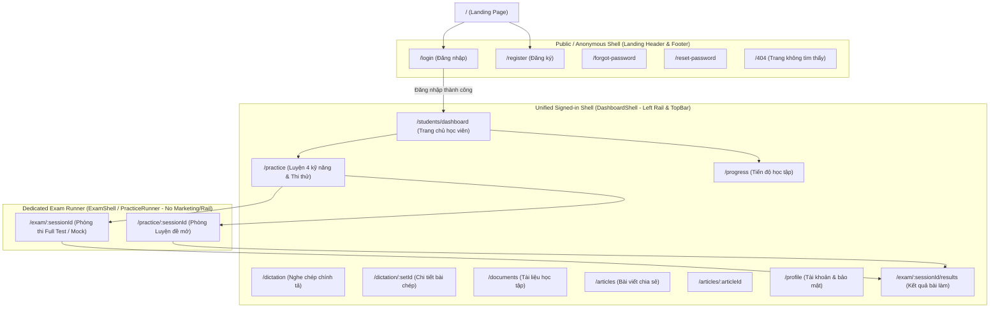

# VNI IELTS AI - Target Information Architecture

Tài liệu này xác lập sơ đồ kiến trúc thông tin (Information Architecture - IA) của ứng dụng học viên VNI IELTS AI sau khi tái thiết kế, tuân thủ các quyết định đã chốt `D-1`, `D-2`, `D-3`, `D-4`, `D-5` và `D-7`.

---

## 1. Bản đồ Tuyến đường (Route Map & Shell Hierarchy)



---

## 2. Cấu trúc Thanh điều hướng (Signed-in Left Rail - `D-1`)

Thanh điều hướng bên trái được áp dụng thống nhất cho toàn bộ các trang của người dùng đã đăng nhập (ngoại trừ khi đang trong phòng thi).

| Nhóm điều hướng | Nhãn hiển thị (Tiếng Việt) | Đường dẫn | Biểu tượng & Ghi chú |
|---|---|---|---|
| **Học tập** | Tổng quan | `/students/dashboard` | Icon Dashboard. Trang chủ học tập định hướng hành động |
| | Luyện 4 kỹ năng | `/practice` | Icon Books/Target. Tích hợp cả Luyện đề và Thi thử (D-5) |
| | Tiến độ | `/progress` | Icon Chart/Trophy. Tuyến đường thực sự theo D-3 |
| **Tài nguyên** | Nghe chép chính tả | `/dictation` | Icon Headphones |
| | Tài liệu | `/documents` | Icon Folder/Files |
| | Bài viết | `/articles` | Icon Newspaper/Pencil |
| **Tài khoản** | Tài khoản & bảo mật | `/profile` | Icon Shield/User. Đổi tên từ "Hồ sơ" (D-3) |
| | Trợ lý AI · Xem trước | *Hành động mở Drawer `AiChatPanel`* | Icon Sparkles kèm Badge **"Xem trước"**. Giữ khung chat vô hiệu hóa theo D-1/B-6 |

### Quy tắc hiển thị thanh Rail:
1. **Desktop (≥ 900px):**
   - Trạng thái mở rộng: Chiều rộng cố định `248px`.
   - Trạng thái thu gọn: Chiều rộng cố định `56px`, chỉ hiển thị biểu tượng (icon-only), có `aria-label` và tooltip khi hover/focus.
   - Trạng thái thu gọn được lưu trong `localStorage` qua key `vni.studentRail.collapsed`.
   - Nhãn văn bản không bao giờ bị cắt ngắn (ellipsis). Nếu không vừa, rail phải mở rộng chứ không cắt chữ.
2. **Mobile (< 900px):**
   - Thu gọn hoàn toàn vào nút Menu (Hamburger) trên TopBar.
   - Nhấn mở Drawer với đầy đủ bẫy focus (focus trap), phím Escape để đóng, khóa cuộn trang nền và phục hồi focus về nút bấm ban đầu.
3. **Thanh TopBar:**
   - Mobile: Nút Hamburger mở Drawer + Tiêu đề trang hiện tại + `AccountMenu`.
   - Desktop: Tiêu đề trang hiện tại + `AccountMenu`.
   - **Ẩn chuông thông báo** do chưa có endpoint backend tương ứng.

---

## 3. Phân định rõ giữa `/progress` và `/profile` (`D-3`)

```text
/progress (Tiến độ học tập)
├── 1. Khối Huấn luyện Mục tiêu (GoalCoachingPanel - Full view)
│   ├── Target Band (Mục tiêu tổng quát)
│   └── Khoảng cách 4 kỹ năng (Reading, Listening, Writing, Speaking)
├── 2. Chuỗi ngày học tập (StreakPanel)
├── 3. Lịch sử bài làm gần đây (Recent Sittings List)
└── 4. Hành động đề xuất tiếp theo (Recommended Next Action)

/profile (Tài khoản & bảo mật)
├── Cột trái (Desktop): Thông tin cá nhân (PersonalInfo: Avatar, Tên, Email, SĐT, Trạng thái xác minh)
└── Cột phải (Desktop): Tabs bảo mật
    ├── Tab mặc định: Mật khẩu (Password management - giữ theo quyết định chủ sản phẩm 21/08/2026)
    └── Tab tiếp theo: Thiết bị (Active Devices & Session Revocation)
```

> **Quy tắc chuyển hướng (Redirects):**
> - `/profile?tab=progress` chuyển hướng vĩnh viễn (301/Replace) sang `/progress`.
> - `/progress` không bao giờ chuyển hướng ngược lại về `/profile`.

---

## 4. Hành vi Điều hướng sau Đăng nhập / Đăng ký (`D-2`)

1. **Từ Protected Action:** Nếu người dùng bị chặn khi bấm vào một tính năng yêu cầu đăng nhập, sau khi đăng nhập thành công phải quay lại chính xác URL đó.
2. **Từ trang thông thường:** Quay lại trang người dùng bắt đầu mở form đăng nhập (ở trạng thái signed-in).
3. **Từ trang chủ (`/`):** Ở lại chính trang chủ (`/`) dưới trạng thái đã đăng nhập. Tuyệt đối không tự động nhảy vào `/students/dashboard` (Quyết định của chủ sản phẩm 21/08/2026).
4. **Sau khi đăng ký tài khoản:** Tuân theo quy tắc trên, kèm một thông báo xác nhận email (dismissible notice) hiển thị trên giao diện, đóng cho phiên làm việc hiện tại.
