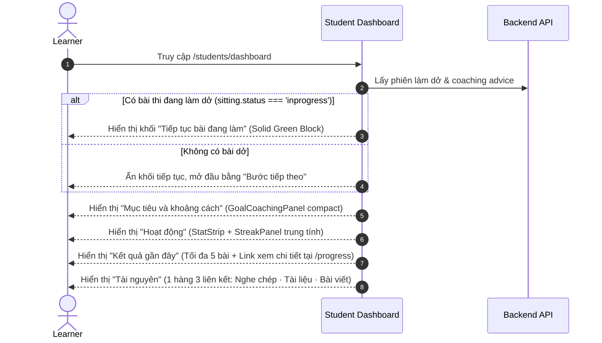
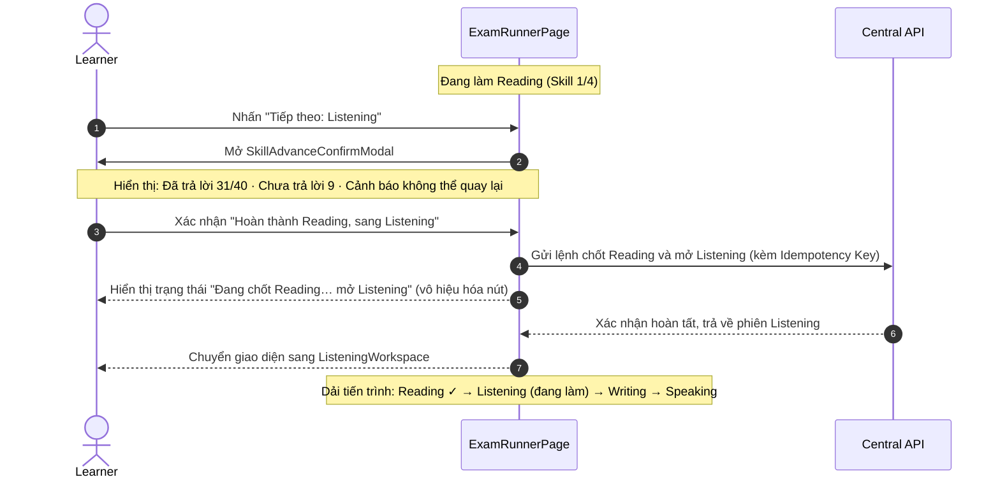
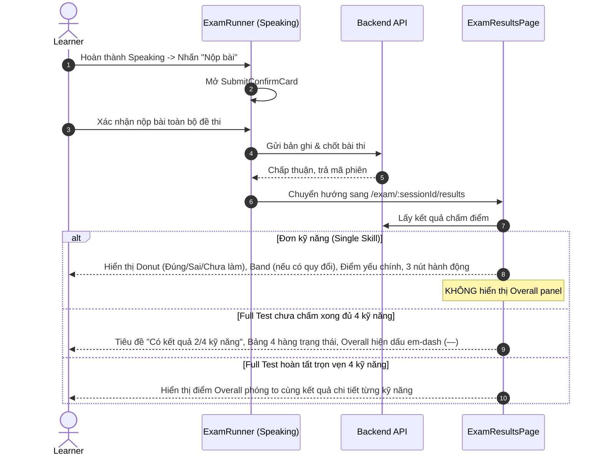

# VNI IELTS AI - Core Learner UX Flows

Tài liệu này chi tiết hóa các luồng trải nghiệm người học trọng yếu trong ứng dụng VNI IELTS AI theo các quyết định đã chốt `D-4`, `D-5`, `D-6`, `D-7`, `D-8`, `D-9`.

---

## 1. Luồng Trang Chủ Học Viên (`/students/dashboard` - `D-4`)



---

## 2. Luồng Lựa Chọn Luyện Đề & Thi Thử (`/practice` - `D-5`)

```mermaid
graph TD
  Start[Vào trang /practice] --> EntryCheck{Bài test đầu vào?}
  EntryCheck -->|Trạng thái S4| S4Layer[Modal Entry Test: Bài test đầu vào chưa mở]
  S4Layer --> SkipEntry[Bấm nút chính: Bỏ qua, vào luyện luôn]
  SkipEntry --> Catalogue[Danh mục bài tập / Đề thi]
  
  Catalogue --> ScopeSelect[Chọn Phạm vi: Một kỹ năng | Full Test]
  
  ScopeSelect -->|Chọn Một kỹ năng| SkillFilter[SkillSelector: Lưới 2x2 chọn Reading / Listening / Writing / Speaking]
  SkillFilter --> CardSingle[Card bài thi: 2 nút Luyện đề & Thi thử]
  CardSingle -->|Bấm Luyện đề| PracticeRun[/practice/:sessionId - Đếm giờ tăng, cho phép dừng]
  CardSingle -->|Bấm Thi thử| MockRun[/exam/:sessionId - Đếm ngược máy chủ, nghiêm ngặt]
  
  ScopeSelect -->|Chọn Full Test| CardFull[Card Full Test: 1 nút duy nhất Thi thử]
  CardFull --> ReadinessModal[Full Test Readiness Dialog: Xác nhận 4 kỹ năng & thiết bị]
  ReadinessModal -->|Hủy| Catalogue
  ReadinessModal -->|Bắt đầu Full Test| FullTestRun[/exam/:sessionId - Bắt đầu Reading]
```

---

## 3. Luồng Tiến Trình Full Test & Chuyển Kỹ Năng (`D-7`)

Trình tự bắt buộc theo quyết định chủ sản phẩm: `Reading -> Listening -> Writing -> Speaking`.



---

## 4. Luồng Nộp Bài Cuối Cùng & Trả Kết Quả (`D-9`)


