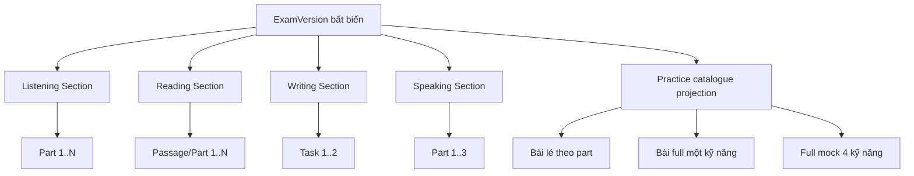
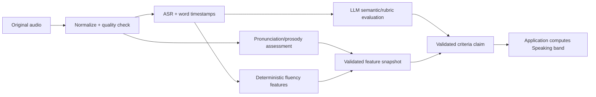

# Nghiên cứu chức năng luyện tập và thi thử IELTS 4 kỹ năng

> **Ngày:** 28/08/2026  
> **Trạng thái:** nghiên cứu và đề xuất kỹ thuật; **chưa phải implementation plan**.  
> **Cổng tiếp theo:** chủ sản phẩm cung cấp các điều kiện ở §11, trả lời các quyết định ở §12 và xác
> nhận **OK**; sau đó mới viết plan hoàn thiện full phần luyện 4 kỹ năng.

## 1. Kết luận điều hành

Yêu cầu có thể triển khai trên kiến trúc hiện tại, nhưng cần sửa bốn ranh giới trước khi viết plan:

1. **Không nhân bản đề khi tách bài luyện.** Một lần upload tạo đúng một `ExamVersion` bất biến. Các
   bài lẻ, bài full kỹ năng và full mock là `PracticeUnit`/projection tham chiếu về cùng nội dung.
2. **Tách ba khái niệm đang bị gộp:** loại trải nghiệm (`practice`/`mock`), phạm vi
   (`part`/`skill`/`full-test`) và thời gian (`stopwatch`/`deadline`). `single/full` hiện tại không đủ
   diễn đạt yêu cầu mới.
3. **Tách chấm điểm khỏi giải thích.** Reading/Listening luôn chấm từ answer key; AI chỉ giải thích.
   Writing/Speaking được AI đánh giá theo rubric có version, sau đó application code kiểm tra và tính
   band. AI không được tự sửa điểm deterministic hay tính overall band.
4. **Voice cần pipeline nhiều tầng.** Một model speech-to-text không đủ để đánh giá Pronunciation.
   Cần ASR có word timestamp, pronunciation/prosody assessment, deterministic fluency features và
   một LLM khác để đánh giá ngữ nghĩa, từ vựng, ngữ pháp, coherence.

Foundation hiện có nhiều phần dùng lại được: exam package, `ExamVersion`, four-skill session,
server-authoritative timer, autosave, deterministic scorer, recording upload, marking outbox và
validated result contract. Tuy nhiên catalogue hiện chỉ sinh `exam × module`, matching đang dùng
`select`, recording upload chưa resumable, `ITranscriptSource` chỉ trả về một chuỗi và chưa có AI
adapter/rubric thật.

## 2. Chuẩn IELTS và phạm vi cấu hình

IELTS Academic chính thức hiện có:

| Kỹ năng | Cấu trúc chuẩn | Thời gian/điểm chính |
|---|---|---|
| Listening | 4 part, mỗi part 10 câu | khoảng 30 phút; 40 câu; mỗi câu đúng 1 mark; nghe một lần |
| Reading | 3 section/passage | 60 phút; 40 câu; mỗi câu đúng 1 mark |
| Writing | 2 task | 60 phút; Task 1 ≥150 từ, Task 2 ≥250 từ; Task 2 đóng góp gấp đôi Task 1 |
| Speaking | 3 part | 11–14 phút; chấm FC, LR, GRA và Pronunciation |

Nguồn chính thức: [Academic overview](https://ielts.org/take-a-test/test-types/ielts-academic-test),
[Listening](https://ielts.org/take-a-test/test-types/ielts-academic-test/ielts-academic-format-listening),
[Reading](https://ielts.org/take-a-test/test-types/ielts-academic-test/ielts-academic-format-reading),
[Writing](https://ielts.org/take-a-test/test-types/ielts-academic-test/ielts-academic-format-writing),
[Speaking](https://ielts.org/take-a-test/test-types/ielts-academic-test/ielts-academic-format-speaking).

Vì vậy ví dụ “Reading có 4 part” phải được hiểu là **một đề/practice format do VNI cấu hình**, không
phải cấu trúc IELTS Academic full chuẩn. Engine vẫn phải hỗ trợ `N` part vì đề luyện rút gọn hoặc nội
dung VNI có thể khác; nhưng validator cần phân biệt:

- `formatProfile: ielts-academic-full` — kiểm đúng 4/3/2/3 và các invariant chính thức.
- `formatProfile: ielts-general-full` — cấu trúc tương ứng General Training.
- `formatProfile: vni-practice` — số part/câu/thời gian lấy hoàn toàn từ package và không tự nhận là
  full IELTS chuẩn.

## 3. Mô hình nội dung: upload một lần, chiếu ra nhiều bài



### 3.1 Cấu trúc canonical

```text
ExamVersion
 ├─ formatProfile
 ├─ scoringProfile + timingProfile
 └─ Section[]                         reading/listening/writing/speaking
     └─ SectionPart[]                 passage/recording/task/speaking-part
         └─ QuestionGroup[]
             └─ Question[]
                 └─ ResponseSlot[]    số câu thực tế trên answer sheet
```

`ResponseSlot` là phần còn thiếu quan trọng. Một question object có thể mang nhiều mark, nhưng footer
và answer sheet của người học vận hành theo **ô trả lời được đánh số**. Ví dụ “Choose TWO letters” có
thể là một prompt nhưng hai số câu; gap `[28]`, `[29]`, `[30]` là ba slot. Footer phải đếm slot, không
đếm object.

### 3.2 Practice-unit projection

Mỗi `PracticeUnit` chỉ chứa metadata và reference:

| Trường | Ý nghĩa |
|---|---|
| `practiceUnitId` | ID ổn định, ví dụ `examVersion:reading:part:2` |
| `examVersionId` | Nguồn nội dung duy nhất |
| `runKind` | `practice` hoặc `mock` |
| `scope` | `part`, `skill`, `full-test` |
| `module` | null với full-test; một trong bốn skill ở hai scope còn lại |
| `partIds` | một part hoặc toàn bộ part của skill |
| `questionSlotCount` | số ô trả lời, không phải số object |
| `timingProfile` | stopwatch/deadline + duration/target policy |
| `scoreProfileRef` | bảng chấm đúng cho unit; null nếu unit không thể trả band |

Không copy passage, audio, answer key hay rubric sang từng unit. Khi publish version mới, projection
được sinh lại; session cũ vẫn trỏ version cũ để kết quả không thay đổi.

## 4. Ba trải nghiệm cần hỗ trợ

| Hành vi | Practice · bài lẻ | Practice · full kỹ năng | Mock · full 4 kỹ năng |
|---|---|---|---|
| Nội dung | một `SectionPart` | toàn bộ part của một skill | cả bốn skill |
| Đồng hồ | đếm lên; pause/resume server-side | đếm lên; pause/resume server-side | countdown/deadline; không pause |
| Target time | preset + tự nhập; chỉ cảnh báo | tương tự | không dùng target cá nhân |
| Điều hướng | tự do trong part | qua lại các part trước submit | qua lại trong skill hiện tại; skill đã chốt bị khóa |
| CTA cuối | Nộp bài | Nộp bài | Tiếp theo; skill cuối là Nộp bài thi |
| Kết quả | raw/accuracy; band chỉ khi có profile riêng | band kỹ năng nếu scoring profile hợp lệ | bốn band + overall khi AI hoàn tất |
| Đáp án/giải thích | hiện sau submit | hiện sau submit | theo policy cần chủ sản phẩm chốt |

### 4.1 Điểm không được suy đoán

- **Part lẻ không tự có IELTS band.** Bảng raw→band chính thức áp dụng trên full skill 40 câu và còn
  thay đổi nhẹ giữa test version. Một Reading passage 13 câu không thể lấy `10/13` rồi nội suy thành
  “Reading 7.0” mà không có calibration table riêng. Nguồn:
  [IELTS scoring](https://ielts.org/take-a-test/your-results/ielts-scoring-in-detail).
- Writing Task 1 hoặc Task 2 riêng có thể có criterion evaluation, nhưng không được gọi là full
  Writing band nếu chưa kết hợp hai task theo trọng số 1:2.
- Speaking part riêng có thể nhận feedback luyện tập; official-style Speaking band chỉ hợp lý khi
  đánh giá toàn bộ ba part.
- “Theo chuẩn kỳ thi IELTS” cần chốt order. Code hiện chạy Reading → Listening → Writing → Speaking;
  đề xuất high-fidelity là Listening → Reading → Writing, còn Speaking là một block riêng. Nếu VNI
  muốn cả bốn nối liền, phải gắn nhãn rõ là product simulation.

## 5. Exam runner: header, main, footer

Runner mở ở route riêng, không dùng marketing/dashboard chrome. Ba vùng giữ chiều cao ổn định để nội
dung không nhảy khi trạng thái save/timer thay đổi.

### 5.1 Header

| Vùng | Practice | Mock |
|---|---|---|
| Trái | logo, icon kỹ năng, tên đề, tên part/skill | tương tự + tiến trình skill |
| Play/Pause | pause/resume stopwatch sau khi server xác nhận | không hiển thị hoặc disabled có giải thích |
| Set target | preset 20/40/60/90 phút + custom | không hiển thị |
| Clock | elapsed time + target marker | remaining time từ server deadline |
| Connection/save | trạng thái ngắn, không dùng màu làm tín hiệu duy nhất | tương tự |

Logo/back phải mở confirm-exit; không được làm mất draft. Practice pause chỉ có hiệu lực sau response
server. Mock không cho pause vì nếu client tự dừng đồng hồ thì server-authoritative deadline mất ý
nghĩa.

### 5.2 Main theo kỹ năng

| Kỹ năng | Bố cục chính |
|---|---|
| Reading | desktop split view: passage trái, question phải; mobile chuyển tab/stack nhưng giữ vị trí đọc |
| Listening | audio toàn hàng; answer bank nếu group có options; questions phía dưới |
| Writing | task prompt/ảnh cố định và editor rộng; word count; tắt autocorrect/spellcheck trong mock |
| Speaking | prompt/cue card, prep timer, waveform/input level, record/pause/finish, upload progress và retry |

Layout được chọn từ `part.kind` và `question.type`, không hard-code theo tên đề. Mỗi trạng thái loading,
offline, save failed, audio failed, recording interrupted và AI pending phải có UI thật.

### 5.3 Footer

- Active part hiển thị một ô cho mỗi `ResponseSlot`; ô có các state `empty`, `dirty`, `saving`,
  `answered`, `save-failed`, `current`.
- `answered` dùng tick xanh và text/shape; không ngụ ý đúng trước khi submit.
- Part khác thu gọn thành `Section/Part N · answered/total`, ví dụ `Part 2 · 0/10`.
- Khi chuyển part, part cũ thu gọn thành `10/10`; part mới được mở thành các ô số.
- Previous/Next điều hướng part; click ô cuộn/focus đúng response slot.
- Practice dùng Submit + confirm. Mock dùng Next để chốt skill và mở skill kế; skill đã chốt không sửa
  lại. Skill cuối dùng Submit test.

## 6. Question interaction và accessibility

| Loại | Tương tác bắt buộc | Lưu ý |
|---|---|---|
| Completion/short answer | input inline có số câu nằm trong/giáp ô | giữ word limit; không autocorrect làm đổi đáp án |
| Answer bank | kéo-thả vào slot | bắt buộc có click/tap chọn rồi đặt và keyboard fallback |
| Multiple choice | radio tròn | một đáp án |
| Multiple select | checkbox | số lựa chọn tối đa lấy từ content; scoring partial-credit chưa được tự đặt |
| T/F/NG · Y/N/NG | radio group | label đầy đủ; không chỉ dùng ký tự/màu |
| Matching/labelling | shared bank + slot | option có thể dùng một hay nhiều lần theo group rule |
| Writing | textarea/editor thuần | autosave, word count, paste policy và plagiarism policy tách riêng |
| Speaking | native recorder trên mobile, web recorder là fallback | bản ghi phải lưu cục bộ trước upload |

Drag-and-drop không được là con đường duy nhất: học sinh dùng điện thoại, bàn phím hoặc assistive
technology vẫn phải trả lời được. Answer key không bao giờ đi xuống client trước submit.

## 7. Kết quả và giải thích

### 7.1 Reading/Listening

Chấm ngay bằng answer key:

```text
submitted slots → deterministic normalization → raw score → versioned band table
```

AI explanation là dữ liệu phụ, không nằm trên đường tính điểm. Khuyến nghị hai cấp:

1. **Canonical explanation:** AI tạo một lần khi import/publish, trích passage hoặc timestamp của
   transcript, qua validation và CMS review, sau đó lưu cùng `ExamVersion`.
2. **Personalized explanation:** chỉ tạo on-demand sau submit, nhận learner answer + canonical
   evidence; dùng khi cần giải thích đúng lỗi hiểu nhầm của người học.

Canonical-first giúp kết quả hiện nhanh, nhất quán và không trả tiền lại cho cùng một câu ở mọi
attempt. Một explanation tối thiểu cần `correctAnswer`, `shortReason`, `evidence[]`,
`commonMistake` và `model/version`; evidence Reading dùng passage span, Listening dùng audio
start/end + transcript span.

### 7.2 Writing

Pipeline:

```text
essay + task prompt + rubric version
  → plagiarism/input checks
  → GPT hoặc Gemini structured evaluation
  → schema + evidence validation
  → criterion bands
  → application recomputes task/skill band
```

Output phải có bốn criteria, band theo bước 0.5, feedback cụ thể, lỗi ngữ pháp/từ vựng có span bằng
chứng và gợi ý cải thiện. Task 1/Task 2 được lưu riêng; full Writing band áp dụng trọng số 1:2 trong
code, không nhờ model tính.

### 7.3 Speaking



Contract hiện tại `ITranscriptSource -> string` không đủ. Research contract cần tối thiểu:

```text
SpeechAnalysis
 ├─ transcript + language
 ├─ words[]: text, start, end, confidence
 ├─ audioQuality: duration, clipping, silence, SNR/quality flags
 ├─ pronunciation[]: word/phoneme accuracy, stress/prosody where available
 ├─ fluencyFeatures: rate, articulation rate, pauses, fillers, repetitions
 └─ provider, modelVersion, requestId, processingTime, cost metadata
```

Raw pronunciation score của vendor **không phải IELTS band**. Nó là feature phải hiệu chỉnh với
human-rated VNI samples trước khi dùng trong criterion Pronunciation.

## 8. Nghiên cứu model/API voice và AI

### 8.1 Shortlist speech

| Provider/model | Có gì phù hợp | Giới hạn với bài toán này | Vai trò nên thử |
|---|---|---|---|
| **Gemini 3.5 Transcribe** | stable STT, word-level timestamps, custom vocabulary, diarization | tài liệu không công bố pronunciation/phoneme score | ASR shortlist số 1 vì hệ thống đã chọn Gemini |
| **Deepgram Nova-3** | batch/stream, word start/end và per-word confidence; English accents | không phải pronunciation assessment | ASR latency/accuracy comparator |
| **OpenAI `gpt-transcribe`** | model khuyến nghị cho transcript, hỗ trợ m4a/webm, stream file | word timestamp chỉ có ở `whisper-1`, nên một mình không đủ fluency pipeline | transcript-quality baseline; `whisper-1` làm timing baseline |
| **Azure Speech Pronunciation Assessment** | scripted/unscripted; phoneme/word accuracy, fluency, prosody; streaming/continuous | prosody và chi tiết phoneme tập trung `en-US`; score không IELTS-calibrated | pronunciation shortlist số 1 |
| **Speechace Premium** | Score Speech/Task trả pronunciation, fluency, grammar, vocabulary, coherence và IELTS-oriented scores; có Singapore endpoint | Score Task by invitation; đây là vendor scoring claim, phải calibration độc lập | end-to-end comparator và pronunciation shortlist số 2 |
| **Self-hosted Whisper/NeMo** | giữ audio trong hạ tầng kiểm soát; không phụ thuộc per-minute API | GPU/ops; chưa có pronunciation criterion đáng tin | phương án data-residency, cần spike riêng |

Nguồn vendor:

- [Gemini models](https://ai.google.dev/gemini-api/docs/models) — `gemini-3.5-transcribe` và model
  strings hiện hành.
- [Deepgram models](https://developers.deepgram.com/docs/models-languages-overview) và
  [word confidence/timestamps](https://developers.deepgram.com/docs/confidence).
- [OpenAI file transcription](https://developers.openai.com/api/docs/guides/speech-to-text) —
  `gpt-transcribe`, giới hạn 25 MB, input formats và giới hạn timestamp của `whisper-1`.
- [Azure Pronunciation Assessment](https://learn.microsoft.com/en-us/azure/ai-services/speech-service/how-to-pronunciation-assessment).
- [Speechace overview](https://api-docs.speechace.com/) và
  [Score Task](https://api-docs.speechace.com/api-reference/score-task).

### 8.2 Shortlist LLM đánh giá/giải thích

- OpenAI hiện công bố GPT-5.6 family: `gpt-5.6-sol` quality-first, `gpt-5.6-terra` cân bằng và
  `gpt-5.6-luna` high-volume. Dùng Responses API và structured output; không chọn model chỉ từ tên —
  phải chạy eval. Nguồn: [latest model](https://developers.openai.com/api/docs/guides/latest-model.md)
  và [Structured Outputs](https://developers.openai.com/api/docs/guides/structured-outputs).
- Google hiện công bố `gemini-3.7-flash` stable và structured JSON Schema subset. Nguồn:
  [Gemini models](https://ai.google.dev/gemini-api/docs/models) và
  [structured output](https://ai.google.dev/gemini-api/docs/structured-output).

Baseline nghiên cứu đề xuất:

| Workload | Candidate chính | Candidate đối chứng |
|---|---|---|
| Canonical R/L explanation | Gemini 3.7 Flash | GPT-5.6 Luna/Terra |
| Personalized explanation | GPT-5.6 Terra | Gemini 3.7 Flash |
| Writing/Speaking rubric evaluation | GPT-5.6 Terra; Sol làm quality ceiling | Gemini 3.7 Flash |

Không ensemble/average hai model để ra band. Một evaluator active được pin version; model còn lại chạy
shadow/canary hoặc fallback chỉ sau khi chứng minh parity. Mọi kết quả lưu `provider`, `modelVersion`,
`promptVersion`, `rubricVersion` và validation flags.

### 8.3 Bake-off bắt buộc trước khi chọn voice provider

Dataset tối thiểu đề xuất:

- 30–50 bài Speaking có đồng ý sử dụng cho calibration.
- Phủ band 4–8, nhiều giới tính/thiết bị, phòng yên và có nhiễu, giọng Việt Nam từ nhiều vùng.
- Human transcript và ít nhất hai human ratings cho bốn Speaking criteria.
- Không dùng dữ liệu học viên thật qua reseller/test proxy.

Đo trên cùng file audio:

| Metric | Cổng quyết định |
|---|---|
| ASR | WER, named-entity error, timestamp alignment, low-confidence recall |
| Pronunciation | correlation/MAE với human Pronunciation band; false flags theo phoneme |
| Overall marking | tỷ lệ trong ±0.5 band, exact agreement, bias theo band/accent/gender |
| Runtime | P50/P95 end-to-end, timeout/retry rate, upload + processing time |
| Cost | cost/audio minute và cost/full Speaking attempt |
| Compliance | region, retention, deletion API/DPA và quyền dùng audio để train |

Không có provider nào được chọn từ benchmark marketing hoặc general English WER.

## 9. Internal API cần có

Đây là interface research để xác định khối lượng; OpenAPI cuối chỉ được khóa trong implementation
plan.

| API | Mục đích/thay đổi cần thiết |
|---|---|
| `GET /api/v1/practice-units` | catalogue part/full-skill/full-test; filter skill, scope, variant, topic/difficulty khi data có |
| `POST /api/v1/sessions` | nhận `practiceUnitId` hoặc `runKind + scope`; giữ idempotency |
| `GET /api/v1/sessions/{id}` | trả current skill/part, response slots, timer, answers, revisions và save state |
| `PUT /api/v1/sessions/{id}/answers` | patch theo `responseSlotId`, sequence + revision; không chỉ question id |
| `PUT .../stopwatch` · `PUT .../target-time` | practice-only, server-authoritative |
| `POST .../advance` | mock chốt skill và mở skill kế; idempotent; không quay lại skill đã đóng |
| `POST .../submit` | submit part/skill/test theo scope; trả partial result + marking jobs |
| `POST .../recordings/init` | khai báo format, duration, checksum; nhận upload session/presigned parts |
| `POST .../recordings/{uploadId}/complete` | verify checksum, lưu recording id, enqueue speech analysis |
| `GET .../results` | deterministic score, AI status, criteria, overall band và explanation availability |
| `GET .../questions/{slotId}/explanation` | canonical explanation sau submit |
| `POST .../questions/{slotId}/personalized-explanation` | optional on-demand explanation; rate/token policy riêng |
| `GET .../evaluation-events` | SSE hoặc polling contract cho Writing/Speaking pending/completed/failed |

Các response trước submit không được chứa answer key, transcript Listening hoặc explanation làm lộ
đáp án.

## 10. External integration và secret contract

Key thật không được paste vào chat hoặc commit. Chủ sản phẩm tạo account/project rồi nạp secret qua
environment/secret manager theo tên cấu hình được plan khóa sau.

| Nhóm | Cần cung cấp | Mức bắt buộc |
|---|---|---|
| OpenAI | project có quyền Responses API; API key; budget/rate limit | bắt buộc nếu GPT là evaluator production |
| Google | Google AI/Vertex project; Gemini API credential; quota cho Flash + Transcribe | bắt buộc nếu Gemini/Transcribe được dùng |
| Azure Speech | Speech resource key/token + region hỗ trợ Pronunciation Assessment | bắt buộc cho pronunciation bake-off đề xuất |
| Speechace | Premium key, region; quyền Score Speech và invitation Score Task nếu đánh giá | comparator khuyến nghị |
| Deepgram | project key + Nova-3 quota | ASR comparator tùy chọn |
| Object storage | S3-compatible bucket, region, lifecycle/CORS và server-side credential | bắt buộc cho audio/media |
| Observability | OTLP endpoint/key sau này | không chặn feature research |

## 11. Điều kiện cần được cung cấp trước implementation plan

### 11.1 Nội dung và dữ liệu

- [ ] Ít nhất một đề full bốn kỹ năng có quyền sử dụng/phân phối.
- [ ] Audio, image, passage, prompt, answer key, accepted variants và word-limit rules.
- [ ] Bảng raw→band được VNI chấp thuận cho từng full Reading/Listening version.
- [ ] Quyền/nguồn của Writing và Speaking band descriptors; `rubricVersion` và
  `descriptorSource`.
- [ ] 30–50 Writing samples có human criterion bands cho model eval.
- [ ] 30–50 Speaking samples có transcript + human criterion bands + consent cho vendor bake-off.

### 11.2 Account/API

- [ ] OpenAI project/key và ngân sách thử nghiệm.
- [ ] Gemini project/key và quota model thử nghiệm.
- [ ] Tối thiểu hai ASR candidates có credential; đề xuất Gemini Transcribe + Deepgram/Azure STT.
- [ ] Tối thiểu hai pronunciation candidates; đề xuất Azure + Speechace.
- [ ] S3-compatible development bucket cho audio/media.

### 11.3 Mục tiêu vận hành

- [ ] Concurrent mock sessions và Speaking submissions dự kiến.
- [ ] P95 latency chấp nhận cho explanation, Writing result và Speaking result.
- [ ] Cost ceiling cho một full attempt và một personalized explanation.
- [ ] Audio retention, data residency, consent/deletion policy.

## 12. Quyết định chủ sản phẩm phải chốt

| ID | Câu hỏi | Khuyến nghị nghiên cứu | Trạng thái |
|---|---|---|---|
| D1 | Bài part lẻ hiển thị gì? | raw + accuracy; chỉ hiện “estimated band” nếu có calibration table riêng | Chưa chốt |
| D2 | Full mock theo order nào? | Listening → Reading → Writing; Speaking là block riêng hoặc ghi rõ product simulation | Chưa chốt |
| D3 | Mock có cho xem answer/explanation ngay không? | chỉ mở sau khi toàn test submit; cấu hình được | Chưa chốt |
| D4 | Listening mock được nghe mấy lần/seek không? | một lần, không seek; practice cho replay/seek | Chưa chốt |
| D5 | Multi-mark có partial credit không? | theo scoring profile của package, không đặt global rule | Chưa chốt |
| D6 | Writing practice tách Task 1/Task 2 ra bài lẻ không? | có; gọi là task evaluation, không full Writing band | Chưa chốt |
| D7 | Speaking practice tách ba part hay luôn ghi đủ? | cho part drill feedback; full band chỉ khi đủ ba part | Chưa chốt |
| D8 | Explanation canonical hay personalized? | canonical mặc định; personalized là on-demand/có quota | Chưa chốt |
| D9 | Voice provider bake-off được phép gửi audio tới region nào? | dùng consented synthetic/calibration data trước; legal chốt production | Chưa chốt |
| D10 | Result practice có vào history/progress không? | lưu riêng, không trộn với mock score trend | Chưa chốt |
| D11 | AI failure hiển thị và retry thế nào? | trả deterministic result ngay; AI phần nào pending/failed phần đó | Chưa chốt |
| D12 | Ngưỡng chấp nhận AI marking? | khóa sau bake-off; tối thiểu đo agreement ±0.5 và bias theo cohort | Chưa chốt |

## 13. Definition of Ready để bắt đầu viết implementation plan

Chỉ chuyển sang plan khi:

1. `D1…D12` có quyết định hoặc được chủ sản phẩm chấp nhận đúng recommendation.
2. Có một exam package thật và nguồn scoring/rubric hợp lệ.
3. Có credential an toàn cho LLM và tối thiểu hai voice candidates để chạy bake-off.
4. Có calibration datasets và tiêu chí pass/fail, không chỉ “nghe có vẻ đúng”.
5. Data residency/retention/consent cho audio có owner.
6. Chủ sản phẩm đọc tài liệu này và xác nhận **OK để viết plan**.

Sau cổng đó, implementation plan phải bao phủ schema/package v2, catalogue projection, session state
machine, four-skill runners, all question renderers, result/explanation, AI adapters, voice bake-off,
CMS authoring/import, migration, test matrix, rollout và observability.

## 14. Cập nhật nguồn dữ liệu và phạm vi triển khai ngày 28/08/2026

Sau khi kiểm kê trực tiếp `Đề IELTS/` và `exam/`, phần implementation có thể bắt đầu theo hai lớp:

- **Làm được ngay:** Reading/Listening part + full, Writing task + full với GPT/Gemini, deterministic
  scoring, AI explanation, mock state machine, Speaking runner/capture và R2 storage.
- **Deferred có chủ đích:** ASR/pronunciation và Speaking band production, vì chưa có corpus audio có
  human transcript/criterion bands và chưa có voice-provider acceptance.

`Đề IELTS/` hiện có 138 file gồm 14 PDF, 32 DOCX và 92 media; toàn bộ 96 media khi tính thêm
`exam/Exam1` đều probe được, tổng khoảng 15.83 giờ. VOL 9 có 8 Reading + 8 Listening test với key và
audio, là nguồn pilot tốt nhất. Rubric và sample task Writing đủ để xây functional pipeline; chất lượng
vẫn phải mang nhãn `AI-estimated` cho đến khi có calibration set rộng hơn.

Implementation plan đã được tạo tại
[`../development/four-skills-functional-core-todolist.md`](../development/four-skills-functional-core-todolist.md).
Plan không đánh dấu Speaking AI/overall band là hoàn thành giả; điều kiện mở lại phần voice nằm ở mục
Deferred voice backlog của plan.
