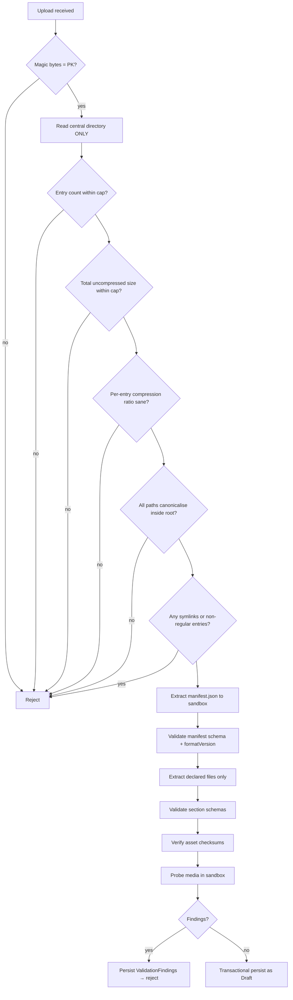

# Secure ZIP Ingestion

Requirement I-13: *treat uploaded ZIP files as untrusted input.*

"Only administrators can upload" is not a mitigation. It narrows **who** can attack, not **what** an attack can do — and an admin account is itself a compromise target ([T20](threat-model.md)).

---

## The rule that shapes everything

> **Validate before extracting. Extract to a sandbox. Persist only after every check passes.**

Most ZIP vulnerabilities are exploited *during* extraction. Any design that extracts first and validates second has already lost.



---

## Attacks and defences

### A1 · Zip Slip (path traversal)

An entry named `../../../etc/cron.d/evil` or `..\\..\\windows\\system32\\x` escapes the extraction directory and writes anywhere the process can reach.

**Defence — canonicalise and verify, for every entry, before extracting anything:**

1. Reject absolute paths and drive letters.
2. Reject any entry whose path contains `..` after normalisation.
3. Resolve the intended destination to its **canonical** form and assert it is still inside the sandbox root.
4. Reject entries whose declared path differs from their canonical form.

```csharp
var destination = Path.GetFullPath(Path.Combine(sandboxRoot, entry.FullName));
var root = Path.GetFullPath(sandboxRoot) + Path.DirectorySeparatorChar;
if (!destination.StartsWith(root, StringComparison.Ordinal))
    throw new PackageValidationException("PATH_ESCAPE", entry.FullName);
```

Do **not** implement this with a string check for `".."` alone — encoding tricks, mixed separators, and Unicode normalisation defeat it. Canonicalisation is the check; the `..` scan is a cheap early filter.

### A2 · Zip bomb (decompression amplification)

A few kilobytes expanding to gigabytes, exhausting disk or memory. Nested bombs compound it.

**Defence — enforce all four, before extraction:**

| Cap | Purpose |
|---|---|
| Compressed upload size | First line of defence |
| **Total uncompressed size** (from the central directory) | Catches the classic bomb |
| **Entry count** | Catches many-small-files attacks |
| **Per-entry compression ratio** | Catches a single hyper-compressed member |

`[ASSUMPTION]` Starting caps, to be tuned against real packages:

```
maxCompressedBytes    = 200 MB
maxUncompressedBytes  = 1 GB
maxEntryCount         = 5,000
maxCompressionRatio   = 100:1 per entry
maxNestingDepth       = 0        (nested archives rejected outright)
```

**Do not trust the central directory alone.** Declared sizes can lie. Also enforce a hard byte cap on the *actual* extraction stream and abort if it is exceeded — the declared size is a fast pre-filter, the stream cap is the real limit.

### A3 · Symlink and special-entry escape

A symlink entry pointing outside the sandbox turns a later write into an arbitrary-file write.

**Defence:** reject any entry that is not a regular file or directory — symlinks, hard links, devices, and anything with unexpected external file attributes.

### A4 · Filename attacks

Null bytes, control characters, reserved Windows names (`CON`, `PRN`, `AUX`, `NUL`, `COM1`…), trailing dots or spaces, over-long paths, right-to-left override characters, and Unicode homoglyphs.

**Defence:** allowlist the permitted character set for entry paths; enforce a maximum path length; reject reserved names case-insensitively; normalise Unicode before comparison.

### A5 · Malicious media

Crafted audio or image files targeting decoder vulnerabilities.

**Defence:** verify magic bytes against the declared media type; probe with a hardened tool **in a sandboxed process with CPU, memory, and wall-clock limits**; enforce duration and dimension caps; strip metadata; never serve uploaded media from the API origin.

### A6 · Schema and parser abuse

Deeply nested JSON causing stack exhaustion; enormous string values; duplicate keys with differing values.

**Defence:** cap JSON document size, nesting depth, and array lengths before parsing; use a parser configured with limits; reject duplicate keys rather than resolving them.

### A7 · Resource exhaustion via concurrency

Many simultaneous uploads, each individually within limits.

**Defence:** cap concurrent package processing; queue rather than parallelise; per-user upload rate limits; total sandbox disk quota.

### A8 · Time-of-check to time-of-use

Validating an entry, then re-reading it during extraction from a source that could change.

**Defence:** persist the upload once to immutable storage; hash it; perform all validation and extraction against that fixed artefact. Never re-read from a mutable source between check and use.

---

## Sandbox properties

Extraction happens in a directory that is:

- Unique per package, created fresh, deleted on completion **or failure**
- Outside any web-served path
- On a filesystem with a size quota
- Owned by a process running with least privilege, with no write access to application directories
- Subject to a wall-clock timeout that kills processing and cleans up

`[ASSUMPTION]` Containerised deployment provides the process boundary; a dedicated worker container for ingestion is preferable to running it in the API process.

---

## Persistence rules

**Nothing is persisted until every check passes.** A partially imported exam is worse than a rejected one — it looks publishable while being incomplete, and the failure surfaces only when a learner sits it.

Import produces **`Draft`**. Publishing is a separate, separately-permissioned action (`exam.publish`). Requirement I-11 permits either, but auto-publishing untrusted uploaded content directly to learners eliminates the only human review point in the pipeline.

Assets move from the sandbox to object storage **after** validation, under server-generated keys — never under a client-supplied filename.

---

## Error reporting

Administrators need actionable errors; attackers must not receive a debugging oracle.

| Do | Do not |
|---|---|
| Report the JSON Pointer path of the offending item | Include stack traces |
| Use stable machine-readable codes | Echo raw file contents |
| Report which validation stage failed | Reveal sandbox paths or internal structure |
| Report all findings at once, not just the first | Reveal specific limit values on rejection |

The last row is a deliberate trade-off: telling an attacker the exact compression-ratio threshold helps them tune. Log the specifics internally; return the category externally.

---

## Testing

Security tests for this pipeline are non-optional and should include real hostile fixtures:

| Fixture | Expected |
|---|---|
| Entry named `../../evil.txt` | Rejected — `PATH_ESCAPE` |
| Absolute path entry | Rejected |
| Symlink entry | Rejected |
| 42.zip-style nested bomb | Rejected — nesting |
| 10 KB → 10 GB single entry | Rejected — ratio cap |
| 100,000 empty entries | Rejected — entry count |
| Null byte in filename | Rejected |
| Reserved name `CON.json` | Rejected |
| `.png` containing an executable | Rejected — magic bytes |
| 10,000-deep nested JSON | Rejected — depth cap |
| Asset in archive but not in manifest | Rejected — `ASSET_UNDECLARED` |
| Manifest checksum mismatch | Rejected — `CHECKSUM_MISMATCH` |
| Valid package | Imported as Draft |

Keep these fixtures in the repository. This pipeline will be modified over time, and these tests are what stop a refactor from silently reopening a hole.
