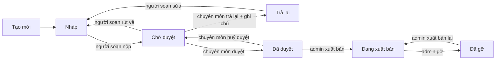

# CMS — hệ thống vận hành nội dung của nền tảng luyện thi IELTS

> **Đây không phải "dashboard quản trị website".** Đây là hệ thống mà đội ngũ phía sau sản phẩm —
> người soạn đề, người phụ trách chuyên môn, người biên tập, quản trị viên — dùng để **tạo và kiểm
> soát mọi thứ học viên nhìn thấy** ở `apps/web`.
>
> Phạm vi: **`apps/admin`** và hợp đồng nội dung nó ghi ra. Không kéo sang LMS, không quản lý lớp học.
>
> **Trạng thái:** `Đ1`…`Đ9` đã được chủ sản phẩm chốt ngày **24/08/2026** — §0.2. Phần còn lại của
> tài liệu ở trạng thái `PROPOSED`, kèm bốn câu hỏi mới phát sinh ở §11 cần trả lời trước khi xây.
>
> Bản v1 (24/08, xếp theo *vai → quyền → giao diện*) đã được viết lại theo thứ tự
> **nội dung → vòng đời → quyền → vai → giao diện → nhật ký**, theo chỉ đạo của chủ sản phẩm:
> *nếu `ExamVersion`, `Question`, `Media`, `Article`, `Dictation` chưa rõ thì vai có chính xác đến
> đâu cũng chưa xây được CMS tốt.*

---

## 0 · Tóm tắt

### 0.1 · Sản phẩm phía trước, CMS phía sau

Mỗi nhánh CMS tồn tại là vì có một thứ học viên nhìn thấy ở phía trước. Không có nhánh nào tồn tại vì
"hệ quản trị nào cũng có".

| Học viên thấy gì ở `apps/web` | CMS nào tạo ra nó | Hiện trạng đường nạp |
|---|---|---|
| Luyện đề — Full Test · Practice · Mock | Exam Content → Question Builder | **Chưa có** — chờ lộ trình dưới |
| Luyện từng kỹ năng R · L · W · S | Cùng một `ExamVersion`, khác cách vào bài | Cùng trên |
| Dictation | Content → Dictation | Nội dung từ seeder |
| Articles | Content → Articles | **Viết cứng trong mã nguồn `apps/web`** |
| Documents / Library | Content → Documents | **Viết cứng trong mã nguồn `apps/web`** |
| AI Evaluation | Không phải nội dung soạn — nhưng CMS phải **soi được** | Chờ API AI |
| Progress / Results | Sinh ra từ lượt làm bài | Đã chạy |

### 0.2 · Chín quyết định làm việc — 24/08/2026

| ID | Quyết định của chủ sản phẩm |
|---|---|
| `Đ1` | Vai giáo viên = **soạn đề** (`exam-author`), không phải quản lớp |
| `Đ2` | Tách `M-11a` quản lớp *(ngoài phạm vi)* và `M-11b` soạn đề *(trong phạm vi)* |
| `Đ3` | `content-editor` → **Content Manager**: bài viết · tài liệu · dictation · media. **Thu hẹp 24/08**: nhóm quyền giữ nguyên, nhưng **chưa gieo thành vai riêng** — gộp vào `admin` cho tới khi có người chuyên trách (`C-25`) |
| `Đ4` | `academic-lead` chỉ **Approve / Return**. **Admin** là người xuất bản |
| `Đ5` | Quy ước khoá quyền: `<resource>.<action>[.<scope>]` |
| `Đ6` | Người soạn xem được analytics **dạng gộp, ẩn danh** |
| `Đ7` | Trình soạn bám đúng 10 dạng câu trong schema, **không chờ `B-8`** |
| `Đ8` | Article · Document · Dictation dùng **chung một vòng đời** |
| `Đ9` | Phải xác định định dạng nguồn đề hiện tại trước khi chọn đường nhập |

> **Không có gì ở đây là bất di bất dịch.** Chủ sản phẩm phát biểu 24/08/2026: *"mình không khoá gì
> hết, đều có thể thay đổi theo từng giai đoạn làm để phù hợp với bài toán mình đề ra"*. Chín dòng
> trên là **quyết định làm việc** — đủ chắc để bắt đầu xây, và được xem lại ở cổng duyệt của mỗi
> phase.
>
> Điều đó **không** có nghĩa mọi thứ đổi rẻ như nhau. §0.4 nói rõ cái nào rẻ, cái nào không.

### 0.4 · Đổi lúc nào cũng được, và đổi muộn thì đắt

Đây là bảng đáng đọc kỹ nhất nếu tinh thần là *vừa làm vừa điều chỉnh*. Cách để "không khoá gì hết"
thành sự thật trên thực tế là **xây các thứ chưa chắc thành khe cắm có cấu hình**, đúng nguyên tắc
`G-11` — chưa có luật thì để khe cắm rỗng, **không bịa giá trị mặc định**.

| Đổi rẻ, lúc nào cũng được | Vì sao rẻ |
|---|---|
| Thêm / bớt / đổi tên vai | Vai là **dữ liệu gieo sẵn**, không phải mã. Một dòng dữ liệu |
| Ai giữ quyền nào | Cùng lý do. Kể cả chuyển `exam.publish` sang `academic-lead` sau này |
| Cây sidebar, bố cục màn, nhãn tiếng Việt | Giao diện. Không chạm mô hình |
| Thêm khuôn soạn IELTS mới | Nhờ tách hai tầng ở §2.5 — thêm khuôn không đụng bộ chấm |
| Thêm trường metadata cho đề | Schema minor bump, trường tuỳ chọn, bản cũ vẫn đọc được |
| Ngưỡng hiện thống kê · danh mục chủ đề · chính sách phiên thi | Cấu hình, không phải hằng số trong mã |
| Thêm chế độ luyện đề thứ ba *(`M-30`)* | Nếu giữ `mode` là khái niệm của **phiên thi**, không nhét vào nội dung đề |

| Đổi muộn thì đắt — hoặc không đổi được | Chuyện gì xảy ra |
|---|---|
| **Phiên bản đã xuất bản là bất biến** | Cho sửa tại chỗ nghĩa là điểm lịch sử bị viết lại lặng lẽ. Không phải "điều chỉnh", mà là **mất niềm tin vào toàn bộ kết quả cũ** — và chỉ lộ ra khi có người khiếu nại band |
| **Nội dung media đã xuất bản là bất biến** | Cùng một lỗi, đi bằng cửa sau: giữ nguyên tham chiếu, đổi tệp phía sau, học viên nghe audio khác |
| **10 kiểu chấm trong schema** | Mỗi kiểu là năm bề mặt. Đổi sau khi trình soạn đã có thì phải sửa cả năm, cộng nội dung đã soạn theo kiểu cũ |
| **Tách origin giữa CMS và app học viên** *(`V-13`)* | Quyết muộn làm **mất hiệu lực mọi phiên đang đăng nhập**, và khoảng thời gian chờ đúng là lúc tài khoản cộng tác viên ngoài đã tồn tại |
| **Tên khoá quyền sau khi đã gieo** | Là một lần migrate dữ liệu. Rẻ nếu đổi trước Phase 1, đắt dần sau đó |
| **Trạng thái vòng đời sau khi đã có nội dung nằm ở trạng thái đó** | Phải chuyển đổi dữ liệu thật, không phải đổi enum |

Bốn dòng đầu của bảng dưới **không phải sở thích kỹ thuật** — chúng là thứ giữ cho điểm số và nội
dung học viên đã thấy còn đúng. Tôi giữ nguyên chúng trừ khi bạn nói khác, và nếu bạn muốn đổi thì
đó là một cuộc trao đổi riêng chứ không phải một dòng cấu hình.

### 0.3 · Ba chỗ định hướng chạm vào hợp đồng đã khoá — và cách xử lý

Không chỗ nào phải phá. Cả ba đều là **bổ sung**, và cả ba đều cần một quyết định nhỏ:

| Chỗ chạm | Việc gì xảy ra | Cách xử lý đề xuất |
|---|---|---|
| Danh sách dạng câu trong Question Builder có **Matching Headings / Information / Features** và **Sentence / Summary / Note-Table Completion** — schema chỉ có `matching` và `completion` | Hai tầng khái niệm đang bị gộp làm một | **Tách hai tầng**: *kiểu chấm* (10, đã khoá) và *khuôn soạn* (14 khuôn mang tên IELTS). → §2.5 |
| **Media Library** dùng chung audio/ảnh giữa nhiều đề — `assetRef` trong schema là **đường dẫn trong gói**, cố ý không phải URL | Soạn tại chỗ không có "gói" nào để trỏ vào | Mở rộng `assetRef` thêm dạng `media/<id>`, và **nội dung media là bất biến**. → §2.4 |
| Nhóm **Luyện đề: Full Test · Practice Test · Mock Test** — `E-11` đã chốt **hai** chế độ: Full Test và Single Skill | Ba tên mới, chưa có định nghĩa phân biệt | Câu hỏi mới `M-30`, chưa tự chọn. → §11 |

---

## 1 · CMS này là gì, và không là gì

| Là | Không là |
|---|---|
| Hệ vận hành nội dung của một nền tảng luyện thi | CMS tổng quát kiểu WordPress |
| Nơi một đề đi từ bản nháp tới học viên, có người ký ở mỗi chặng | Bảng CRUD có nút Sửa và nút Xoá |
| **Trình soạn của `exam.schema.json`** — thứ nó ghi ra là hợp đồng đã có | Một cái form nối thẳng vào cơ sở dữ liệu |
| Công cụ cho ~5–15 người nội bộ, dùng hằng ngày, trên máy để bàn | Hệ quản lý trung tâm: lớp, điểm danh, học phí |

Câu thứ ba là câu quan trọng nhất về mặt kỹ thuật. `exam.schema.json` tự mô tả mình là *"The single
definition of a valid exam. **Three producers** validate against this file and no other: the
development seeder, the ZIP importer, and **in-place CMS authoring**."* Trình soạn đề đã được tính
đến từ đầu — nó là nhà sản xuất thứ ba, không phải một nhánh mới.

---

## 2 · Mô hình nội dung

### 2.1 · Ba họ nội dung

```
                         NỘI DUNG
                            │
        ┌───────────────────┼───────────────────┐
        │                   │                   │
      ĐỀ THI            BÀI VIẾT            TÀI NGUYÊN
   (Exam Content)      (Editorial)        (Tài liệu · Dictation)
        │                   │                   │
   Nặng nhất:          Nhẹ nhất:          Trung bình:
   có cấu trúc,        văn bản +          tệp + metadata
   có đáp án,          ảnh bìa            + bản chép chuẩn
   có chấm điểm
        │                   │                   │
        └───────────────────┼───────────────────┘
                            │
                      MEDIA LIBRARY
                  (audio · ảnh · tệp)
```

Ba họ khác nhau về **độ phức tạp**, nhưng dùng **chung một vòng đời** (`Đ8`) và **chung một kho
media**. Đó là điều làm CMS này có một mental model duy nhất thay vì ba cái rời rạc.

### 2.2 · Đề thi — hai khái niệm, không phải một

Điều này **đã đúng trong mã nguồn hiện tại** và không đổi:

| Khái niệm | Là gì | Ví dụ |
|---|---|---|
| **`ExamDefinition`** — *Đề* | Danh tính của đề, sống mãi | `IELTS Reading Practice Test 024` |
| **`ExamVersion`** — *Phiên bản đề* | Một ảnh chụp nội dung, **bất biến sau khi xuất bản** | `v1` · `v2` · `v3` |

Phát hiện lỗi trong `v1` đang xuất bản thì đường đi là:

```
Published v1  ──►  tạo v2 (nháp)  ──►  duyệt  ──►  xuất bản v2  ──►  v1 tự động thành unpublished
```

**Không sửa `v1` trực tiếp.** Kết quả và lượt thi cũ trỏ tới đúng `examVersionId` của chúng; sửa
tại chỗ là lặng lẽ viết lại điểm lịch sử, và lỗi đó chỉ lộ ra khi có người khiếu nại band — đúng lúc
tệ nhất.

### 2.3 · Bên trong một phiên bản đề

```
ExamVersion
 └── Section            (module: reading · listening · writing · speaking)
      └── Part          (kind: passage · recording · task · speaking-part)
           ├── body / title          văn bản passage hoặc đề bài
           ├── audio / image         → Media Library
           ├── transcript            (Listening)
           ├── cueCard               (Speaking part 2)
           ├── constraints           maxWords — đây là luật chấm, phải chính xác
           └── Question[]
                ├── type             1 trong 10 kiểu chấm đã khoá
                ├── preset           khuôn soạn mang tên IELTS      ← đề xuất mới
                ├── prompt / options
                ├── answerKey        không bao giờ gửi xuống client trước khi chấm
                └── explanation      giải thích do người soạn viết   ← đề xuất mới
```

Hai trường đề xuất thêm, cả hai đều **cộng thêm, không phá cái đang có**:

- **`preset`** — §2.5.
- **`explanation`** — giải thích đáp án do chính người soạn viết. Đây là thứ biến một đề luyện thành
  một bài học. Áp đúng luật của `answerKey`: **không bao giờ gửi xuống client trước khi chấm xong**
  (mối đe doạ `T7`) — nếu không, mở DevTools là thấy đáp án.

### 2.4 · Media Library — kho dùng chung, nhưng nội dung bất biến

Hiện `assetRef` trong schema là **đường dẫn tương đối trong gói** (`assets/listening-p1.mp3`), cố ý
không phải URL, và cố ý không dùng làm khoá lưu trữ. Điều đó đúng cho gói ZIP. **Soạn tại chỗ thì
không có gói nào cả.**

Đề xuất `Đ10`: mở rộng `assetRef` thành hai dạng —

| Dạng | Dùng khi | Ví dụ |
|---|---|---|
| `assets/<path>` | Nhập từ gói ZIP *(giữ nguyên)* | `assets/audio/part1.mp3` |
| `media/<id>` | Soạn tại chỗ, chọn từ Media Library | `media/8f3a…` |

Kèm **một luật không được nhân nhượng**:

> **Nội dung của một media đã được một phiên bản đã xuất bản tham chiếu là bất biến.**
> Không có nút "thay tệp". Muốn đổi audio thì tải lên media mới và tạo phiên bản đề mới.

Không có luật này thì Media Library trở thành cửa sau để sửa một đề đã xuất bản: giữ nguyên `media/8f3a`
nhưng đổi tệp phía sau, và mọi học viên đang thi nghe một đoạn audio khác. Tính bất biến của
`ExamVersion` sẽ chỉ còn đúng trên giấy.

Hệ quả vận hành: media có thể **gỡ khỏi bộ chọn** (không ai chọn được nữa) nhưng **không xoá được**
khi còn phiên bản đã xuất bản tham chiếu tới.

Và một luật thứ hai, sinh ra từ chính luật trên:

> **Đề có tham chiếu media không phân giải được thì không duyệt và không xuất bản được.**
>
> Pipeline nhập gói ZIP đã từ chối gói nào có asset không phân giải (chặng 6). Soạn tại chỗ cần đúng
> cửa từ chối đó, chỉ khác chỗ đứng: **trước khi xuất bản, không phải giữa lúc học viên đang thi**.
> Một đề Listening đủ câu hỏi, đủ đáp án, đã duyệt xong mà thiếu file audio thì vẫn là một đề không
> thi được — và nó trông hoàn chỉnh cho tới đúng giây học viên bấm play.
>
> Nộp duyệt thì **không** chặn: người soạn có thể muốn xin ý kiến về phần câu hỏi trong lúc bản thu
> còn đang cắt.

Mỗi media mang: `id` · loại · checksum · kích thước · thời lượng *(audio)* · người tải · thời điểm ·
**danh sách đề đang dùng**. Cột cuối là cột hay bị bỏ quên và là cột người ta cần nhất — không có nó
thì không ai dám xoá gì.

### 2.5 · Taxonomy dạng câu hỏi — hai tầng, không phải một

Đây là điều chỉnh quan trọng nhất trong tài liệu này.

Danh sách trong Question Builder bạn nêu là **danh sách của người ra đề IELTS** — đúng nghiệp vụ.
Enum trong schema là **danh sách của bộ chấm** — 10 giá trị, đã khoá. Chúng không mâu thuẫn, chúng ở
hai tầng khác nhau, và gộp chúng lại là cách làm hỏng cả hai:

- Gộp lên tầng nghiệp vụ → mỗi khuôn IELTS thành một kiểu chấm mới → mỗi cái kéo theo **năm bề mặt**
  (trình soạn · renderer · hình dạng đáp án · validator · luật chấm). Schema nói thẳng: *"Adding one
  is a minor version bump; changing one after its editor exists is not cheap."*
- Gộp xuống tầng chấm → người soạn đề IELTS phải chọn "matching" rồi tự nhớ mình đang làm Headings
  hay Features, và học viên đọc được câu lệnh sai.

**Đề xuất: `type` quyết định *chấm thế nào*; `preset` quyết định *soạn thế nào* và *câu lệnh hiện ra
cho học viên là gì*.**

| Khuôn soạn *(người soạn chọn cái này)* | `type` — kiểu chấm | `preset` |
|---|---|---|
| Multiple Choice — một đáp án | `multiple-choice` | `mc-single` |
| Multiple Choice — nhiều đáp án | `multiple-select` | `mc-multi` |
| True / False / Not Given | `true-false-notgiven` | — |
| Yes / No / Not Given | `yes-no-notgiven` | — |
| Matching Headings | `matching` | `matching-headings` |
| Matching Information | `matching` | `matching-information` |
| Matching Features | `matching` | `matching-features` |
| Sentence Completion | `completion` | `sentence-completion` |
| Summary Completion | `completion` | `summary-completion` |
| Note / Table / Flow-chart Completion | `completion` | `note-table-completion` |
| Short Answer | `short-answer` | — |
| Diagram / Map / Plan Labelling | `labelling` | `diagram-labelling` |
| Writing Task 1 · Task 2 | `essay-task` | `task-1` · `task-2` |
| Speaking Part 1 · 2 · 3 | `speaking-response` | `part-1` · `part-2` · `part-3` |

Bốn khuôn cuối bảng không có trong danh sách bạn liệt kê vì bạn đang nói tới Reading — nhưng trình
soạn phải có đủ, nếu không thì Writing và Speaking không soạn được.

**Chi phí của cách này gần bằng không:** `preset` là một chuỗi, không đổi cách chấm, không đổi hình
dạng đáp án, và object `question` trong schema hiện **không khoá thuộc tính lạ** — nên đây là một
minor version bump đúng nghĩa. Đổi lại, thêm một khuôn IELTS sau này chỉ là thêm một trình soạn con,
không đụng tới bộ chấm.

### 2.6 · Metadata của đề — ba loại, đừng trộn

Danh sách metadata bạn nêu là đúng thứ cần có. Nhưng chúng thuộc **ba nơi khác nhau**, và trộn lại
sẽ sinh ra một lỗ hổng cụ thể.

| Loại | Nằm ở đâu | Gồm |
|---|---|---|
| **Nội dung** — thuộc về bản thân đề | Trong `exam.schema.json` | Tiêu đề · variant *(Academic/General)* · mô tả · chủ đề · độ khó do người soạn đặt · band mục tiêu |
| **Hệ thống** — thuộc về bản ghi, không thuộc về tệp | Trên thực thể `ExamVersion` | Trạng thái · người soạn · người duyệt · số phiên bản · các mốc thời gian |
| **Suy ra** — không lưu ở đâu cả | Tính lúc đọc | Kỹ năng *(từ danh sách section)* · thời lượng *(từ `TimingProfile`)* · số câu hỏi |

> **Vì sao "hệ thống" tuyệt đối không được nằm trong tệp:** nếu `status` là một trường trong JSON thì
> một gói ZIP tải lên **tự khai mình đã xuất bản**. Cả pipeline kiểm gói dựng ra để chặn chuyện đó
> sẽ bị đi vòng bằng một dòng metadata. Trạng thái là thứ hệ thống quyết định, không phải thứ tệp
> khai báo.

Và một điểm về **độ khó** — nó là hai con số khác nhau, đừng để chúng ghi đè nhau:

| | Nghĩa | Nguồn |
|---|---|---|
| `difficultyAuthored` | Người soạn *cho rằng* đề này band 6.5 | Người nhập |
| `difficultyObserved` | Dữ liệu làm bài *cho thấy* đề này band 5.5 | Tính từ lượt thi thật → §8 |

Khoảng cách giữa hai con số chính là thứ đáng xem nhất trong Analytics.

**Chủ đề (`topic`)** phải là **danh mục có sẵn, sửa được**, không phải ô nhập tự do. Tag tự do sẽ rã
thành `Environment`, `environment`, `Môi trường`, `MT` trong vòng ba tháng, và lúc đó lọc theo chủ đề
không còn dùng được.

---

## 3 · Vòng đời nội dung

### 3.1 · Đề thi — sáu trạng thái



Bốn luật gắn với sơ đồ:

1. **Nháp chỉ người tạo và `academic-lead` thấy.** Không nằm trong danh sách đề chung.
2. **Nộp duyệt là đóng băng mềm.** Ở `Chờ duyệt`, người soạn không sửa được nữa — muốn sửa thì rút
   về, và việc rút được ghi nhật ký. Không có luật này thì người duyệt đang đọc một tài liệu đang
   chạy dưới chân họ.
3. **Đã duyệt vẫn chưa tới tay học viên.** Không tồn tại nút "duyệt và xuất bản luôn" (`Đ4`).
4. **Xuất bản xong là bất biến.** Sửa nội dung = phiên bản mới, đi lại từ đầu.

### 3.2 · Bài viết · Tài liệu · Dictation — bốn trạng thái

```
Nháp  ──►  Chờ duyệt  ──►  Đã xuất bản  ──►  Đã gỡ
             │                                  │
             └──── trả lại ──► Nháp             └──► xuất bản lại
```

Cùng động từ, cùng nút, cùng hộp xác nhận, cùng dòng nhật ký — chỉ **không có bước `Đã duyệt` tách
riêng**, vì không có ai phải ký chuyên môn cho một bài blog. Đây là ý nghĩa thật của `Đ8`: không
phải "y hệt nhau", mà là **một mô hình tư duy duy nhất**, học một lần dùng cho tất cả.

### 3.3 · Bốn nguồn nội dung, một cổng kiểm

```
   Soạn tại chỗ      Nhập JSON       Nhập ZIP        AI phân tích
        │                │               │                │
        └────────────────┴───────┬───────┴────────────────┘
                                 ▼
                    exam.schema.json  —  cổng kiểm duy nhất
                                 ▼
                              NHÁP
                                 ▼
                          CHỜ DUYỆT  ──►  ĐÃ DUYỆT  ──►  XUẤT BẢN
```

**Đây không phải đề xuất mới — đây là mô tả cái đã có.** `ExamPackageReader` hiện là cổng duy nhất và
tự ghi rõ lý do: ba nhà sản xuất, một validator, vì *"Two definitions of validity would drift, and the
drift surfaces as a learner mid-attempt hitting a question the renderer cannot draw."*

Hệ quả đúng như bạn nói: **AI parsing sau này không cần một workflow riêng.** Nó là nguồn thứ tư đi
vào cùng một cổng, ra cùng một bản nháp, qua cùng một hàng chờ duyệt. Việc `I-16` yêu cầu nội dung do
AI sinh phải qua duyệt trở thành **hệ quả tự nhiên**, không phải một luật gắn thêm.

Một điểm cần nói rõ ngay: **mã lỗi kiểm gói dùng chung cho cả trình soạn.** Người soạn đề thấy đúng
`ASSET_NOT_FOUND` mà người nhập ZIP thấy. Một bộ từ vựng lỗi, không phải hai.

---

## 4 · Mô hình quyền

### 4.1 · Quy ước và vấn đề "của tôi"

`Đ5` chốt: **`<resource>.<action>[.<scope>]`**.

Phần `scope` tồn tại vì một phát hiện: **mô hình quyền hiện tại không có khái niệm "của tôi"**.
`Role.Grants(permission)` là một phép so chuỗi toàn cục — `exam.update` nghĩa là sửa được bản nháp
của **mọi người**. Với đội nội bộ thì không sao. Với người soạn đề — có thể là cộng tác viên ngoài —
thì không chấp nhận được.

Chọn cách **khai báo cả hai vế** (`.own` và `.any`) thay vì để `.own` là ngầm định, vì ma trận quyền
là một bảng hộp kiểm: một ô trống mang nghĩa *"có, nhưng hạn chế"* là cách chắc chắn để cấp nhầm.

### 4.2 · Khoá quyền

Đậm là khoá **mới**. 24 khoá hiện có giữ nguyên tên, trừ ba khoá `exam.*` được thêm hậu tố phạm vi.

| Nhóm | Khoá |
|---|---|
| Đề — đọc | `exam.read.own` · **`exam.read.any`** |
| Đề — soạn | `exam.create` · **`exam.update.own`** · **`exam.update.any`** · **`exam.delete.own`** · **`exam.delete.any`** |
| Đề — vòng đời | **`exam.submit`** · **`exam.review`** · **`exam.preview`** · `exam.publish` · `exam.unpublish` |
| Gói nhập | `package.upload` · `package.read` · `package.delete` |
| Media | **`media.read`** · **`media.upload`** · **`media.retire`** |
| Bài viết | **`article.read`** · **`article.write`** · **`article.publish`** |
| Tài liệu | **`document.read`** · **`document.write`** · **`document.publish`** |
| Dictation | **`dictation.read`** · **`dictation.write`** · **`dictation.publish`** |
| Thống kê | **`analytics.exam.read`** · **`analytics.content.read`** |
| Đánh giá AI | `evaluation.read` · `evaluation.rerun` · `evaluation.override` |
| Nội dung học viên | `learner-content.read` |
| Người dùng | `user.read` · `user.update` · `user.suspend` · `user.delete` · `user.export` |
| Vai | `role.read` · `role.assign` · `role.manage` |
| Cấu hình · Nhật ký | `config.read` · `config.update` · `audit.read` |

Ba nhóm nội dung tách riêng (`article` · `document` · `dictation`) thay vì gộp thành `content.*`, vì
**xuất bản một bài viết không phải là xuất bản một đề thi**, và sẽ có lúc cần cấp cái này mà không
cấp cái kia.

### 4.3 · Thay đổi mô hình dữ liệu

Nhỏ, và **không phá ranh giới lưu trữ** ([ADR-0004](../decisions/0004-persistence-abstraction-boundary.md)):

| Thực thể | Thêm | Vì sao |
|---|---|---|
| `ExamVersion` | `createdBy` · `createdAt` | Không có thì không có khái niệm "của tôi" |
| `ExamVersion` | `submittedBy` · `submittedAt` | Ai chịu trách nhiệm nội dung này |
| `ExamVersion` | `reviewedBy` · `reviewedAt` · `reviewDecision` | Chữ ký chuyên môn |
| `ExamVersionStatus` | thêm `InReview` · `Returned` · `Approved` | §3.1 |
| **Mới** `ExamReviewNote` | `versionId` · `author` · `at` · `body` · `anchor` *(trỏ tới câu hỏi nào)* | Trả lại mà không nói vì sao thì người soạn phải đoán |
| **Mới** `MediaAsset` | `id` · `kind` · `checksum` · `bytes` · `durationMs` · `uploadedBy` · `usedBy[]` | §2.4 |
| **Mới** `Article` · `Document` · `DictationItem` | nội dung + trạng thái + tác giả | §3.2 |

`IsSittable` vẫn **chỉ đúng với `Published`**. Thêm ba trạng thái không nới lỏng điều đó.

---

## 5 · Vai

| Vai | Người thật | Việc chính | Cố ý **không** làm được |
|---|---|---|---|
| `learner` | Học viên | Thi, xem kết quả | Mọi thứ trong CMS |
| **`exam-author`** | Giáo viên IELTS, có thể là cộng tác viên ngoài | Tạo đề · sửa **đề của mình** · tải media · đặt đáp án · xem thử · nộp duyệt · xem thống kê đề của mình | **Xuất bản** · duyệt · đọc bài và ghi âm học viên · thấy nháp của người khác |
| **`academic-lead`** | Trưởng chuyên môn IELTS | Mọi thứ trên, trên đề của **mọi người** · **duyệt hoặc trả lại** kèm ghi chú neo theo câu hỏi | **Xuất bản** *(`Đ4`)* · quản lý người dùng · cấu hình |
| `admin` | Bạn và 1–2 người | Toàn quyền, gồm **xuất bản** và **gỡ xuất bản**. Kiêm nội dung và hỗ trợ cho tới khi có người chuyên trách | — |

**Ba vai, và con số này là quyết định nhân sự chứ không phải quyết định kiến trúc.** Quyền mới là mô
hình; vai chỉ là **một túi quyền lưu dạng dữ liệu**. Nên câu hỏi *"bao nhiêu vai"* thật ra là *"hiện
có bao nhiêu loại người khác nhau ở VNI"* — và gieo sẵn một vai không ai giữ có cái giá thật: người
đi cấp quyền phải đọc một danh sách, và mục không ai dùng chính là mục dễ bị chọn nhầm.

**Đã gộp vào `admin` ngày 24/08/2026, và cái giá của việc gộp:**

| Vai đã gộp | Lẽ ra làm gì | Mất gì khi gộp |
|---|---|---|
| `content-manager` | Bài viết · tài liệu · nghe chép · kho media | **Không mất gì hiện tại** — không thứ nào trong số đó tồn tại trước Phase 4, nên vai này đang canh một cái cửa chưa có phòng |
| `support` | Tra cứu người dùng, xem bài học viên khi có khiếu nại | Là chỗ **duy nhất ngoài admin** giữ `learner-content.read`. Gộp lại làm quyền đọc bài luận và ghi âm học viên **hẹp đi**, không rộng ra — đúng hướng theo PDPL |

Toàn bộ khoá quyền của hai vai đó **vẫn nằm trong mô hình**. Tách lại là **một dòng dữ liệu gieo
thêm**, không phải một lần triển khai — đó là lý do cắt ở đây không mất gì.

**`academic-lead` thì không gộp**, vì nó giữ đúng điều bạn đã nêu: admin đẩy đề lên web nhưng chưa
chắc có kiến thức IELTS. Nếu admin là người duy nhất giữa bản nháp và học viên thì họ đang ký một
thứ họ không đọc được, và bước duyệt thành thủ tục rỗng. Trung tâm hiện chưa đủ người thì **cấp cả
hai vai cho một tài khoản** — vẫn tách ra được bất cứ lúc nào, không phải sửa mã.

### Ma trận quyền

| Quyền | `exam-author` | `academic-lead` | `admin` |
|---|:---:|:---:|:---:|
| `exam.read.own` | ✓ | ✓ | ✓ |
| `exam.read.any` | — | ✓ | ✓ |
| `exam.create` | ✓ | ✓ | ✓ |
| `exam.update.own` · `exam.delete.own` | ✓ | ✓ | ✓ |
| `exam.update.any` | — | ✓ | ✓ |
| `exam.delete.any` | — | — | ✓ |
| `exam.submit` | ✓ | ✓ | ✓ |
| `exam.review` | — | ✓ | ✓ |
| `exam.preview` | ✓ | ✓ | ✓ |
| `exam.publish` · `exam.unpublish` | — | — | ✓ |
| `package.upload` · `package.read` | ✓ | ✓ | ✓ |
| `package.delete` | — | — | ✓ |
| `media.read` · `media.upload` | ✓ | ✓ | ✓ |
| `media.retire` | — | ✓ | ✓ |
| `article.*` · `document.*` · `dictation.*` — soạn | — | — | ✓ |
| …`publish` | — | — | ✓ |
| `analytics.exam.read` | ✓ *(đề của mình)* | ✓ | ✓ |
| `analytics.content.read` | — | — | ✓ |
| `evaluation.read` | — | ✓ | ✓ |
| `evaluation.rerun` · `evaluation.override` | — | — | ✓ |
| **`learner-content.read`** | **—** | **—** | ✓ |
| `user.read` | — | — | ✓ |
| `user.update` · `user.suspend` · `user.delete` · `user.export` | — | — | ✓ |
| `role.*` · `config.*` · `audit.read` | — | — | ✓ |

Hai ô đáng dừng lại:

- **Không ai ngoài `admin` có `exam.publish`** — đúng nguyên văn yêu cầu.
- **`exam-author` và `academic-lead` không có `learner-content.read`.** Người soạn đề không có lý do
  nghiệp vụ để đọc bài luận hay nghe ghi âm của học viên. Đây là giới hạn mục đích theo PDPL
  ([`../security/privacy-vietnam-pdpl.md`](../security/privacy-vietnam-pdpl.md)), không phải sự thiếu
  tin tưởng — và nó đặc biệt quan trọng khi người soạn là cộng tác viên ngoài. Cái họ cần để làm tốt
  việc của mình là **thống kê gộp** (`Đ6`), không phải bài của từng người.

**`media.retire` tách khỏi `media.upload`**: người soạn đề tải tệp lên được nhưng không dọn kho được.
Gỡ một tệp khỏi bộ chọn ảnh hưởng tới đề của người khác, nên nó thuộc về người nhìn được toàn bộ kho.

---

## 6 · Giao diện

### 6.1 · Sidebar theo công việc, không theo bảng dữ liệu

Sidebar hiện tại liệt kê **thực thể kỹ thuật** (Đề thi · Người dùng · Vai · Nhật ký…). Bản mới xếp
theo **công việc của đội vận hành**. Mục nào không có quyền đọc thì không hiện — cơ chế này đã chạy,
chỉ đổi nội dung cây.

```
VNI IELTS CMS                    admin thấy toàn bộ

TỔNG QUAN
  Bảng điều khiển

ĐỀ THI
  Đề của tôi
  Tất cả đề
  Hàng chờ duyệt          ← số đang chờ hiện ngay trên nhãn
  Chờ xuất bản
  Nhập đề

NỘI DUNG
  Bài viết
  Tài liệu
  Dictation

MEDIA
  Kho media

THỐNG KÊ
  Thống kê đề
  Thống kê nội dung

HỆ THỐNG
  Người dùng
  Vai và quyền
  Nhật ký
  Cấu hình
```

Cùng cây đó, `exam-author` chỉ thấy:

```
TỔNG QUAN · Bảng điều khiển
ĐỀ CỦA TÔI · Tất cả · Nháp · Chờ duyệt · Trả lại · Đã xuất bản
MEDIA · Kho media
THỐNG KÊ · Đề của tôi
```

`academic-lead` thấy thêm `Tất cả đề` · `Hàng chờ duyệt` · `Đã duyệt` · `Thống kê đề`.

> **Năm mục trạng thái dưới "Đề của tôi" là năm bộ lọc của một màn, không phải năm màn.** Dựng năm
> màn gần giống nhau nghĩa là mỗi lần sửa cột phải sửa năm chỗ, và chúng sẽ lệch nhau.

### 6.2 · Trình soạn đề là một không gian làm việc, không phải một form

Đây là màn quyết định CMS này trông như sản phẩm hay như một trang CRUD.

```
┌────────────────────────────────────────────────────────────────────┐
│ IELTS Reading Practice Test 024              [Nháp]  v2  · Tự lưu  │
│ Người soạn: Nguyễn A                                               │
├──────────────┬─────────────────────────────────┬───────────────────┤
│ CẤU TRÚC     │ SOẠN NỘI DUNG                   │ KIỂM TRA          │
│              │                                 │                   │
│ ▸ Passage 1  │  Câu 4    Matching Headings     │ ● 2 lỗi           │
│   Q1 ✓       │  ┌───────────────────────────┐  │   Câu 7 thiếu     │
│   Q2 ✓       │  │ Chọn tiêu đề cho đoạn B   │  │   đáp án          │
│   Q3 ✓       │  └───────────────────────────┘  │   Passage 2 thiếu │
│   Q4 ●       │                                 │   audio           │
│ ▸ Passage 2  │  Danh sách tiêu đề  i…viii      │                   │
│   Q5–Q13     │  Đáp án đúng:  [ iv ▾ ]         │ ○ 1 cảnh báo      │
│ ▸ Passage 3  │                                 │   Q11 chưa có     │
│              │  Giải thích  (tuỳ chọn)         │   giải thích      │
│ + Thêm phần  │  ┌───────────────────────────┐  │                   │
│              │  └───────────────────────────┘  │ MEDIA             │
│              │                                 │  part1.mp3 4:12   │
├──────────────┴─────────────────────────────────┴───────────────────┤
│ [ Lưu nháp ]        [ Xem thử như học viên ]      [ Nộp duyệt ]    │
└────────────────────────────────────────────────────────────────────┘
```

Sáu thứ cột phải, theo đúng thứ tự quan trọng:

1. **Cây cấu trúc bên trái** — người soạn luôn biết mình đang ở đâu trong đề 40 câu.
2. **Trình soạn đổi theo khuôn** — bấm `+ Thêm câu hỏi` hiện bộ chọn 14 khuôn (§2.5), chọn xong thì
   ô nhập đổi theo. Không có một form dài chứa mọi trường của mọi dạng.
3. **Bảng kiểm chạy liên tục**, dùng **đúng mã lỗi của pipeline nhập gói**. Người soạn sửa lỗi trong
   lúc soạn, không phải lúc nộp.
4. **Xem thử như học viên** — đây là màn `3.6` mà `cms-spec.md` để treo dưới `M-18`. Với người soạn
   đề thì nó không còn là tuỳ chọn: soạn mà không thấy được thứ mình vừa tạo là soạn mù.
5. **Tự lưu, và nói rõ đã lưu lúc nào.** Một đề Reading là 40 câu; mất việc vì đóng nhầm tab là mất
   một buổi.
6. **Trạng thái và số phiên bản luôn hiện trên đầu.** Người soạn phải biết mình đang sửa nháp `v2`
   chứ không phải nhìn vào `v1` đang có người thi.

**Ràng buộc giao diện** — [`DESIGN.md`](DESIGN.md) áp nguyên vẹn: mật độ `compact`, sàn chữ 14px,
không cuộn ngang. Bố cục ba cột cần bề rộng: CMS là **web trên máy để bàn**, không bao giờ đóng gói
vào bản mobile, nên khai báo thẳng một bề rộng tối thiểu được hỗ trợ và hiện thông báo rõ ràng dưới
ngưỡng đó — tốt hơn nhiều so với một bố cục ba cột bị bóp nát trên màn hình 13 inch.

### 6.3 · Màn hình cần dựng

| # | Màn | Vai | Chặn bởi |
|---|---|---|---|
| A1 | **Đề của tôi** — một danh sách, năm bộ lọc, thấy ghi chú trả lại | `exam-author` | — |
| A2 | **Trình soạn đề** — §6.2 | `exam-author` | `Đ7` đã gỡ chặn |
| A3 | **Xem thử như học viên** | `exam-author` | `M-18` |
| B1 | **Hàng chờ duyệt** — xếp theo thời gian nộp, hiện tuổi chờ | `academic-lead` | — |
| B2 | **Màn duyệt** — nội dung + ghi chú neo theo câu hỏi + Duyệt / Trả lại | `academic-lead` | — |
| C1 | **Chờ xuất bản** — đã duyệt, chưa lên web | `admin` | — |
| C2 | Chi tiết đề — bổ sung dòng thời gian duyệt vào timeline version | `admin` | — |
| D1 | **Kho media** — bộ lọc, cột "đang dùng ở đâu", trạng thái khoá / gỡ | `exam-author` · `academic-lead` · `admin` | — |
| D2 | **Media của đề** trên màn duyệt — tham chiếu nào phân giải được, tham chiếu nào không | `academic-lead` · `admin` | — |
| E1–E3 | **Bài viết · Tài liệu · Dictation** — danh sách + soạn, chung vòng đời | `admin` *(tách thành vai riêng khi có người chuyên trách)* | — |
| F1 | **Thống kê đề** — §8 | `exam-author` · `academic-lead` | Cần lượt thi thật |

---

## 7 · Nhật ký

Nhật ký chỉ-ghi-thêm **đã chạy**. Cần bổ sung các hành động mới, mỗi cái một bản ghi trong cùng
request đã tạo ra nó:

nộp duyệt · rút về nháp · trả lại *(kèm ghi chú)* · duyệt · huỷ duyệt · tải media lên · gỡ media ·
xuất bản bài viết / tài liệu / dictation · gỡ xuất bản chúng.

Cộng với những hành động đã ghi: xuất bản · gỡ xuất bản · nhập gói · xoá nháp · đổi vai · đổi quyền ·
khoá tài khoản · xoá tài khoản · xuất dữ liệu cá nhân · mở nội dung học viên · chạy lại đánh giá ·
ghi đè điểm · đổi cấu hình.

Nguyên tắc giữ nguyên: không nút sửa, không nút xoá, không "dọn log" — mối đe doạ `T21`.

---

## 8 · Thống kê

### Thống kê đề — thứ làm vai người soạn có giá trị thật

| Chỉ số | Trả lời câu hỏi gì |
|---|---|
| Tỉ lệ đúng theo từng câu | Câu nào cả loạt học viên làm sai — đề sai hay câu khó thật? |
| Phân bố lựa chọn sai | Với trắc nghiệm: phương án nhiễu nào đang "ăn" hết, phương án nào không ai chọn *(nhiễu chết)* |
| Thời gian trung bình mỗi câu | Câu nào ngốn thời gian bất thường — thường là câu diễn đạt tối nghĩa |
| Độ khó quan sát so với độ khó khai báo | §2.6 — khoảng cách giữa hai con số |
| Tỉ lệ bỏ dở theo phần | Chỗ học viên bỏ cuộc |

**Ba luật bảo vệ dữ liệu cá nhân**, và đây là điều kiện để `Đ6` an toàn:

1. **Chỉ số gộp, không bao giờ theo từng người.** Không có đường nào từ màn này tới danh tính học viên.
2. **Ngưỡng tối thiểu trước khi hiện.** Dưới ngưỡng thì "chưa đủ dữ liệu", không hiện phần trăm —
   với 3 lượt làm bài thì "67% sai" vừa vô nghĩa vừa gần như chỉ đích danh. Ngưỡng cụ thể → `M-33`.
3. **`exam-author` chỉ thấy đề của mình**; `academic-lead` thấy tất cả.

### Thống kê nội dung

Lượt xem bài viết · lượt tải tài liệu · lượt hoàn thành dictation. Nhẹ, nhưng là thứ duy nhất trả lời
được *"có nên viết tiếp loạt bài này không"*.

---

## 9 · Rủi ro đi kèm khi mở vai mới

| # | Rủi ro | Vì sao có thật ở đây | Xử lý |
|---|---|---|---|
| 1 | **Tài khoản người soạn là bề mặt tấn công mới** | Có thể là cộng tác viên ngoài, dùng máy cá nhân. Một tài khoản bị chiếm mà có `exam.publish` là đẩy được nội dung tới mọi thí sinh — mối đe doạ `T20` | Không cấp `exam.publish`. Bắt buộc 2FA cho mọi tài khoản vận hành → `M-17` đang treo |
| 2 | **Nội dung do người ngoài nhập là đầu vào không tin cậy** | Passage dán từ Word mang theo HTML — mối đe doạ `T17` | Làm sạch lúc hiển thị, không lúc lưu. Không bao giờ render thô |
| 3 | **Media tải lên là đầu vào không tin cậy** | Một tệp "mp3" có thể không phải mp3 | Kiểm magic bytes, dò media, hạn mức dung lượng — dùng lại đúng pipeline của [`../security/zip-ingestion-security.md`](../security/zip-ingestion-security.md) |
| 4 | **Duyệt thành thủ tục rỗng** | Người duyệt không có công cụ đọc kỹ thì họ bấm Duyệt cho xong | Ghi chú neo theo câu hỏi + xem thử như học viên. Mỗi lần duyệt ghi tên vào nhật ký |
| 5 | **Bản quyền đề khi người soạn nghỉ việc** | Đề do cộng tác viên soạn thuộc về ai | `[BUSINESS DECISION]` — hợp đồng, không phải phần mềm. Nhưng `createdBy` phải lưu để có bằng chứng |
| 6 | **CMS và app học viên đang dùng chung một origin và một khoá phiên** | Đây là rủi ro `V-13` đã ghi từ 21/08, và mở vai người soạn làm nó nặng thêm: JavaScript của app học viên đọc được token của người vận hành, mà app học viên là bề mặt tấn công lớn hơn — và `M-24` Articles sẽ render nội dung do người khác soạn | Quyết **trước khi** CMS mang tài khoản vận hành thật. Tách origin sau này làm mất hiệu lực mọi phiên đang đăng nhập |

---

## 10 · Hợp đồng schema phải đổi những gì

Cụ thể, để lượng hoá được công. Cả bốn đều là **minor version bump** (`formatVersion` `1.0` → `1.1`),
đúng cơ chế mà schema tự khai: *"Minor versions are additive; unknown optional fields are ignored."*

| # | Thay đổi | Mức |
|---|---|---|
| 1 | Thêm `preset` *(tuỳ chọn)* vào `question` | Nhỏ — object `question` hiện không khoá thuộc tính lạ |
| 2 | Thêm `explanation` *(tuỳ chọn)* vào `question`, kèm luật không gửi trước khi chấm | Nhỏ |
| 3 | Mở rộng `assetRef` thành `oneOf [ đường dẫn gói, media/<id> ]` | Vừa — đụng cả trình đọc gói và tầng lưu trữ |
| 4 | Thêm `metadata` *(tuỳ chọn)*: chủ đề · độ khó khai báo · band mục tiêu | Vừa — object gốc **có** khoá thuộc tính lạ nên phải khai báo tường minh |

Và **một thứ dứt khoát không được thêm vào schema**: `status` · `author` · `reviewer` · các mốc thời
gian. Chúng thuộc về bản ghi, không thuộc về tệp. → §2.6

---

## 11 · Bốn câu hỏi mới — và khe cắm để không phải chờ chúng

Chủ sản phẩm đã nói rõ: không khoá gì, điều chỉnh theo từng giai đoạn. Nên bốn câu dưới **không
chặn việc xây**. Mỗi câu có một khe cắm để câu trả lời tới lúc nào cũng lắp vào được.

| ID | Khe cắm dựng sẵn để câu trả lời lắp vào |
|---|---|
| `M-30` | `mode` giữ nguyên là khái niệm của **phiên thi**, không nhét vào nội dung đề. Hiện chỉ có hai chế độ `E-11`. Thêm chế độ thứ ba sau này là thêm một chính sách phiên, không phải chuyển đổi nội dung |
| `M-31` | Mọi tham chiếu media đi qua **một hàm phân giải duy nhất**. Phase 2 hỗ trợ đường dẫn gói; thêm dạng `media/<id>` là sửa một chỗ |
| `M-32` | Chủ đề là **dữ liệu gieo sẵn với danh sách khởi đầu rỗng**, sửa được trong CMS. Không bịa danh mục thay chuyên môn |
| `M-33` | Ngưỡng là **giá trị cấu hình**, không phải hằng số. Chưa đặt thì màn thống kê nói "chưa đủ dữ liệu" thay vì hiện số |

Nội dung đầy đủ của bốn câu hỏi:


| ID | Câu hỏi | Vì sao không tự quyết được |
|---|---|---|
| **`M-30`** | **Practice Test và Mock Test khác Full Test ở chỗ nào?** | `E-11` đã chốt **hai** chế độ: Full Test và Single Skill. Cây sản phẩm mới có **ba** tên dưới "Luyện đề". Nếu khác nhau ở *nội dung* thì đề phải mang thêm một thuộc tính; nếu chỉ khác ở *cách làm bài* (bấm giờ thật, không xem đáp án giữa chừng) thì đó là luật của phiên thi và đề không cần biết. Hai câu trả lời cho ra hai CMS khác nhau |
| **`M-31`** | **`assetRef` chọn hướng nào** — mở rộng schema, hay soạn tại chỗ vẫn ghi ra đường dẫn kiểu gói? | Quyết định này khoá cứng hình dạng Media Library. Đề xuất: mở rộng, kèm luật bất biến ở §2.4 |
| **`M-32`** | **Danh mục chủ đề lấy từ đâu?** | Danh mục có sẵn thì cần một danh sách khởi đầu do chuyên môn IELTS đặt. Đây là việc của `academic-lead`, không phải của kỹ thuật |
| **`M-33`** | **Ngưỡng số lượt tối thiểu trước khi hiện thống kê là bao nhiêu?** | Là lựa chọn giữa *hữu ích sớm* và *an toàn dữ liệu*. Không có con số chuẩn ngành cho ngữ cảnh này |

`Đ9` — *đề của bạn hiện đang ở dạng gì?* — cũng không còn là câu chặn. Bốn nguồn nội dung đi vào
**cùng một cổng kiểm** (§3.3), nên câu trả lời chỉ quyết định **làm đường nhập nào trước**, không
quyết định kiến trúc. Phase 2 bắt đầu bằng đường JSON vì nó đúng với mọi câu trả lời, rồi ZIP, rồi
AI. Biết sớm thì đỡ làm thừa một nhịp; không biết cũng không phải ngồi chờ.

---

## 12 · Lộ trình

Theo đúng thứ tự chủ sản phẩm đưa ra. Mỗi phase là **một cổng duyệt**: xong → đối chiếu → báo cáo →
dừng.

### Phase 1 — Nền tảng · *không chặn bởi gì đang treo*

RBAC mở rộng · quyền theo phạm vi sở hữu · metadata trên `ExamVersion` · vòng đời 6 trạng thái · nhật
ký cho các hành động mới.

- [ ] Hai vai mới gieo sẵn, ma trận quyền lấy cột từ nguồn duy nhất trong mã
- [ ] `exam.update.own` từ chối bản nháp của người khác — **có test chứng minh nó từ chối**
- [ ] Sáu trạng thái, năm chuyển trạng thái, mỗi cái một bản ghi nhật ký trong cùng request
- [ ] Ba màn: Đề của tôi · Hàng chờ duyệt · Chờ xuất bản
- [ ] Một đề đi hết vòng từ nháp tới xuất bản — nội dung tạm nhập bằng JSON

### Phase 2 — Đường nạp nội dung · *chặn bởi `Đ9`*

Nhập JSON · nhập ZIP bảy chặng kiểm · **đường tải media lên thật** · kiểm tệp tải lên phía máy chủ.

> Giao diện kho media và luật của nó đã dựng ở Phase 1 — xem `next-actions.md` §Phase 1b. Cái còn
> thiếu là phía dưới: adapter object storage sau cổng `IObjectStorage` (MinIO đã có trong
> `compose.yaml` nhưng **chưa có adapter nào trong mã**), endpoint tải lên, và `MediaAsset` như một
> thực thể. Hiện `FixtureAssetStore` đọc audio từ thư mục `fixtures/` và **chỉ đăng ký ở
> Development** — nó tự đặt tên mình là stopgap.

### Phase 3 — Trình soạn đề · *phần nặng nhất*

14 khuôn soạn · bốn kỹ năng · bảng kiểm chạy liên tục · xem thử như học viên · tự lưu.

### Phase 4 — CMS nội dung

Bài viết · tài liệu · dictation, chung vòng đời. Gỡ được dữ liệu viết cứng khỏi `apps/web`.

### Phase 5 — Thống kê

Tỉ lệ đúng theo câu · phân tích phương án nhiễu · độ khó quan sát · thống kê nội dung.

### Phase 6 — AI

Đề thô → AI phân tích → **cùng một validator** → nháp → duyệt → xuất bản. Không có workflow riêng.

---

## 13 · Cố ý không làm bây giờ

| Thứ | Vì sao |
|---|---|
| Lớp học · giao bài · điểm danh · mã vào lớp | `M-11a` — bài toán khác, và không thêm vào giữa chừng cho rẻ được |
| Màn quản lý token | `B-5a`/`B-5b` chưa có luật. Dựng ô sửa số dư khi chưa có quy tắc cộng trừ là phát minh luật nghiệp vụ ngay trên giao diện |
| Ô nhập khoá API nhà cung cấp AI | Khoá không bao giờ nằm trong repo — `CLAUDE.md` quy tắc 6 |
| Quy trình duyệt nhiều hơn hai cấp | Hai cấp đủ cho quy mô hiện tại. Thêm cấp là thêm chỗ đề nằm chờ |
| Chấm tay / phúc khảo bởi giáo viên | `A-13d` đã chốt: không có người chấm lại trước khi band tới học viên |
| Soạn cộng tác thời gian thực nhiều người một đề | Một đề một người soạn là đủ. Cộng tác thời gian thực là một dự án riêng |

---

## Nguồn

- Yêu cầu: [`../requirements/confirmed.md`](../requirements/confirmed.md) §Admin CMS · §CMS content operations · §Automated exam import
- Câu hỏi mở: [`../requirements/assumptions-and-open-questions.md`](../requirements/assumptions-and-open-questions.md) — `M-11a`/`M-11b` · `M-17` · `M-18` · `M-30`…`M-33`
- Đặc tả màn CMS hiện hành: [`cms-spec.md`](cms-spec.md)
- Ngôn ngữ thiết kế: [`DESIGN.md`](DESIGN.md)
- Hợp đồng nội dung: [`../../contracts/schemas/exam.schema.json`](../../contracts/schemas/exam.schema.json) · [`../architecture/exam-package-format.md`](../architecture/exam-package-format.md)
- Mối đe doạ `T7` · `T17` · `T20` · `T21`: [`../security/threat-model.md`](../security/threat-model.md)
- Kiểm tệp tải lên: [`../security/zip-ingestion-security.md`](../security/zip-ingestion-security.md)
- Dữ liệu cá nhân: [`../security/privacy-vietnam-pdpl.md`](../security/privacy-vietnam-pdpl.md)
- Ranh giới lưu trữ: [ADR-0004](../decisions/0004-persistence-abstraction-boundary.md) · Thứ tự học viên trước: [ADR-0012](../decisions/0012-learner-first-sequencing.md)
- Hàng đợi công việc: [`../development/next-actions.md`](../development/next-actions.md) §T6
