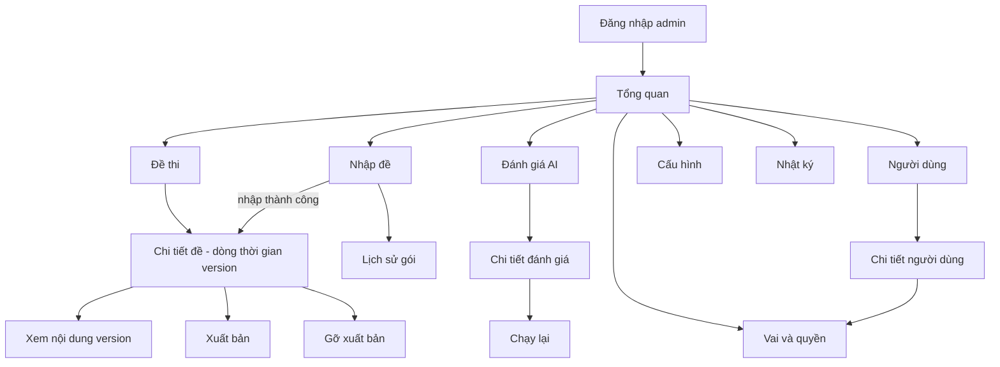
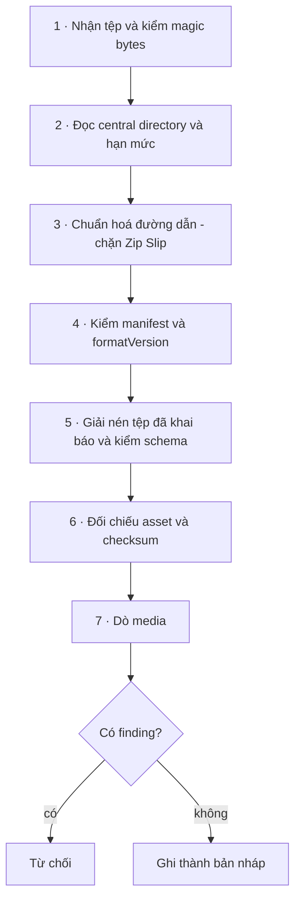

# CMS — đặc tả màn hình và luồng quản trị

> Phạm vi: **C-1…C-13** (Admin CMS) và **I-1…I-13** (nhập đề tự động) trong
> [`../requirements/confirmed.md`](../requirements/confirmed.md).
> Đây là đặc tả **bề mặt quản trị**, không phải quyết định nghiệp vụ. Chỗ nào tài liệu chưa chốt
> thì gắn thẻ và đẩy sang [`../requirements/assumptions-and-open-questions.md`](../requirements/assumptions-and-open-questions.md),
> không tự chọn giúp.
>
> Ngôn ngữ thiết kế dùng chung với bản học viên: [`DESIGN.md`](DESIGN.md). Tài liệu này **không**
> định nghĩa token mới.
>
> Soạn 19/08/2026, sau khi khảo sát prototype học viên. Prototype hiện **không có màn admin nào** —
> toàn bộ nội dung dưới đây là dựng mới từ tài liệu.

---

## 0 · Bảy ràng buộc chi phối mọi màn CMS

Không phải sở thích. Mỗi cái sinh ra từ một quyết định đã ghi, và **thay đổi hình dạng giao diện**.

| # | Ràng buộc | Hệ quả lên UI | Nguồn |
|---|---|---|---|
| 1 | `ExamVersion` đã xuất bản là **bất biến** | Không có nút "Sửa" trên version đã xuất bản. Sửa nội dung = tạo version mới. Màn chi tiết đề là **dòng thời gian version**, không phải form một bản ghi | [`../domain/domain-model.md`](../domain/domain-model.md) |
| 2 | Nhập đề **luôn** ra `Draft` | Không có tuỳ chọn "nhập và xuất bản luôn". Xuất bản là hành động thứ hai, màn khác, quyền khác | [`../architecture/exam-package-format.md`](../architecture/exam-package-format.md) |
| 3 | ZIP là **đầu vào không tin cậy**, kể cả từ admin | Màn nhập đề phải thể hiện được rằng gói *chưa* được ghi vào hệ thống trong lúc kiểm. Không hiện nội dung đề từ gói chưa qua kiểm | [`../security/zip-ingestion-security.md`](../security/zip-ingestion-security.md) |
| 4 | Thông điệp từ chối **không nêu giá trị ngưỡng** | "Gói vượt hạn mức dung lượng" — không ghi "vượt 1 GB". Con số nằm ở log nội bộ | `zip-ingestion-security.md` §Error reporting |
| 5 | Band chỉ thuộc enum nửa bậc; **không bao giờ kẹp giá trị** | Đánh giá có band ngoài enum hiện là **hỏng**, không hiện số đã kẹp. Đây là màn duy nhất trong sản phẩm được phép hiện `rawOutput` sai | [`../ai/output-contracts.md`](../ai/output-contracts.md) |
| 6 | Audit **chỉ ghi thêm** | Không nút sửa, không nút xoá, không "dọn log". Bộ lọc và xuất là toàn bộ hành động cho phép | T21, [`../security/threat-model.md`](../security/threat-model.md) |
| 7 | Client admin là **không tin cậy** | Mọi màn phải chịu được việc quyền bị từ chối ở phía máy chủ dù nút đã hiện. Không tồn tại "ẩn nút là đã phân quyền" | T20 |

Thêm một quy tắc kế thừa từ API: tài nguyên không thuộc tầm nhìn của người gọi trả **404**, không phải
403 ([`../api/api-design-principles.md`](../api/api-design-principles.md)). Trong CMS điều này nghĩa là
màn "không tìm thấy" và màn "không đủ quyền" là **hai màn khác nhau**, dùng ở hai tình huống khác nhau,
và không được suy ra nhau.

---

## 1 · Vai và quyền

C-13 nói rõ bộ khoá ví dụ (`exam.read`, `exam.create`, …) **không phải bản chốt**. Bảng dưới là **đề xuất
chờ duyệt**, không phải quyết định.

### Khoá quyền đề xuất

Theo dạng `resource.action`, là dữ liệu gieo sẵn chứ không phải enum trong code — thêm một quyền không
cần triển khai lại ([`../api/api-design-principles.md`](../api/api-design-principles.md) §Authorisation).

| Nhóm | Khoá |
|---|---|
| Đề thi | `exam.read` · `exam.create` · `exam.update` · `exam.delete` · `exam.publish` · `exam.unpublish` |
| Gói nhập | `package.upload` · `package.read` · `package.delete` |
| Đánh giá AI | `evaluation.read` · `evaluation.rerun` · `evaluation.override` |
| Nội dung học viên | `learner-content.read` |
| Người dùng | `user.read` · `user.update` · `user.suspend` · `user.delete` · `user.export` |
| Vai | `role.read` · `role.assign` · `role.manage` |
| Cấu hình | `config.read` · `config.update` |
| Audit | `audit.read` |

Ba khoá cần giải thích vì chúng là chỗ dễ gộp nhầm:

- **`exam.publish` tách khỏi `exam.update`.** Người nhập đề và người cho đề ra với học viên không nhất
  thiết là một. Đây là mitigation trực tiếp của T20 — gộp lại thì một tài khoản biên tập bị chiếm là đủ
  để đẩy nội dung tới học viên.
- **`learner-content.read` tách khỏi `evaluation.read`.** Xem *điểm và metadata* của một đánh giá là một
  việc; **đọc bài luận hoặc nghe file ghi âm** của học viên là việc khác, và là xử lý dữ liệu cá nhân
  theo PDPL ([`../security/privacy-vietnam-pdpl.md`](../security/privacy-vietnam-pdpl.md)). Gộp hai thứ
  này nghĩa là mọi người soi lỗi chấm điểm đều đọc được bài của học viên.
- **`evaluation.rerun` là quyền tiêu tiền.** Mỗi lần chạy lại là một lần gọi provider có tính phí thật
  ([`../ai/cost-model.md`](../ai/cost-model.md)).

`[OPEN QUESTION]` **Quy ước đặt tên.** `learner-content.read` là khoá duy nhất có tên tài nguyên gồm
hai từ nối gạch; mọi khoá còn lại (`exam`, `package`, `evaluation`, `user`, `role`, `config`, `audit`)
đều một từ, khớp với ví dụ trong C-13. Khoá quyền là **dữ liệu gieo sẵn**, nên đổi tên sau khi đã gieo
là một lần migrate. Chốt quy ước lúc duyệt bảng này, đừng để tới lúc triển khai.

### Vai đề xuất

`[ASSUMPTION]` Ba vai. Không thêm vai giáo viên — M-11 đã chốt ngoài phạm vi bản đầu.

| Quyền | `admin` | `content-editor` | `support` |
|---|:---:|:---:|:---:|
| `exam.read` · `package.read` | ✓ | ✓ | ✓ |
| `exam.create` · `exam.update` · `package.upload` | ✓ | ✓ | — |
| `exam.delete` *(chỉ bản nháp)* | ✓ | ✓ | — |
| `exam.publish` · `exam.unpublish` | ✓ | — | — |
| `evaluation.read` | ✓ | ✓ | ✓ |
| `learner-content.read` | ✓ | — | ✓ |
| `evaluation.rerun` | ✓ | — | — |
| `evaluation.override` | ✓ | — | — |
| `user.read` | ✓ | — | ✓ |
| `user.update` · `user.suspend` | ✓ | — | — |
| `user.delete` · `user.export` | ✓ | — | — |
| `role.*` · `config.*` | ✓ | — | — |
| `audit.read` | ✓ | — | — |

`Role.isSystem` (đã có trong mô hình dữ liệu) khoá ba vai này khỏi bị sửa hay xoá. Vai tự tạo thì sửa
được.

`exam.delete` chỉ áp cho bản nháp. Version đã xuất bản **không xoá được** — phiên thi và kết quả cũ trỏ
tới nó; xoá là phá dữ liệu lịch sử. Nút trên UI là "Gỡ xuất bản", không phải "Xoá".

---

## 2 · Bản đồ điều hướng

Điều hướng là **sidebar cố định**, không phải tab ngang: tám mục là quá nhiều cho tab, và số mục hiện ra
phụ thuộc quyền nên chiều rộng không đoán trước được.

Mục nào người dùng không có quyền đọc thì **không hiện trong sidebar**. Nhưng ẩn mục không phải là phân
quyền — máy chủ vẫn phải chặn khi gõ thẳng URL, và khi đó ra màn 1.2.

---

## 3 · Danh sách màn

| Mã | Màn | Quyền tối thiểu | Có trong demo |
|---|---|---|:---:|
| **1 · Truy cập** ||||
| 1.1 | Đăng nhập admin | — | ✓ |
| 1.2 | Không đủ quyền | đã đăng nhập | ✓ |
| 1.3 | Phiên quản trị hết hạn | — | trạng thái của 1.1 |
| **2 · Tổng quan** ||||
| 2.1 | Bảng tổng quan | bất kỳ | ✓ |
| **3 · Đề thi** ||||
| 3.1 | Danh sách đề | `exam.read` | ✓ |
| 3.2 | Chi tiết đề — dòng thời gian version | `exam.read` | ✓ |
| 3.3 | Xem nội dung version | `exam.read` | trạng thái của 3.2 |
| 3.4 | Xác nhận xuất bản | `exam.publish` | trạng thái của 3.2 |
| 3.5 | Xác nhận gỡ xuất bản | `exam.unpublish` | trạng thái của 3.2 |
| 3.6 | Xem thử như học viên | `exam.read` | — `[OPEN QUESTION]` M-18 |
| **4 · Nhập đề** ||||
| 4.1 | Tải gói lên | `package.upload` | ✓ |
| 4.2 | Đang kiểm — bảy chặng | `package.read` | trạng thái của 4.1 |
| 4.3 | Bị từ chối — danh sách finding | `package.read` | trạng thái của 4.1 |
| 4.4 | Nhập thành công → bản nháp | `package.read` | trạng thái của 4.1 |
| 4.5 | Lịch sử gói | `package.read` | ✓ |
| **5 · Đánh giá AI** ||||
| 5.1 | Danh sách đánh giá | `evaluation.read` | ✓ |
| 5.2 | Chi tiết đánh giá | `evaluation.read` | ✓ |
| 5.3 | Xác nhận chạy lại | `evaluation.rerun` | trạng thái của 5.2 |
| 5.4 | Hàng đợi hỏng | `evaluation.read` | trạng thái của 5.1 |
| **6 · Người dùng** ||||
| 6.1 | Danh sách người dùng | `user.read` | ✓ |
| 6.2 | Chi tiết người dùng | `user.read` | ✓ |
| 6.3 | Khoá / mở khoá | `user.suspend` | trạng thái của 6.2 |
| 6.4 | Xoá theo yêu cầu chủ thể dữ liệu | `user.delete` | trạng thái của 6.2 |
| 6.5 | Xuất dữ liệu cá nhân | `user.export` | trạng thái của 6.2 |
| **7 · Vai và quyền** ||||
| 7.1 | Danh sách vai | `role.read` | ✓ |
| 7.2 | Chi tiết vai — ma trận quyền | `role.manage` | trạng thái của 7.1 |
| 7.3 | Gán vai cho người dùng | `role.assign` | trạng thái của 6.2 |
| **8 · Cấu hình** ||||
| 8.1 | Cấu hình hệ thống | `config.read` | ✓ |
| **9 · Nhật ký** ||||
| 9.1 | Nhật ký audit | `audit.read` | ✓ |

---

## 4 · Nhập đề ZIP — luồng chi tiết

Đây là bề mặt phức tạp nhất của CMS và là lý do C-8, C-9, I-1…I-13 tồn tại.

### 4.1 · Tải gói lên

Trước khi chọn tệp, màn phải nói rõ **gói này sẽ đi đâu**: nhập thành công ra **bản nháp**, chưa tới tay
học viên, và cần một hành động xuất bản riêng. Đây không phải chữ trang trí — nó là điều admin hay hiểu
nhầm nhất ở bước này.

Hiện được ở màn tải lên: định dạng chấp nhận, dung lượng tối đa, và `formatVersion` mà hệ thống hỗ trợ.

> Đây là **ngoại lệ có chủ ý** với ràng buộc số 4: nêu giới hạn dung lượng *trước* khi tải là cần cho
> khả dụng, nhưng thông điệp *từ chối* vẫn chỉ nêu hạng mục, không nêu con số. Ngưỡng nội bộ (số entry,
> tỉ lệ nén, tổng dung lượng sau giải nén) **không** hiện ở đâu trên UI.

### 4.2 · Đang kiểm — bảy chặng

Bảy chặng lấy đúng từ pipeline đã đặc tả, không tự nghĩ thêm:

UI là **stepper dọc**, mỗi chặng một dòng, trạng thái: chờ · đang chạy · xong · dừng ở đây.

Ba điều màn này phải làm đúng:

- **Không hiện thanh phần trăm giả.** Thời lượng mỗi chặng chênh nhau bậc độ lớn (đọc central directory
  tính bằng mili giây, dò media tính bằng giây). Phần trăm nội suy là số bịa.
- **Chặng dừng lại hiện là dừng, không hiện đỏ ngay.** Đỏ dành cho kết luận từ chối ở 4.3, không dành
  cho chặng đang chờ kết luận.
- **Gói xếp hàng phải nói là đang xếp hàng.** Hệ thống giới hạn số gói xử lý đồng thời (A7 trong
  `zip-ingestion-security.md`), nên "chưa chạy" là trạng thái bình thường, không phải treo.

`[TECHNICAL RISK]` Xử lý gói là tác vụ nền có thể chạy lâu hơn phiên trình duyệt. Màn phải mở lại được từ
4.5 và tiếp tục theo dõi bằng `packageId`, không phụ thuộc việc giữ tab.

### 4.3 · Bị từ chối — danh sách finding

`ValidationFinding` là thực thể hạng nhất chứ không phải dòng log, chính là vì màn này. Một gói 200 câu
hỏi sai schema cần **danh sách sửa được**, không cần một câu "gói không hợp lệ".

Mỗi dòng finding hiện đủ ba thứ:

| Thành phần | Ví dụ | Kiểu chữ |
|---|---|---|
| Mã ổn định | `ASSET_NOT_FOUND` | 13px ASCII, mono |
| JSON Pointer | `/sections/listening/parts/0/audio` | 13px ASCII, mono |
| Thông điệp người đọc | "Tệp khai trong manifest nhưng không có trong gói." | 14px trở lên, tiếng Việt |

Hành vi bắt buộc:

- **Hiện toàn bộ finding cùng lúc**, không hiện từng cái một — cùng nguyên tắc với `errors[]` của API.
- **Gộp theo mức nghiêm trọng**: lỗi trước, cảnh báo sau. Đếm số ở đầu mỗi nhóm.
- **Gộp theo mã** khi cùng một mã lặp nhiều lần: "`DUPLICATE_QUESTION_ID` — 14 chỗ", bung ra xem chi
  tiết. Một danh sách phẳng 200 dòng là không dùng được.
- **Sao chép được** toàn bộ danh sách dưới dạng văn bản, để gửi lại cho người soạn đề.
- **Không hiện nội dung tệp trong gói bị từ chối.** Gói chưa qua kiểm là dữ liệu không tin cậy; hiện
  passage lên màn admin là biến nó thành bề mặt XSS lưu trữ (T17).

Bảng mã đầy đủ đã có trong [`../architecture/exam-package-format.md`](../architecture/exam-package-format.md)
§Validation findings. CMS **dịch theo mã**, không hiện thông điệp thô từ máy chủ — đó là lý do mã phải ổn
định.

`[OPEN QUESTION]` **M-10** — gói chỉ có finding mức *cảnh báo* thì có được nhập với xác nhận đè không?
Màn 4.3 phải dựng cả hai nhánh cho tới khi có câu trả lời. Nếu câu trả lời là không, mức "cảnh báo"
không còn tác dụng gì và nên bỏ khỏi đặc tả định dạng.

### 4.4 · Nhập thành công

Kết quả là **một bản nháp**, không phải một đề đã sống. Màn phải:

- gọi đúng tên trạng thái: `Bản nháp`;
- tóm tắt cái vừa nhập (số section, số câu, số asset) để đối chiếu với kỳ vọng của người soạn;
- dẫn thẳng sang 3.2, nơi mới có nút xuất bản;
- **không** có nút "Xuất bản ngay" tại đây.

### 4.5 · Lịch sử gói

Bảng: tên tệp gốc · người tải · thời điểm · `formatVersion` · trạng thái (`uploaded` · `validating` ·
`rejected` · `imported`) · liên kết tới đề tạo ra nếu có.

Tên tệp gốc chỉ để **hiển thị**. Không bao giờ dùng làm khoá lưu trữ — khoá do máy chủ sinh.

---

## 5 · Xuất bản và gỡ xuất bản

### 5.1 · Chi tiết đề là một dòng thời gian

Vì version đã xuất bản là bất biến, màn 3.2 không phải form sửa. Nó là danh sách version xếp theo thời
gian, mỗi dòng có: số version · trạng thái (`draft` · `published` · `unpublished`) · thời điểm xuất bản ·
nguồn (nhập từ gói nào) · hành động cho phép.

| Trạng thái version | Hành động cho phép |
|---|---|
| `draft` | Xem nội dung · Xoá · Xuất bản |
| `published` | Xem nội dung · Gỡ xuất bản |
| `unpublished` | Xem nội dung · Xuất bản lại |

Version `published` **không** có nút Sửa và **không** có nút Xoá. Nếu người dùng cần sửa nội dung, đường
đi là nhập gói mới → tạo version mới. Màn phải nói câu đó ra, không để người dùng đi tìm nút không tồn
tại.

### 5.2 · Xác nhận xuất bản

Hộp xác nhận nêu **hệ quả**, không hỏi "bạn có chắc không":

- đề này sẽ hiện trong kho đề của học viên;
- version đang xuất bản (nếu có) sẽ chuyển sang `unpublished`;
- nội dung sau khi xuất bản **không sửa được**.

Ghi `AuditEvent` với actor, version trước, version sau.

### 5.3 · Xác nhận gỡ xuất bản

Đây là chỗ đặc tả **không được đoán**:

`[OPEN QUESTION]` **M-15** — gỡ xuất bản một version thì phiên thi *đang diễn ra* trên version đó ra sao?
Ba nhánh hợp lý và chúng cho ra ba giao diện khác nhau:

1. phiên đang thi chạy tiếp tới hết, chỉ chặn phiên mới — hộp xác nhận cần hiện **số phiên đang chạy**;
2. phiên đang thi bị kết thúc — cần cảnh báo mạnh và ghi rõ số học viên bị ảnh hưởng;
3. không cho gỡ khi còn phiên đang chạy — nút bị vô hiệu kèm lý do.

Kết quả đã chấm thì rõ: chúng trỏ tới `examVersionId` cụ thể và **không đổi**, vì đó chính là lý do
version bất biến ([`../domain/band-scoring.md`](../domain/band-scoring.md)).

---

## 6 · Soi kết quả AI (C-10)

Màn này là hiện thân giao diện của yêu cầu A-8: *AI là hệ thống đánh giá, không phải trạng thái ứng dụng
được tin cậy*.

### 6.1 · Danh sách đánh giá

Lọc theo: kỹ năng (writing · speaking) · trạng thái (`pending` · `running` · `succeeded` · `failed` ·
`superseded`) · kết quả kiểm định (đạt · bị gắn cờ · bị từ chối) · khoảng thời gian · `modelVersion`.

Mỗi dòng: mã phiên · kỹ năng · band tiết mục · trạng thái · `modelVersion` · thời điểm · cờ.

Ba cờ cần phân biệt được bằng hình dạng, không chỉ bằng màu:

| Cờ | Nghĩa | Nguồn |
|---|---|---|
| Lệch số học | `sectionBand` model trả về khác giá trị tính lại trong code | kiểm định số 5 |
| Nghi chèn lệnh | Feedback chứa mẫu chỉ thị bị chèn | kiểm định số 7 |
| Rò dữ liệu cá nhân | Feedback nhắc thông tin ngoài phần đã gửi | kiểm định số 8 |

### 6.2 · Chi tiết đánh giá

Bố cục ba khối.

**Khối điểm.** Bốn tiêu chí, mỗi tiêu chí một band và một đoạn nhận xét. Band tiết mục hiện **hai giá
trị cạnh nhau** khi lệch: giá trị model trả về và giá trị hệ thống tính lại — cùng nhãn nói rõ **giá trị
tính lại mới là giá trị dùng**. Đây là màn duy nhất trong sản phẩm được phép hiện cả hai.

Mọi band trên màn này vẫn thuộc enum nửa bậc. Một giá trị ngoài enum trong `rawOutput` hiện **nguyên
văn, kèm nhãn bị từ chối** — tuyệt đối không kẹp về `9`. Kẹp là biến một sự cố nhìn thấy được thành một
điểm sai trông hợp lý mà không ai đi tra.

**Khối tái lập.** `modelVersion` · `rubricVersion` · `promptVersion` · độ trễ · lượng token · chi phí ước
tính · `featureSnapshot` (Speaking) · `rawOutput` nguyên văn. `rawOutput` được lưu **cả khi kiểm định
thất bại** và màn này là nơi duy nhất đọc được nó.

**Khối lịch sử.** Chuỗi các đánh giá của cùng một bài: bản nào `superseded`, bản nào đang dùng, ai chạy
lại và lúc nào. Chạy lại **không sửa bản cũ**.

**Nội dung học viên** — bài luận, transcript, file ghi âm — nằm sau `learner-content.read` và **mỗi lần
mở là một `AuditEvent`**. Không bung sẵn khi vào màn.

`[OPEN QUESTION]` **M-19** — admin được tiếp cận bài viết và giọng nói của học viên tới mức nào, và cơ sở
pháp lý là gì. PDPL yêu cầu giới hạn mục đích; "soi lỗi chấm điểm" là mục đích chính đáng nhưng cần được
tuyên bố trong thông báo quyền riêng tư, không phải mặc định ngầm.

### 6.3 · Xác nhận chạy lại

Hộp xác nhận phải nói ba điều:

- lần chạy này **tốn chi phí provider thật**;
- bản đánh giá hiện tại sẽ thành `superseded`, không bị xoá;
- điểm học viên đang nhìn thấy có thể thay đổi.

Gửi kèm `Idempotency-Key` để bấm đúp không thành hai lần tính phí.

`[OPEN QUESTION]` **M-20** — có hạn mức chi phí cho thao tác chạy lại không, và ai được duyệt khi vượt.

### 6.4 · Hàng đợi hỏng

Đánh giá thất bại sau khi hết số lần thử rơi vào dead-letter. Màn này liệt kê chúng kèm lý do thất bại
theo mã. Đây là màn vận hành, và là chỗ phát hiện sớm nhất khi provider đổi hành vi.

Không có nút nào ở đây tạo ra điểm. Một đánh giá hỏng hiện là hỏng — luật L3 của
[`DESIGN.md`](DESIGN.md) áp cả trong CMS.

---

## 7 · Người dùng, vai, và nghĩa vụ dữ liệu cá nhân

### 7.1 · Danh sách và chi tiết người dùng

Danh sách: email · tên hiển thị · trạng thái (`active` · `suspended`) · phương thức đăng nhập · ngày tạo
· vai.

Chi tiết bổ sung: các `UserIdentity` đã liên kết (email · Google · Facebook, kèm thời điểm liên kết) ·
lịch sử phiên thi · bản ghi đồng ý (phiên bản chính sách + dấu thời gian) · số dư entitlement **chỉ
đọc**.

Số dư chỉ đọc vì **B-4 chưa có luật**. Dựng ô sửa số dư khi chưa có quy tắc cộng trừ là mời gọi việc phát
minh luật nghiệp vụ ngay trên giao diện. `[OPEN QUESTION]` **M-21**.

### 7.2 · Khoá tài khoản

Khoá là thao tác đảo ngược được: `status = suspended`, phiên hiện tại bị thu hồi, không xoá dữ liệu.
Hộp xác nhận nêu hệ quả với phiên thi đang chạy — cùng họ câu hỏi với M-15.

### 7.3 · Xoá theo yêu cầu chủ thể dữ liệu

Không phải nút "xoá bản ghi". Đây là **nghĩa vụ pháp lý** với thời hạn cụ thể: dữ liệu tài khoản đã xoá
phải được thanh lọc trong **30 ngày**, và việc xoá phải chạm tới cả object storage lẫn bản sao phía
provider, không chỉ cơ sở dữ liệu
([`../security/privacy-vietnam-pdpl.md`](../security/privacy-vietnam-pdpl.md)).

Giao diện vì thế cần **trạng thái đang xoá**, không phải một hành động tức thời:

| Trạng thái | Ý nghĩa |
|---|---|
| Đã tiếp nhận yêu cầu | Ghi thời điểm, bắt đầu đếm 30 ngày |
| Đang thanh lọc | Từng kho một: cơ sở dữ liệu · object storage · phía provider |
| Đã hoàn tất | Có bằng chứng kiểm chứng được cho từng kho |

Ghi audit đầy đủ. Đây cũng là bản ghi chứng minh tuân thủ khi bị hỏi.

### 7.4 · Vai và quyền

Màn 7.2 là **ma trận hai chiều**: hàng là quyền gộp theo nhóm tài nguyên, cột là vai, ô là hộp kiểm. Vai
hệ thống hiện ở dạng chỉ đọc kèm lý do.

Màn 7.3 (gán vai) phải hiện **hệ quả bằng lời**, không chỉ tên vai: "Vai này cho phép xuất bản đề tới học
viên." Mọi thay đổi vai đều ghi audit — mitigation trực tiếp của T20.

Hai chốt an toàn:

- không tự hạ quyền của chính mình tới mức mất `role.manage` (khoá cửa từ bên trong);
- luôn còn ít nhất một tài khoản giữ `role.manage`.

---

## 8 · Cấu hình hệ thống (C-11) — và ranh giới của nó

Màn này nguy hiểm theo một kiểu riêng: nó hấp dẫn tới mức người ta muốn nhét mọi thứ vào.

**Không thuộc cấu hình hệ thống:**

| Thứ | Thuộc về đâu | Vì sao |
|---|---|---|
| Bảng quy đổi điểm thô → band | `ScoringProfile` của **từng version đề** | Ngưỡng band được cân bằng theo từng version đề, không toàn cục — G-3, [`../domain/band-scoring.md`](../domain/band-scoring.md) |
| Thời lượng từng phần thi | `TimingProfile` của từng version đề | Cùng lý do |
| Quy tắc so khớp đáp án | `ScoringProfile` | Cùng lý do |

**Thuộc cấu hình hệ thống:**

| Nhóm | Ví dụ | Ghi chú |
|---|---|---|
| Vòng đời dữ liệu | Thời hạn giữ audio · thời hạn giữ audit | Audio: `[ASSUMPTION]` M-2, 90 ngày |
| Hạn mức nhập gói | Các ngưỡng ZIP | Sửa được nhưng **không hiển thị ra thông điệp lỗi** |
| Cờ tính năng | Bật/tắt drill, dictation, thông báo | Chờ M-12 · M-13 · M-14 |
| Nhà cung cấp AI | Chọn provider, giới hạn tốc độ | **Khoá cho tới khi B-1 được chốt**. Màn hiện trạng thái "chưa chọn", không hiện ô nhập khoá API |

Ô nhập khoá API **không được dựng**, kể cả dạng giả lập trong demo. Không có khoá AI provider nào được
đưa vào repo này cho tới khi chủ sản phẩm chọn nhà cung cấp.

Mọi thay đổi cấu hình ghi audit kèm giá trị trước và sau.

---

## 9 · Nhật ký audit (C-12)

Bảng chỉ đọc: thời điểm · người thực hiện · hành động · loại thực thể · mã thực thể · trước → sau.

Lọc theo người thực hiện, hành động, loại thực thể, khoảng thời gian. Phân trang **theo con trỏ**, không
theo offset — bản ghi mới liên tục chèn vào đầu, offset sẽ nhảy dòng.

Không nút sửa. Không nút xoá. Không "dọn log". Thời hạn giữ 2 năm là chính sách, thực thi ở tầng lưu
trữ, không phải bằng một nút trên giao diện.

Các hành động **bắt buộc** phải có mặt trong nhật ký:

xuất bản · gỡ xuất bản · nhập gói · xoá bản nháp · thay đổi vai · thay đổi quyền · khoá tài khoản · xoá
tài khoản · xuất dữ liệu cá nhân · **mở nội dung học viên** · chạy lại đánh giá · ghi đè điểm · thay đổi
cấu hình.

---

## 10 · Quy tắc giao diện cho màn dày dữ liệu

[`DESIGN.md`](DESIGN.md) áp nguyên vẹn. Bốn điểm cần diễn giải thêm vì bản học viên không có bảng lớn:

**Bậc 13px cuối cùng cũng đúng chỗ.** Thang chữ cho phép 13px **chỉ cho chuỗi ASCII**. CMS đầy chuỗi
ASCII: mã lỗi, mã thực thể, JSON Pointer, `modelVersion`, checksum. Đặt chúng ở 13px mono là hợp lệ và
làm bảng gọn hơn. Mọi chuỗi tiếng Việt vẫn tối thiểu 14px.

**Không cuộn ngang.** Bảng hẹp lại thì **xếp lại thành thẻ**, không trượt ngang. Với bảng 8 cột như nhật
ký audit, nghĩa là phải chọn trước 3 cột cốt lõi và đẩy phần còn lại vào chi tiết bung ra.

**Đỏ chỉ dành cho việc đã hỏng.** Gói đang kiểm không đỏ. Đánh giá đang chạy không đỏ. Đỏ dành cho: gói
bị từ chối, đánh giá thất bại, kiểm định không đạt.

**Điểm AI vẫn mang nhãn tham khảo** ngay cả trong màn quản trị. Luật L4 không nới lỏng vì người xem là
admin — nhãn đó là nhắc nhở về mức độ tin cậy, không phải chú thích cho người mới.

Thêm một quy tắc chỉ CMS mới cần: **hành động phá huỷ nêu hệ quả bằng danh từ cụ thể**, không dùng "Bạn
có chắc chắn không?". "Gỡ đề này khỏi kho đề của học viên" nói được nhiều hơn "Xác nhận".

---

## 11 · Trạng thái bắt buộc cho mọi màn

Đây là phần mà bản UI/UX trước làm tốt và đáng giữ lại. Mỗi màn trong bảng §3 phải được đặc tả ở **cả
sáu** trạng thái, không chỉ trạng thái thuận lợi:

| Trạng thái | Điều dễ làm sai |
|---|---|
| Rỗng | "Chưa có gói nào" khác hẳn "không lọc ra kết quả nào" — hai câu, hai hành động gợi ý |
| Đang tải | Không dùng skeleton ở ô điểm (L3). Bảng thì skeleton được |
| Lỗi máy chủ | Hiện `traceId` để gửi cho hỗ trợ. Không hiện stack trace, không hiện đường dẫn nội bộ |
| Không đủ quyền | Màn riêng, **khác** màn không tìm thấy. Nói rõ cần quyền gì |
| Tác vụ nền đang chạy | Kiểm gói, xoá dữ liệu, chạy lại đánh giá — đều dài hơn một request. Phải theo dõi lại được sau khi đóng tab |
| Mất mạng | Bảng đang xem là dữ liệu cũ — nói rõ mốc thời gian, không im lặng hiện số cũ như số mới |

---

## 12 · Câu hỏi mở sinh ra từ đặc tả này

Ghi đầy đủ trong
[`../requirements/assumptions-and-open-questions.md`](../requirements/assumptions-and-open-questions.md).
Bảng dưới chỉ để tra nhanh.

| ID | Câu hỏi | Ảnh hưởng lên UI |
|---|---|---|
| **M-15** | Gỡ xuất bản thì phiên đang thi ra sao | Nội dung hộp xác nhận 3.5, có thể là một màn cảnh báo riêng |
| **M-16** | CMS có soạn/sửa câu hỏi tại chỗ không, hay nhập gói là đường duy nhất | Quyết định lớn nhất: trình soạn đề là **hàng chục màn**, không phải một |
| **M-17** | Đăng nhập admin: cổng riêng · bắt buộc 2FA · giới hạn IP | Màn 1.1 và toàn bộ luồng truy cập |
| **M-18** | Admin có xem thử đề bản nháp như học viên trước khi xuất bản không | Màn 3.6 tồn tại hay không |
| **M-19** | Admin đọc bài viết / nghe audio của học viên tới mức nào | Bố cục màn 5.2 và ranh giới quyền `learner-content.read` |
| **M-20** | Hạn mức chi phí cho thao tác chạy lại đánh giá | Màn 5.3 và có cần màn theo dõi chi phí không |
| **M-21** | Admin có được điều chỉnh entitlement không | Màn 6.2 — chặn bởi B-4 |
| **M-10** | Gói chỉ có cảnh báo có được nhập với xác nhận đè không | Màn 4.3, hiện đang phải dựng cả hai nhánh |
| **H-2** | Nguồn nội dung đề | Quyết định M-16 phụ thuộc trực tiếp vào đây |

---

## Nguồn

- Yêu cầu: [`../requirements/confirmed.md`](../requirements/confirmed.md) §Admin CMS, §Automated exam import
- Luồng nhập đề: [`../architecture/key-flows.md`](../architecture/key-flows.md) §4
- Định dạng gói và mã lỗi: [`../architecture/exam-package-format.md`](../architecture/exam-package-format.md)
- Xử lý ZIP an toàn: [`../security/zip-ingestion-security.md`](../security/zip-ingestion-security.md)
- Thực thể: [`../domain/domain-model.md`](../domain/domain-model.md)
- Hợp đồng đầu ra AI: [`../ai/output-contracts.md`](../ai/output-contracts.md)
- Mối đe doạ T17 · T20 · T21: [`../security/threat-model.md`](../security/threat-model.md)
- Nghĩa vụ dữ liệu cá nhân: [`../security/privacy-vietnam-pdpl.md`](../security/privacy-vietnam-pdpl.md)
- Ngôn ngữ thiết kế: [`DESIGN.md`](DESIGN.md)
