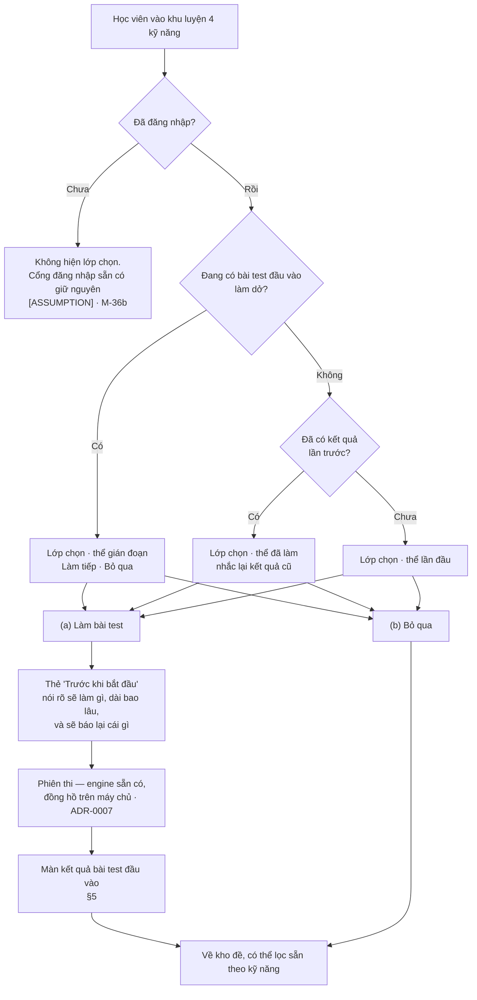

# Lớp chọn ở cửa khu luyện 4 kỹ năng — bài test đầu vào

> **Phạm vi:** `E-15`…`E-19` trong [`../requirements/confirmed.md`](../requirements/confirmed.md) —
> lớp chọn xuất hiện khi học viên vào khu luyện 4 kỹ năng, và hai lối ra của nó.
>
> **Đây là đặc tả bề mặt, không phải quyết định nghiệp vụ.** Chỗ nào chưa chốt thì gắn thẻ và đẩy sang
> [`../requirements/assumptions-and-open-questions.md`](../requirements/assumptions-and-open-questions.md),
> không chọn hộ. Bốn câu hỏi mới: `B-12` · `M-34` · `M-35` · `M-36` · `M-37`.
>
> Ngôn ngữ thiết kế dùng chung: [`DESIGN.md`](DESIGN.md). Tài liệu này **không** định nghĩa token mới.
>
> Soạn 27/08/2026, sau yêu cầu của chủ sản phẩm cùng ngày.

---

## 0 · Tóm tắt trong một trang

**Chủ sản phẩm nói gì.** Nguyên văn 27/08/2026:

> *"đề xuất thêm 1 phần là khi user ấn vào luyện 4 đề thì sẽ hiện mocup để báo user có thể làm bài
> test trước xem trình độ hiện tại là bao nhiêu hoặc user có thể bỏ qua là luyện tập các bài có sẵn
> của mình."*

**Câu đó chốt được ba thứ, và đúng ba thứ:** có một lớp chọn ở cửa vào; nó có hai lối ra; lối "bỏ qua"
luôn mở. Ghi thành `E-15` · `E-16` · `E-17`.

**Câu đó không chốt bài test kia là cái gì.** Nó gồm mấy kỹ năng, dài bao lâu, báo bằng đơn vị nào,
làm lại được không, có tốn token không — không có câu nào trả lời được từ một câu nói. Và câu hỏi lớn
nhất: **bài test đầu vào là chế độ thi thứ ba, hay là Full Test đóng khung khác, hay chỉ là một luật
của phiên thi** — đó là `B-12`, và nó chính là `M-30` với cái tên thứ tư.

**Một sự thật phải nằm ngay ở đầu tài liệu, vì cả màn kết quả dựng quanh nó:**

> ### Hôm nay hệ thống **không** trả lời được câu *"trình độ hiện tại là bao nhiêu"*
>
> | Kỹ năng | Hôm nay ra được cái gì | Vì sao |
> |---|---|---|
> | Reading | **Số câu đúng / 40** | `A-11` — chấm theo đáp án, không cần AI |
> | Listening | **Số câu đúng / 40** | `A-11` |
> | Writing | **Không gì cả** | Evaluator chưa cấu hình — `B-2` chưa có vị trí PDPL cho dữ liệu xuyên biên |
> | Speaking | **Không gì cả** | Chưa chọn speech-to-text, và cũng vướng `B-2` |
> | **Band cho R/L** | **Không được báo** | `H-4` chưa chốt nguồn bảng quy đổi raw→band |
>
> Về `H-4`: bảng quy đổi duy nhất đang có trong repo nằm ở `exam/Exam1/exam.json` và **tự khai** là
> `"provisional": true`, kèm ghi chú *"These are GENERIC tables; they have not been equated to this
> paper. [OPEN QUESTION] H-4 must adjudicate before any band is reported to a learner."* Đó là bảng
> của một **fixture để dựng giao diện**, không phải nội dung phát hành.
>
> Nên: **một màn hình hứa "Trình độ của bạn: 6.5" là hứa một con số sản phẩm chưa được phép đưa ra.**
> Đặc tả dưới đây sống được với sự thật đó, và §5.3 nói rõ cái gì đổi khi `H-4` được trả lời.

---

## 1 · Màn đang có, để biết lớp chọn chèn vào đâu

`/practice` hiện là một trang công khai với bốn trạng thái, đã chạy thật:

| Trạng thái | Màn hiện ra |
|---|---|
| `loading` | Bộ chọn kỹ năng hiện luôn; lưới đề đang tải |
| `anonymous` | Bộ chọn kỹ năng + **thẻ cổng đăng nhập** thay cho lưới đề — kho đề cần token |
| `ready` | Bộ chọn kỹ năng · thanh chế độ (Từng kỹ năng / Thi thử full) · bộ lọc · lưới đề · phân trang |
| `failed` | Bộ chọn kỹ năng + thẻ lỗi kèm nút thử lại |

Hai chế độ trên thanh chế độ là `E-11`: **Từng kỹ năng** và **Thi thử full**. Bấm một kỹ năng nghĩa là
chọn chế độ từng kỹ năng (`E-13`). `skill` và `mode` nằm trên URL; bộ lọc thì không.

**Lớp chọn chèn vào trước cả bốn trạng thái đó** — nó là thứ đầu tiên học viên gặp, và mọi thứ ở trên
là cái nằm sau lưng nó.

---

## 2 · Luồng

---

## 3 · Lớp chọn — mọi trạng thái

### 3.1 · Hình dạng và luật hiển thị

| | |
|---|---|
| Dạng | Lớp phủ có tiêu điểm bị bẫy (modal), **có nút đóng**, đóng được bằng `Esc` và bằng bấm ra ngoài |
| Vì sao được phép làm modal | Vì nó có đường thoát (`E-17`). Một modal không đóng được ở cửa một module là một cái cổng, và chủ sản phẩm mô tả một lời mời |
| Nút chính | **Một** nút tô đặc: *"Làm bài test đầu vào"* |
| Nút phụ | *"Bỏ qua, vào luyện luôn"* — nút viền, **không** phải link chữ nhỏ |
| Vì sao không phải link chữ nhỏ | `E-17` là yêu cầu ngang hàng chứ không phải lối thoát hiểm. Một hành động chính mỗi khung nhìn — [`DESIGN.md`](DESIGN.md) — nên "bỏ qua" là nút viền, đủ to để bấm bằng ngón cái |
| Khi đóng bằng `Esc` / bấm ra ngoài / nút đóng | **Tính là "bỏ qua"**, không phải là chưa quyết. Không hỏi lại lần hai trong cùng lượt truy cập |
| Tiêu điểm sau khi đóng | Về `#work-results` — đúng chỗ danh sách đề bắt đầu, đã có sẵn `tabIndex={-1}` |

### 3.2 · Bảng trạng thái đầy đủ

| # | Trạng thái | Điều kiện | Màn hiện ra | Ghi chú |
|---|---|---|---|---|
| S0 | **Chưa biết** | Phiên đăng nhập đang giải, hoặc chưa biết có kết quả cũ hay không | **Không vẽ gì cả** | Cấm nháy. Vẽ lớp chọn rồi thay nội dung khi dữ liệu về là một lời mời nhấp nháy trên mặt người đang đọc. Trang phía sau vẫn tải bình thường |
| S1 | **Lần đầu** | Đăng nhập rồi, chưa có kết quả, không có bài dở | Tiêu đề · một đoạn giải thích bài test đo cái gì · hai nút | Thể mặc định |
| S2 | **Đã làm rồi** | Có kết quả lần trước | Như S1, cộng một dòng nhắc kết quả cũ kèm ngày, và nút chính đổi chữ thành *"Làm lại bài test"* | Việc **có hiện lại lớp chọn hay không** là `M-36c`, chưa chốt. Việc **có được làm lại hay không** là `M-35`, chưa chốt — nếu câu trả lời là "một lần thôi" thì nút chính chuyển thành *"Xem lại kết quả"* |
| S3 | **Đang làm dở** | Có phiên bài test đầu vào chưa nộp | Nút chính là *"Làm tiếp"*, kèm thời gian còn lại **do máy chủ trả về** | **Không có nút bỏ hẳn.** Bỏ để làm lại là một luật làm lại, và đó là `M-35` |
| S4 | **Chưa mở** | Chưa cấu hình nội dung bài test đầu vào (`M-34` chưa trả lời) | Nút chính **vô hiệu, kèm lý do đọc được**: *"Bài test đầu vào chưa mở"*. Nút "bỏ qua" đổi thành nút chính | **Đây là trạng thái của hôm nay.** Không giấu nút — nút biến mất khiến người ta tưởng mình nhớ nhầm; nút chết khiến người ta bấm hai lần rồi bỏ đi |
| S5 | **Không tra được** | Gọi API hỏi trạng thái bài test đầu vào bị lỗi | **Không vẽ modal.** Trang mở bình thường; lời mời tụt xuống thành một dải chữ trong thanh workspace, có nút thử lại | Hỏng cái mời thì mất cái mời, không mất cái module. Một modal có dữ liệu lỗi là cái bẫy |
| S6 | **Mất mạng** | Ngoại tuyến khi lớp chọn đang mở | Nút chính vô hiệu kèm *"Cần kết nối để bắt đầu"*; nút "bỏ qua" **vẫn chạy** | Kho đề đã tải rồi thì vẫn xem được. Cấm để cả hai nút chết |
| S7 | **Chưa đăng nhập** | Không có phiên đăng nhập | **Không vẽ lớp chọn.** Cổng đăng nhập sẵn có của kho đề giữ nguyên | `[ASSUMPTION]` → `M-36b`. Lý do: cả hai lựa chọn đều cần tài khoản, nên bày ra là một lựa chọn giả — bấm cái nào cũng ra màn đăng nhập |

### 3.3 · Chữ trên lớp chọn — cái được nói và cái không

**Được nói:** bài test đo cái gì, mất bao lâu, kết quả dùng để làm gì, và bỏ qua thì mất gì (không
mất gì).

**Không được nói, kể cả khi nghe rất xuôi tai:**

| Câu cấm | Vì sao |
|---|---|
| *"Biết chính xác band hiện tại của bạn"* | `H-4`. Sản phẩm chưa được phép nói band |
| *"Chỉ 15 phút"* / bất kỳ con số thời lượng nào | `M-34`. Thời lượng lấy từ nội dung thật, chưa có nội dung thì không có số |
| *"Miễn phí"* | Đặt giá bằng 0 vẫn là đặt giá — `M-37`, `B-5a`, và anti-pattern #12 trong [`DESIGN.md`](DESIGN.md) |
| *"Lộ trình học riêng cho bạn"* | Không ai yêu cầu lộ trình. `A-12a` (danh sách cấm, gồm cả *personalised roadmap*) đang `PROPOSED` dưới `B-10` — chưa chốt cấm, nhưng cũng chưa chốt có |
| *"Chuẩn IELTS"* / *"tương đương điểm thi thật"* | VNI không phải hội đồng thi. Kết quả nội bộ không được gắn nhãn IELTS |

---

## 4 · Hai nhánh

### 4.1 · Nhánh (a) — làm bài test đầu vào

#### Bước 1 · Thẻ "Trước khi bắt đầu"

Chèn giữa lớp chọn và phiên thi. Không phải một bước thừa: nó là chỗ duy nhất nói được sự thật ở §0
trước khi người ta bỏ ra một khoảng thời gian.

Thẻ gồm đúng bốn dòng, mỗi dòng lấy từ dữ liệu, **không dòng nào viết cứng**:

| Dòng | Lấy từ | Chưa có thì |
|---|---|---|
| Bài test gồm những phần nào | Nội dung bài test đầu vào (`M-34`) | Không vào được bước này — trạng thái S4 chặn từ trước |
| Thời lượng | Nội dung | ⟂ như trên |
| **Sẽ báo lại cái gì** | Khả năng chấm thật của từng kỹ năng | Xem §5.1 — hôm nay là *"số câu đúng"*, không phải band |
| Chi phí token | Cấu hình giá (`M-37`) | **Không vẽ dòng nào.** Không phải "Miễn phí" |

Kèm hai câu về cách phiên thi chạy, vì chúng đúng cho engine hiện tại chứ không phải chính sách mới:
đồng hồ chạy trên máy chủ và không tạm dừng được ([ADR-0007](../decisions/0007-server-authoritative-exam-timer.md)),
và trong phiên thi không có link ra ngoài ([`DESIGN.md`](DESIGN.md) § Chrome trong/ngoài phiên thi).

#### Bước 2 · Trong lúc làm

**Không có màn mới.** Bài test đầu vào chạy trên đúng engine phiên thi đang có — cùng chrome, cùng
đồng hồ, cùng cách lưu. Đây là hệ quả trực tiếp của việc `B-12` chưa chốt: **thêm một giao diện thi
thứ hai lúc này là tự trả lời `B-12` bằng code.**

Các trạng thái gián đoạn vì thế **không có gì mới** và đặc tả này cố ý không phát minh thêm:

| Gián đoạn | Hành vi | Nguồn |
|---|---|---|
| Rớt mạng giữa chừng | Như mọi phiên thi khác | Engine hiện có |
| Cuộc gọi đến / ứng dụng bị đẩy nền | `H-7b` — `[TECHNICAL RISK]`, chưa chốt | Đã mở sẵn |
| Hết giờ | Máy chủ chốt hạn từ `startedAt` và từ chối bài nộp muộn | [ADR-0007](../decisions/0007-server-authoritative-exam-timer.md) |
| Bỏ ngang, quay lại `/practice` | Trạng thái **S3** ở §3.2 | Tài liệu này |

#### Bước 3 · Sau khi nộp

Về màn kết quả bài test đầu vào — §5.

### 4.2 · Nhánh (b) — bỏ qua

| | |
|---|---|
| Chuyện gì xảy ra | Lớp chọn đóng. Kho đề hiện ra **đúng như hôm nay**, không đổi một dòng nào |
| `E-11`…`E-13` có đổi không | **Không.** Hai chế độ giữ nguyên. Bỏ qua không phải là một chế độ thứ ba, nó là việc không chọn |
| Tiêu điểm | Về `#work-results` |
| Có lưu lại việc đã bỏ qua không | Trong cùng lượt truy cập: có, và không hỏi lại. Qua lượt sau: `M-36c` chưa chốt |
| Lời mời còn quay lại được không | **Có, và đây là ràng buộc thiết kế chứ không phải trang trí.** Một chỗ vào yên tĩnh nằm lại trong thanh workspace: *"Chưa biết bắt đầu từ đâu? Làm bài test đầu vào"* |

> **Vì sao lối quay lại là bắt buộc.** `E-17` cho phép bỏ qua, và người ta sẽ bỏ qua — phần lớn người
> bấm vào "luyện tập" là để luyện tập. Nếu bỏ qua là cửa một chiều thì lời mời chỉ sống được **một
> lần trong đời tài khoản**, và cái duy nhất đo được sau đó là "bao nhiêu người bấm nhầm". Giữ lối
> quay lại là điều kiện để `M-35` và `M-36` có dữ liệu mà trả lời.

---

## 5 · Màn kết quả — cái khó nhất của yêu cầu này

### 5.1 · Hôm nay báo cái gì

Màn kết quả bài test đầu vào **không** phải màn kết quả phiên thi hiện có. Màn kia trả lời *"tôi làm
bài đó thế nào"*; màn này trả lời *"tôi đang ở đâu"* — và hôm nay nó phải trả lời câu đó bằng những gì
thật sự đo được.

| Vùng | Nội dung hôm nay |
|---|---|
| Dòng đầu | **Không** phải một con số lớn. Một câu: *"Đây là kết quả bạn vừa làm. Chưa quy ra band được — xem lý do bên dưới."* |
| Reading | `32 / 40 câu đúng`, kèm chi tiết theo từng phần |
| Listening | `27 / 40 câu đúng`, kèm chi tiết theo từng phần |
| Writing | `—` kèm *"Chưa chấm được"* |
| Speaking | `—` kèm *"Chưa chấm được"* |
| Ô band | `—`, không phải `0.0`, **không skeleton** — luật `L3` trong [`DESIGN.md`](DESIGN.md) |
| Vì sao chưa có band | Một khối giải thích ngắn, viết cho học viên đọc chứ không phải trích mã yêu cầu |
| Bước tiếp | Nút về kho đề, lọc sẵn theo kỹ năng học viên vừa làm yếu hơn |

**"Yếu hơn" ở đây là số học, không phải lời khuyên.** So tỉ lệ đúng giữa Reading và Listening rồi lọc
sẵn danh sách là sắp xếp thứ tự; **gợi ý lộ trình học là một tính năng chưa ai yêu cầu** và nằm trong
vùng `B-10`. Màn này **không có** lộ trình, không có mục tiêu band, không có dự báo tiến bộ.

### 5.2 · Ba thứ tuyệt đối không được xuất hiện

1. **Một con số band.** Kể cả lấy từ bảng trong `exam/Exam1/exam.json` — bảng đó tự khai là tạm và
   chưa equate cho đề nào.
2. **Một con số ước lượng, dù có chữ "khoảng".** *"Khoảng 5.5–6.0"* là một band có thêm cái ngoặc.
3. **Số 0 hoặc skeleton ở ô của Writing và Speaking.** Chưa chấm là `—`. Một kỹ năng không được chấm
   khác một kỹ năng được 0 điểm, và `L3` tồn tại vì hai cái đó nhìn giống nhau trên màn hình.

### 5.3 · Cái gì đổi khi các câu hỏi được trả lời

Màn ở §5.1 được dựng để **mỗi câu trả lời là một dòng thêm vào, không phải một màn dựng lại**:

| Khi câu này được chốt | Màn kết quả đổi thế nào |
|---|---|
| **`H-4`** — nguồn bảng quy đổi raw→band | Reading và Listening có thêm **một dòng band** bên dưới dòng câu đúng. Dòng câu đúng **ở lại** — nó là cái đo được, band là cái suy ra. Khối "vì sao chưa có band" biến mất. Nhãn nguồn là `Theo đáp án` (nền xám, viền đặc) theo `L4` |
| **`B-2`** + có evaluator | Writing thôi `—`, có band **kèm nhãn `AI · tham khảo`** — viền gạch đứt, `L4`. `A-13c`: mỗi tiêu chí phải trích được một đoạn trong chính bài của học viên |
| **`B-2`** + chọn được ASR (`V-10`) | Speaking thôi `—`, cùng luật nhãn như trên |
| **Cả bốn kỹ năng có band** | Ô Overall mới được phép có số — `L3`: thiếu một kỹ năng thì Overall là `—` |
| **`M-34`** — bài test rút gọn | **Bảng quy đổi của đề full không dùng lại được.** Band được equate theo từng version (`H-4`); một điểm thô trên đề rút gọn quy đổi bằng bảng của đề full là một con số bịa mang hình dạng con số thật |
| **`M-35`** — luật làm lại | Màn có thêm phần so với lần trước, hoặc không có gì cả nếu chỉ được làm một lần |

> **Dòng `M-34` trong bảng trên là cái bẫy đắt nhất của yêu cầu này.** "Rút gọn cho nhanh" nghe như
> một quyết định về trải nghiệm, nhưng nó là một quyết định về **chấm điểm**: rút ngắn đề rồi vẫn muốn
> báo band thì phải equate một bảng mới cho đề rút gọn đó, và không ai equate được một bảng từ chỗ
> ngồi này. Đây là lý do `B-12` và `M-34` phải trả lời cùng nhau.

---

## 6 · Khe cắm cấu hình — `G-11` đọc thành danh sách

Không có mục nào dưới đây mang giá trị mặc định. Chưa cấu hình thì phần giao diện tương ứng **không
vẽ**, hoặc vẽ ở trạng thái "chưa mở" kèm lý do đọc được.

| Khe cắm | Chưa cấu hình thì | Đóng lại bởi |
|---|---|---|
| Nội dung bài test đầu vào | Lớp chọn ở trạng thái **S4** | `M-34` |
| Đơn vị báo kết quả | Báo điểm thô, kèm lý do (§5.1) | `M-35`, `H-4` |
| Luật làm lại và hạn dùng của kết quả | Chỉ làm tiếp bài dở; không có nút bỏ hẳn | `M-35` |
| Luật hiện lại lớp chọn | Vẫn hiện, và nói kết quả cũ (§3.2 S2) | `M-36c` |
| Giá token | **Không vẽ dòng chi phí** | `M-37`, `B-5a` |
| Bài test đầu vào là chế độ hay là nội dung | Chạy trên engine phiên thi hiện có, **không thêm gì vào `exam.schema.json`** | `B-12` |

---

## 7 · Cái tài liệu này cố ý **không** làm

| Không làm | Vì sao |
|---|---|
| Không đặt tên chế độ thứ ba | `E-11` chốt hai chế độ. Đặt tên cái thứ ba là trả lời `B-12` bằng cách gõ chữ |
| Không thêm trường nào vào `exam.schema.json` | `M-30` và `B-12` chưa chốt |
| Không vẽ màn "Lộ trình" | Không ai yêu cầu; `B-10` |
| Không thiết kế màn nạp token cho bài test | Anti-pattern #16 trong [`DESIGN.md`](DESIGN.md) — `B-3`, `B-4` chưa chốt |
| Không đụng vào `E-11`…`E-13` | Bỏ qua đưa học viên về đúng kho đề hôm nay |
| Không suy ra gì từ prototype | Prototype đã đóng băng 20/08 và ghi *cái đang có*, không phải *cái được yêu cầu* — quy tắc 11 trong `CLAUDE.md` |

---

## 8 · Câu hỏi phải trả lời trước khi dựng

Xếp theo thứ tự chặn. Chi tiết từng câu ở
[`../requirements/assumptions-and-open-questions.md`](../requirements/assumptions-and-open-questions.md).

| Mã | Câu hỏi | Chặn cái gì |
|---|---|---|
| **`B-12`** | Chế độ thứ ba · Full Test đóng khung khác · hay luật của phiên thi? | Hình dạng `ExamSession`, `exam.schema.json`, màn kết quả |
| **`M-34`** | Bài test gồm mấy kỹ năng, full hay rút gọn? | Có phải soạn nội dung mới không — và trả lời cùng `B-12` |
| **`M-35`** | Báo bằng đơn vị gì · làm lại được không · kết quả sống bao lâu? | Toàn bộ §5 |
| **`M-36`** | Hiện với ai, hiện khi nào, hiện lại không? | §3.2 các thể S2 · S7 |
| **`M-37`** | Có tốn token không? | Một dòng trên thẻ "Trước khi bắt đầu" |
| `H-4` | Bảng quy đổi raw→band lấy từ đâu? | Đã mở từ trước. **Là lý do màn kết quả hôm nay không nói band** |
| `M-30` | Practice Test và Mock Test khác Full Test ở chỗ nào? | Đã mở từ trước. `B-12` là cùng một câu hỏi với cái tên thứ tư |
